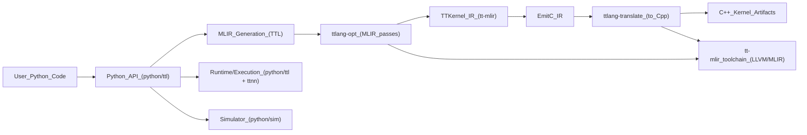
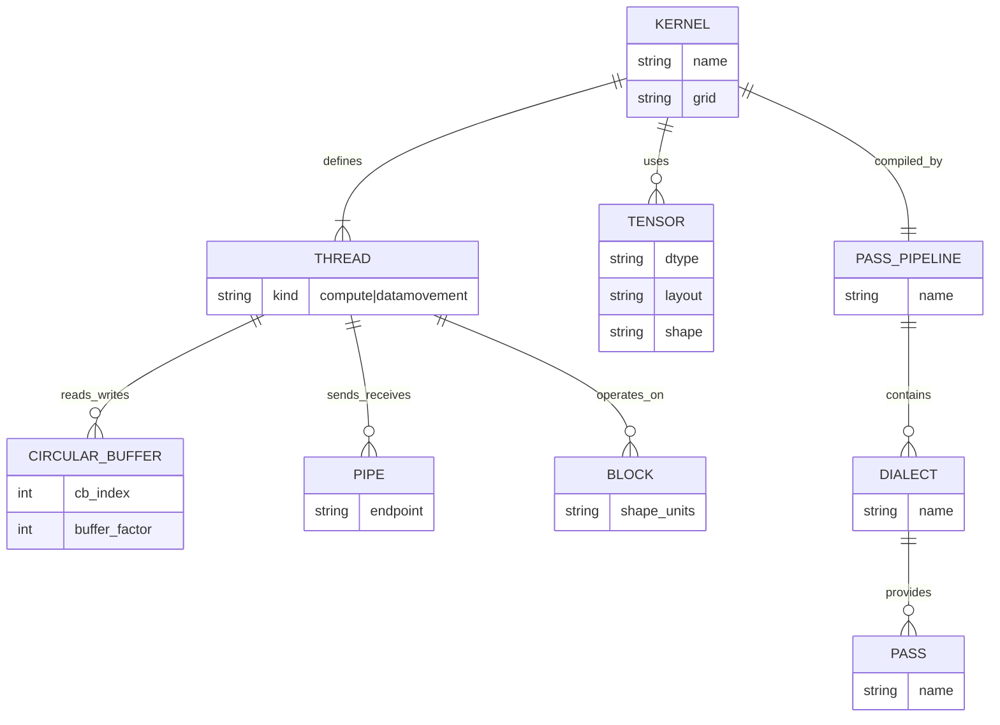
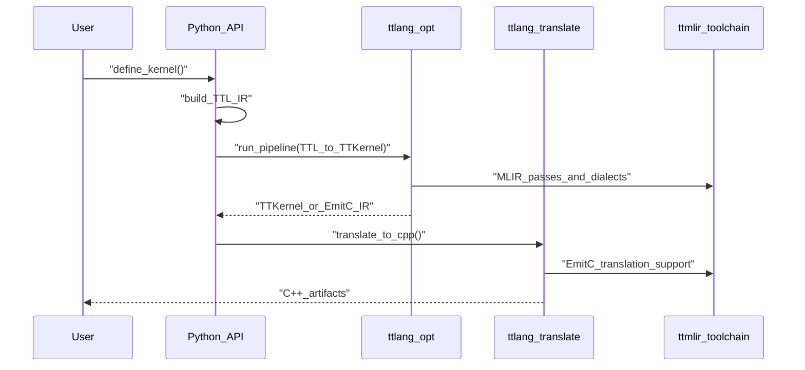
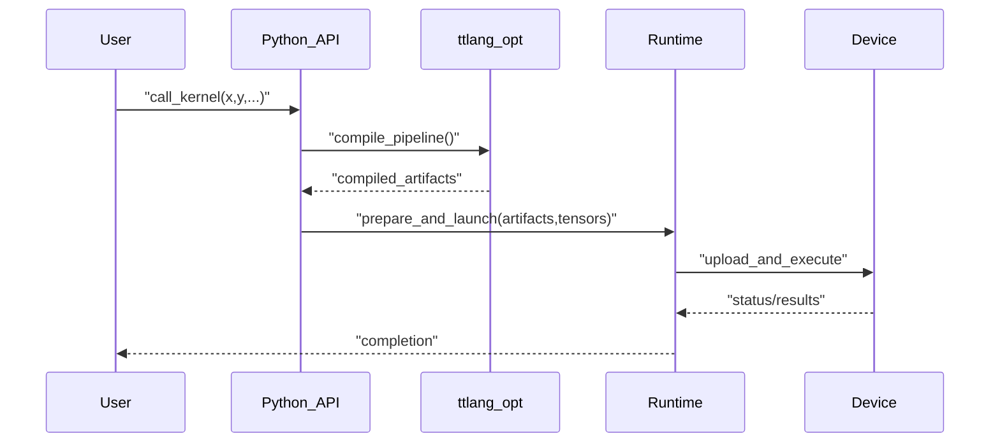
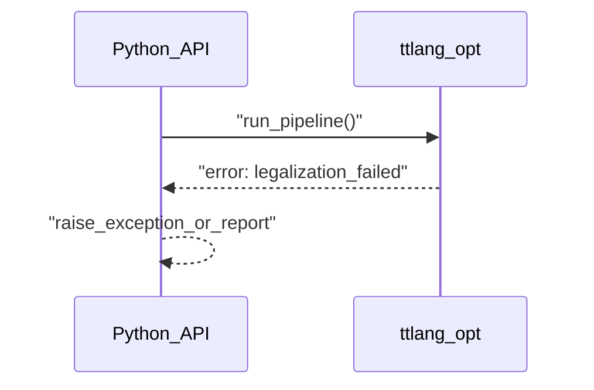
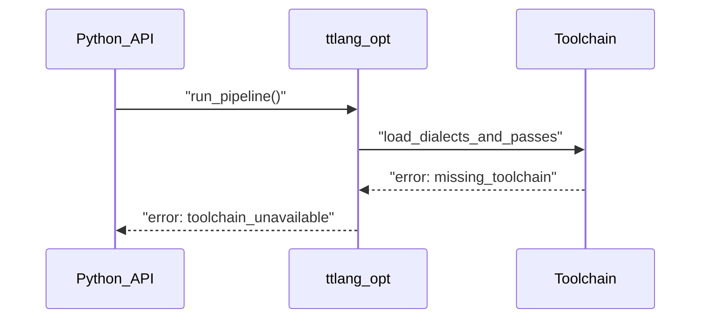

# TT-Lang Architecture — High Level Design (HLD)

## 1. Цель и область

Этот документ — **source of truth** для архитектуры `tt-lang`.
Он фиксирует:

- какие крупные компоненты существуют,
- как они взаимодействуют,
- какие “публичные” интерфейсы поддерживаются (CLI / Python API / C API),
- какие основные потоки выполнения и какие типовые ошибки ожидаемы.

Низкоуровневая детализация (LLD) должна быть **производной** от этого HLD и ссылаться на конкретные исходники.

## 2. Краткий обзор системы (L0)

TT‑Lang — Python DSL, который компилирует kernel‑код в MLIR и далее в низкоуровневые представления, пригодные для генерации C++/запуска на железе или симуляции.

## 3. Основные сущности (Concept / ER)

Ниже — “концептуальная ER‑карта” (не БД): какие сущности существуют и как связаны.

## 4. Публичные интерфейсы (CLI / Python / C API)

В tt‑lang есть несколько публичных “API поверхностей”:

1) CLI инструменты (`ttlang-opt`, `ttlang-translate`)
2) Python API (`python/ttl/*`) для декларации, компиляции и запуска
3) C API (`include/ttlang-c/*`) для интеграции

### 4.1 CLI интерфейсы

| Интерфейс | Назначение | Входы | Выходы | Ошибки |
|---|---|---|---|---|
| `ttlang-opt` | Прогон MLIR pass/pipeline | MLIR файл + флаги/pipeline | MLIR файл (промежуточный) | неверный IR, не удалось легализовать ops, отсутствует toolchain |
| `ttlang-translate` | Трансляция (например TTKernel/EmitC -> C++) | MLIR файл + режим трансляции | C++ артефакты/текст | неподдерживаемый op, ошибка трансляции, несовместимый IR |

Примечание: конкретные флаги/пайплайны — в LLD (с привязкой к `tools/` и pipeline файлам).

**Примеры вызова (аргументы/выходы CLI):**

| Сценарий | Команда | Выходы | Сигнал ошибки |
|---|---|---|---|
| TTL -> TTKernel | `ttlang-opt --ttl-to-ttkernel-pipeline --canonicalize input.mlir -o out.ttkernel.mlir` | `out.ttkernel.mlir` | exit code != 0, diagnostics в stderr |
| TTL -> EmitC (встроенно в pipeline) | `ttlang-opt --ttl-to-ttkernel-pipeline="lower-to-emitc=1" input.mlir -o out.emitc.mlir` | `out.emitc.mlir` | exit code != 0 |
| EmitC/TTKernel -> C++ | `ttlang-translate --ttkernel-to-cpp -o out.cpp out.emitc.mlir` | `out.cpp` | exit code != 0 |

### 4.2 Python API

| API | Назначение | Входы | Выходы | Ошибки |
|---|---|---|---|---|
| `@ttl.kernel()` | Объявление kernel‑функции | Python функция + сигнатуры тензоров | callable объект | ошибки ограничений DSL, ошибки типизации/внутренней валидации |
| `@ttl.compute()` / `@ttl.datamovement()` | Объявление потоков | Python функция | thread‑функция | нарушение ограничений, неподдерживаемые конструкции |
| runtime execute | Запуск на устройстве | тензоры, grid, параметры | выполнение/результаты | устройство недоступно, runtime ошибки, несовместимые layout/shape |
| simulator execute | Запуск в симуляторе | те же логические входы | симулированные результаты/трассы | ограничения симулятора, несовпадение моделей |

### 4.3 C API

| API | Назначение | Входы | Выходы | Ошибки |
|---|---|---|---|---|
| `ttlang-c` | Интеграция без Python | handle’ы, атрибуты, IR | статусы, созданные объекты | статус‑коды/ошибки биндинга |

## 5. Основные потоки (sequence diagrams)

### 5.1 Compile-only (Python -> C++ артефакты)

### 5.2 Run (compile + execute)

### 5.3 Ошибочные потоки (типовые)

#### Ошибка 1: неверный/нелегальный IR

#### Ошибка 2: отсутствует toolchain / несовместимая сборка

## 6. Нефункциональные требования (NFR, кратко)

- **Детерминизм компиляции**: одинаковые входы дают одинаковые артефакты.
- **Отладочность**: возможны дампы IR/пассов/артефактов.
- **Производительность компиляции**: пайплайны должны быть “разумными” по времени.
- **Производительность рантайма**: контроль над data movement + compute.

## 7. Границы документа

Подробные детали по:

- пассам/пайплайнам,
- расположению кода,
- тестовой инфраструктуре,
- симулятору,
переносятся в LLD файлы в этой же директории.

