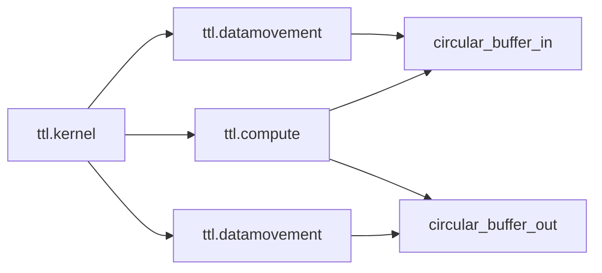

# TT-Lang Architecture — Low Level Design: Runtime & Python API

## 1. Назначение

Этот документ описывает Python‑слой tt‑lang: DSL API, компиляцию из Python и (в общих терминах) запуск на устройстве или в симуляции.

## 2. Ключевые модули и точки входа

- Python API ядра: `python/ttl/` (основной пользовательский слой)
- Главная спецификация языка и терминов: `docs/sphinx/specs/TTLangSpecification.md`

Типовой вход:

- `@ttl.kernel()` — kernel‑функция (принимает `ttnn.Tensor`, возвращает `None`)
- `@ttl.compute()` и `@ttl.datamovement()` — thread‑функции внутри kernel

## 3. Модель исполнения (логически)

Внутри kernel задаются thread‑функции (compute / datamovement), которые используют примитивы:

- circular buffers,
- семафоры,
- blocks/pipes (более высокоуровневые абстракции над layout/коммуникацией).

## 4. Артефакты компиляции и отладки

Важная практическая часть — возможность:

- сохранять промежуточный IR,
- видеть пайплайн пасов,
- воспроизводить проблему на минимальном тесте.

Связанные темы:

- `docs/LOWERING_MULTITILE.md` — пример “Python -> MLIR -> C++” трассировки

## 5. Ошибки (типовые) и обработка

### 5.1 Ошибки ограничений DSL

Симптомы:

- пользовательская функция использует неподдерживаемый Python/контекст.

Ожидаемое поведение:

- понятная ошибка с указанием, что именно не поддержано.

### 5.2 Ошибки компиляции (MLIR)

Симптомы:

- верификация/легализация не проходит,
- транслятор не поддерживает какой‑то op.

Ожидаемое поведение:

- ошибка с ссылкой на стадию и возможностью получить IR‑дампы.

### 5.3 Ошибки запуска

Симптомы:

- устройство недоступно,
- runtime не может подготовить данные/артефакты,
- несовместимые layout/shape.

Ожидаемое поведение:

- явный статус/исключение, без “тихих” фолбеков.

## 6. Точки расширения

- расширение Python API: добавление новых примитивов, операторов, sugar‑синтаксиса;
- интеграция с новыми возможностями tt‑mlir toolchain;
- улучшение отладочной поверхности (дампы, трассировка, статистики).

