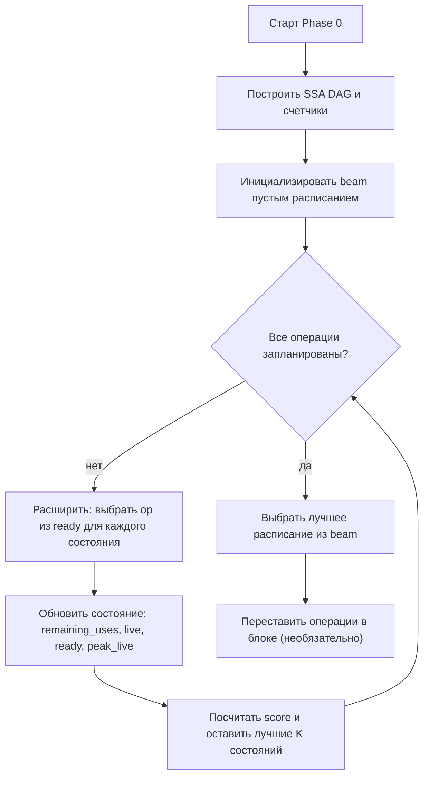
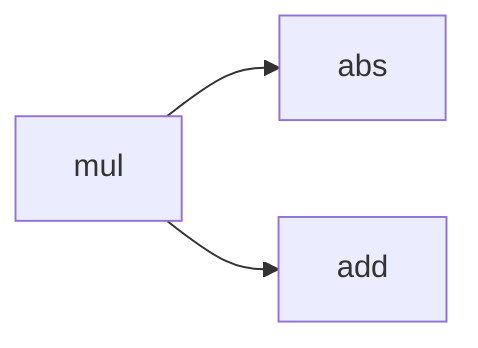

# Планирование Phase 0 через beam search (TTLAssignDST)

## Контекст

В `tt-lang` pass `TTLAssignDST` сейчас делает:

- **Phase 1**: вставка копий (copy insertion) для multi-consumer values при наличии unary consumer.
- **Phase 2**: построение live intervals (с unary merging).
- **Phase 3/4**: линейный аллокатор (linear scan allocation) по интервалам.

В `docs/development/DST_Allocation.md` описана **опциональная Phase 0**: перестановка независимых операций внутри `ttl.compute`, чтобы:

- снизить пик live values в DST (register pressure),
- сделать так, чтобы unary consumer для multi-consumer value оказался последним,
- уменьшить потребность в дополнительных `ttl.copy_dst` / `ttl.copy_tile`.

Этот документ предлагает практичную реализацию Phase 0 как **beam search** по пространству частичных расписаний.

## Почему не Дейкстра

Формулировка “поиск пути” здесь возможна, но классический алгоритм Дейкстры обычно не подходит:

- Состояние — это не “текущая операция”, а **частичное расписание** (множество уже выбранных ops) + текущее множество live values + текущие счётчики.
- Количество состояний экспоненциальное (комбинаторика topological orders).
- Стоимость шага зависит от контекста (какие values live, где последнее использование, какие copy понадобятся).

Поэтому на практике нужен **приближённый поиск** с жёстким ограничением ширины фронта.

## Идея: beam search над topological orders

Beam search не ищет один “идеально оптимальный” путь, а держит **лучшие K частичных расписаний** на каждом шаге.

### Определение графа

Рассматриваем DAG зависимостей SSA внутри `ttl.compute` region:

- Ребро \(A \to B\), если `B` использует результат `A` (по SSA operands).
- В `ttl.compute` обычно нет control-flow, поэтому граф близок к DAG.

### Состояние (State)

Минимальный набор состояния, чтобы оценивать pressure и применять эвристики:

- `scheduled_count`: сколько ops уже добавлено в расписание.
- `ready`: набор ops с `indegree == 0` (готовые к выбору).
- `remaining_uses[value]`: сколько ещё осталось uses для SSA value в невыполненных ops.
- `live`: набор values, у которых `remaining_uses > 0` после текущего шага.
- `peak_live`: максимальный размер `live` по пути (приближённая оценка давления на регистры).
- `copy_risk`: накопленная оценка риска “понадобится copy” для multi-consumer + unary паттерна.
- опционально: `crit_priority[op]` — предвычисленная “distance to yield” / приоритет критического пути.

Важные замечания:

- Для Phase 0 мы **не меняем IR** (не вставляем copy на этом шаге), мы только выбираем порядок ops.
- Мы оцениваем, какой порядок потенциально сократит copies, которые потом будут вставлены в Phase 1.

### Переход (Transition)

Выбрать `op` из `ready`:

1. Добавить `op` в расписание.
2. Для каждого operand value:
   - уменьшить `remaining_uses[value]--`,
   - если `remaining_uses[value]` стало 0 — value можно убрать из `live`.
3. Для result value:
   - добавить в `live` (если `remaining_uses[result] > 0`).
4. Для каждого dependent:
   - `indegree[dep]--`, если стало 0 — добавить в `ready`.
5. Обновить `peak_live = max(peak_live, live.size())`.

### Оценка (Scoring)

Beam search требует скор (score), по которому сравниваются кандидаты.

Практично держать два уровня:

1) **Основная цель (минимизируем)**:

- `peak_live` — базовая метрика для снижения register pressure.

2) **Вторичные эвристики (максимизируем/минимизируем)**:

Можно использовать tuple, аналогично доке в `DST_Allocation.md`, но с инкрементальными метриками:

- `release_pot`: сколько operands у этого op сейчас “последнее использование” (`remaining_uses == 1` до декремента).
- `fire_pot`: сколько ops станет ready после этого op (сколько dependents упадут до `indegree == 0`).
- `live_aff`: сколько operands уже live (или в модели “в DST”).
- `unary_last_bonus`: бонус, если unary op потенциально становится последним consumer для value с несколькими consumers.
- `crit_priority`: предвычисленный приоритет по критическому пути.

Типичная стратегия сравнения состояний:

- основное: минимальный `peak_live`,
- затем: максимальный лексикографический tuple `(release_pot, fire_pot, live_aff, unary_last_bonus, crit_priority)`.

То есть в beam можно сортировать по ключу:

```
(peak_live ASC, tie_break_tuple DESC)
```

где `tie_break_tuple` — это эвристика.

### Детерминизм

Если нужен стабильный результат:

- при равном score добавлять tie-break по `opIndex` (block order) или по stable ID,
- beam сортировать стабильно.

## Алгоритм (псевдокод)

```text
Вход: операции в теле ttl.compute
Построить DAG: indegree[op], dependents[op]
Предвычислить: remaining_uses[value] по SSA uses
Инициализация: ready = операции с indegree == 0
Beam = { начальное состояние }

for step in 0..N-1:
  Candidates = пусто
  for state in Beam:
    for op in state.ready:
      next = apply(state, op)  // обновить remaining_uses/live/ready/peak_live
      next.score = score(next) // посчитать score
      Candidates.add(next)     // добавить кандидата
  Beam = take_best_K(Candidates) // оставить лучшие K состояний

Результат: лучшее состояние из Beam (min peak_live, затем tie-break)
Выход: новый порядок операций
```

Mermaid flowchart:



## Пример: unary на multi-consumer

### IR (упрощенно)

```text
%0 = mul(%a, %b)
%1 = abs(%0)     // unary
%2 = add(%0, %c) // binary
yield %2
```

Здесь `%0` имеет 2 consumer: `abs` и `add`. Если `abs` выбрать раньше, то он может “перезатереть” DST слот, в котором лежит `%0` (в модели in-place unary), и тогда Phase 1 будет вынуждена вставить copy.

Beam search (лучевой поиск) должен предпочесть расписание:

```
mul, add, abs
```

чтобы unary consumer оказался последним.

Mermaid: DAG зависимостей



### Как это отражается в score

На шаге после `mul` в `ready` будут `abs` и `add`.

Эвристика:

- `abs` получает penalty (или низкий `unary_last_bonus`), потому что он unary на multi-consumer value.
- `add` получает меньший penalty и может лучше “освободить” operands.

## Сложность и практические лимиты

Пусть:

- `R` — средний размер `ready`
- `K` — ширина beam (beam width)
- `N` — число операций

Тогда expansions примерно `O(N * K * R)`, а применение одного шага — `O(#operands(op) + #dependents(op))`.

Практически:

- `K = 8..32` (стартовое значение)
- если `ready` большой, можно обрезать `ready` по локальному score (top-M) на каждое состояние

## Интеграция в TTLAssignDST

Текущий pass `TTLAssignDST` не делает Phase 0 в коде. Это можно добавить как опцию:

- `--ttl-assign-dst-enable-phase0-schedule`
- `--ttl-assign-dst-beam-width=N`

Место для интеграции:

1) В `runOnOperation()` для каждого `ComputeOp`:
   - после получения `body` и `yieldOp`
   - до Phase 1 (вставка copy)

2) После получения расписания:
   - физически переставить операции в `body` (только независимые)
   - или построить внутренний список операций для дальнейших фаз без изменения IR (но тогда потребуется переписать Phase 1/2/3, чтобы они следовали этому порядку)

Низкорисковый вариант — переставить ops в блоке (исправляя `opIndex` и debug output).

## План тестирования

1) Lit tests для планировщика:
   - блок с multi-consumer + unary
   - проверить debug output (или предсказуемый порядок)
2) Regression: копии в Phase 1 должны исчезнуть (или уменьшиться их количество) при включенной Phase 0
3) Детерминизм:
   - один и тот же input -> один и тот же output при фиксированном tie-break

## Практические подводные камни

- `compute_cost` должен быть инкрементальным, иначе будет дорого.
- Parallel policies (par/par_unseq) теоретически можно использовать при оценке ready-кандидатов внутри одной итерации, но:
  - beam search всё равно последователен по шагам
  - нужна полная thread-safety (без shared мутаций)
  - детерминизм требует жёсткого tie-break
