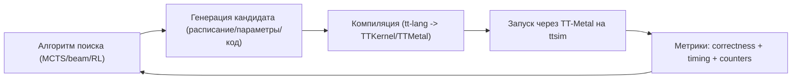

# Как использовать `ttsim` (виртуальное Tenstorrent-устройство) вместе с `tt-lang`

Репозиторий `ttsim`: `https://github.com/tenstorrent/ttsim` (публичные бинарные релизы, без pull request’ов) [tenstorrent/ttsim](https://github.com/tenstorrent/ttsim).

## Зачем это нужно (контекст “нет железа”)

На машине без Tenstorrent HW есть 2 разных “класса симуляции”:

1) **Функциональная симуляция на Python/torch** (уже есть в `tt-lang`)
   - `./bin/ttlang-sim` и `python/sim/ttnnsim.py`.
   - Хорошо подходит для быстрых проверок корректности на уровне “API/семантики”.
   - Обычно не моделирует реальные NOC/CB/ресурсные детали.

2) **Симуляция “как устройство TT-Metal”** через `ttsim`
   - `ttsim` подключается к TT-Metalium как виртуальное устройство (через `TT_METAL_SIMULATOR=/path/to/libttsim_*.so`).
   - Это ближе к “железоподобному” исполнению (но медленнее, и есть ограничения).
   - Полезно, когда хочется:
     - запускать интеграционные тесты без железа,
     - ловить проблемы, которые не проявляются в чисто функциональном симе,
     - собирать профили/тайминги для дальнейшего авто-тюнинга.

## Как `tt-lang` уже “понимает”, что симулятор включен

В тестовой инфраструктуре `tt-lang` проверка доступности устройства/симулятора делается через переменные окружения:

- если выставлен `TT_METAL_SIMULATOR`, то `is_hardware_available()` возвращает True, и тесты считаются “разрешенными для устройства”.
- `lit.cfg.py` явно пробрасывает `TT_METAL_SIMULATOR`, `TT_METAL_SLOW_DISPATCH_MODE`, `TT_METAL_HOME` в окружение lit-тестов.

Это значит: **чтобы в CI/локально запускать “device tests” без железа, достаточно правильно выставить env vars и иметь установленный TT-Metal + `ttsim`**.

## Установка `ttsim` (минимальный рецепт)

Согласно README `ttsim` [tenstorrent/ttsim](https://github.com/tenstorrent/ttsim):

1) Скачать бинарник `libttsim_*.so` под нужную архитектуру (Wormhole/Blackhole) из Releases.
2) Рядом с `.so` положить `soc_descriptor.yaml` (копируется из `tt-metal`).
3) Включить симулятор через переменные окружения, плюс **обязательно** включить slow dispatch.

Пример (Wormhole), в терминах `ttsim` README:

```bash
export TT_METAL_HOME="/abs/path/to/tt-metal"

mkdir -p ~/sim
cd ~/sim

# Скачай libttsim_wh.so из Releases (версию подставь сам)
# wget .../libttsim_wh.so

export TT_METAL_SIMULATOR="$HOME/sim/libttsim_wh.so"
cp "$TT_METAL_HOME/tt_metal/soc_descriptors/wormhole_b0_80_arch.yaml" "$HOME/sim/soc_descriptor.yaml"

# Важно: fast dispatch не работает
export TT_METAL_SLOW_DISPATCH_MODE=1
```

## Как запускать `tt-lang` тесты/примеры с `ttsim`

### 1) Сборка `tt-lang`

Обычно:

```bash
cd /home/kilka/Projects/ML/TT-NN/tt-lang
source build/env/activate
cmake --build build
```

### 2) Запуск lit-тестов (MLIR)

`lit.cfg.py` уже пробрасывает нужные переменные окружения, поэтому достаточно, чтобы они были выставлены в shell:

```bash
source build/env/activate

export TT_METAL_SIMULATOR="$HOME/sim/libttsim_wh.so"
export TT_METAL_SLOW_DISPATCH_MODE=1
export TT_METAL_HOME="/abs/path/to/tt-metal"

cmake --build build --target check-ttlang-mlir
```

### 3) Запуск pytest сим-тестов `tt-lang`

У `tt-lang` есть отдельный сим-набор `test/sim/`, который не обязательно использует `ttsim` (часто это функциональный сим на torch), но его удобно держать рядом:

```bash
source build/env/activate
pytest test/sim/
```

Примечание: если pytest ругается на `--order-scope=class`, это означает, что в окружении нет плагина `pytest-order` (он задается в `test/pytest.ini`). Тогда нужно установить зависимости dev/test окружения, которыми пользуется ваш toolchain venv.

## Как использовать `ttsim` “алгоритмически” (MCTS/поиск/автотюнинг)

Идея: использовать симулятор как “орэкл исполнения”, который по запросу:

- запускает kernel (или микс kernels),
- возвращает метрики: корректность (выходные тензоры) + производные метрики (время, stalls, счетчики),
- и эти метрики используются в MCTS/beam/RL для выбора следующих действий.

### Важная оговорка про цель

`ttsim` позиционируется как функционально точный (bit-exact) симулятор, но его README прямо предупреждает, что:

- fast dispatch не работает (нужен slow dispatch),
- порядок выполнения может отличаться при недостаточной синхронизации (timing-dependent вариации),
- некоторые блоки могут быть “не полностью bit-exact” (зависит от архитектуры/подсистем).

Поэтому для MCTS/поиска обычно разумно разделять:

- **корректность** (functional): проверять bit-exact/close outputs (это сильная сторона симулятора),
- **тайминги/производительность**: использовать как “сигнал направления”, но помнить, что симуляция может быть неидеальным предиктором железа.

### Архитектура “поиск -> симулятор -> метрики”



### Что может быть “действием” в поиске

Примеры:

- выбор стратегии планирования (например, beam width, эвристики),
- выбор порядка ops (Phase 0 scheduling),
- выбор параметров (tile sizes, loop order),
- выбор синхронизации (где поставить wait/barrier, какие TRID).

### Как сделать оценку кандидата воспроизводимой

Чтобы поиск был стабильным:

- фиксировать seed там, где это возможно,
- фиксировать входные данные (тензоры),
- фиксировать конфиги TTNN/TT-Metal,
- избегать кандидатов, которые зависят от “случайного” runtime порядка (например, если нет достаточной синхронизации между потоками).

## Как выбрать: `ttlang-sim` vs `ttsim`

### Когда лучше `ttlang-sim` (быстро)

- проверка семантики/правильности на уровне DSL и простых операций,
- быстрый цикл разработки без тяжелой интеграции TT-Metal,
- unit-тесты.

### Когда лучше `ttsim` (ближе к железу)

- интеграционные проверки “как будет исполняться на устройстве” (пусть и медленнее),
- отладка проблем в нижних слоях (NOC/CB/барьеры/dispatch),
- сбор профиля/метрик для FDO/автотюнинга,
- “oracle” для MCTS/поиска, если важна близость к реальному стэку.

## Практический следующий шаг для этой машины (без железа)

1) Убедиться, что есть checkout `tt-metal` и он собран.
2) Скачать `libttsim_*.so` из Releases `ttsim` и подготовить `soc_descriptor.yaml`.
3) Выставить:
   - `TT_METAL_HOME`
   - `TT_METAL_SIMULATOR`
   - `TT_METAL_SLOW_DISPATCH_MODE=1`
4) Запускать:
   - `cmake --build build --target check-ttlang-mlir`
   - и/или наборы тестов/примеров, которые помечены как “device” и должны проходить при наличии симулятора.
