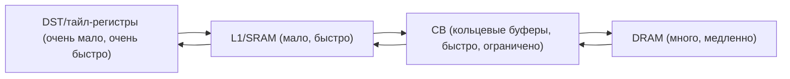
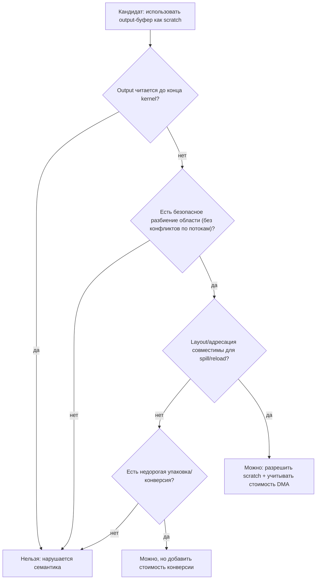
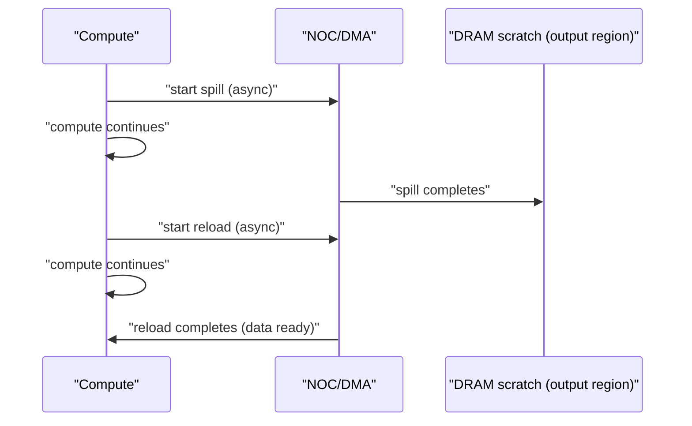

# Использование выходного буфера как scratch (spill в DRAM ради освобождения SRAM/L1)

## Идея

Во многих kernels “выход” (output) обязателен только **к концу** алгоритма, а не на протяжении всего вычисления. Это означает, что часть памяти, предназначенной под output (DRAM interleaved/sharded, SRAM/L1, либо даже регистры/тайл-регистры), может быть временно использована как **scratch buffer** для промежуточных значений.

Параллельная идея: если на каком-то участке алгоритма не хватает быстрой памяти (SRAM/L1/CB/DST), то некоторые intermediate значения можно **вытолкнуть в DRAM** (spill), освобождая быстрый ресурс, и затем при необходимости **подтянуть обратно** (reload) или вообще **пересчитать** (rematerialize), если это дешевле.

Это по сути “управление памятью под давлением” (memory pressure management) в стиле компиляторных оптимизациq:

- register allocation / spilling (для DST/регистров),
- buffer reuse / buffer forwarding (для буферов),
- live range splitting (для значений во времени),
- rematerialization (пересчитать вместо хранения).

## Почему это может дать выигрыш

- **SRAM/L1/CB** ограничены по объёму, и при сложных графах вычислений/мульти-тред взаимодействии можно упираться в “пик живых данных”.
- DRAM медленнее, но часто:
  - NOC и DMA могут работать асинхронно (можно перекрывать),
  - “редкие” spills стоят дешевле, чем постоянные stall’ы из-за нехватки SRAM,
  - output всё равно должен оказаться в DRAM — иногда можно “встроить” spill/reload в уже существующий DMA паттерн.

## Где именно “выход” можно использовать как scratch

### Случай A: output в DRAM (interleaved/sharded)

Если output всё равно будет финально записан в DRAM, то в DRAM можно:

- хранить некоторые intermediate данные, пока они не нужны,
- использовать отдельные “плитки” output-области как временный storage,
- при этом важно не испортить финальный output (нужна дисциплина “когда и что можно перезаписать”).

### Случай B: output в SRAM/L1 (локальный буфер)

Если output живёт в L1/CB или локальном буфере, то:

- на ранних стадиях можно использовать часть буфера под intermediate,
- а затем “перезаписать” его финальным output в последней фазе.

### Случай C: output в регистрах/тайл-регистрах

Для DST/тайл-регистров “output как scratch” — это очень естественно:

- многие tile unary ops и так работают in-place,
- можно специально выбирать порядок выполнения, чтобы reuse регистров был максимальным,
- если не хватает, можно spill’ить части значений наружу (в CB/L1/DRAM).

## Как формализовать задачу (на уровне компилятора)

Можно описать значения как “буферы”/“тайлы” с жизненным интервалом во времени.

Для каждого value/буфера известны:

- где он размещён (DRAM/L1/CB/DST),
- когда он впервые нужен (first use) и когда последний раз нужен (last use),
- можно ли его перезаписать (aliasing и semantics),
- сколько стоит spill/reload/rematerialize.

Цель: минимизировать функцию стоимости, например:

\[
  \text{cost} = w_1 \cdot \text{peak\_SRAM} + w_2 \cdot \text{DMA\_bytes} + w_3 \cdot \text{stall\_time} + w_4 \cdot \text{recompute\_ops}
\]

Mermaid: ресурсы и куда можно “выталкивать”

## “Output как scratch”: требования корректности

Чтобы это было корректно, нужно явно обеспечить:

- **Отсутствие “раннего чтения” output**: никто не должен читать output-область до того, как туда записан финальный результат.
- **Чёткие точки “завершения”**: когда финальный output записан, область перестаёт быть scratch.
- **Alias analysis**: scratch и output не должны неожиданно alias’ить с другими буферами (или это должно быть учтено).
- **Layout совместимость**:
  - если output “шардирован” и имеет специфический layout, intermediate, которые туда spill’ятся, должны быть совместимы с записью/чтением (или нужен “переупаковщик”).
- **Согласованность многопоточности**:
  - если несколько threads/cores пишут в output-область, scratch-использование должно быть локальным или защищённым.

Mermaid: логика принятия решения “можно ли использовать output как scratch”

## Как это встроить в планировщик/аллокатор

Есть два естественных места:

### 1) Планирование (сдвиг порядка ops)

Если изменить порядок независимых ops, можно:

- снизить пик одновременно живых буферов,
- увеличить шанс in-place,
- сократить потребность в spill в DRAM.

Это сочетается с идеями beam search / time-aware scheduling из соседних документов.

### 2) Аллокация/раскладка буферов (buffer assignment)

Если пик памяти всё равно превышает лимит SRAM/L1/CB, нужен механизм:

- выбрать кандидатов на spill,
- выбрать куда spill’ить (часто DRAM или “output region”),
- сгенерировать reload или rematerialization.

Это похоже на register spilling, но для буферов.

## Практичная стратегия “сначала сделать полезное, потом идеальное”

### Шаг 1: Самый безопасный кейс (output в DRAM, без ранних чтений)

Ограничить оптимизацию на случай:

- output записывается один раз в конце,
- до этого output не читается,
- область output можно разбить на независимые “страницы/тайлы” по потокам.

В этом режиме output-область можно использовать как “spill arena”:

- выделить под scratch часть output-тайлов,
- гарантировать, что финальный output перезапишет их позже.

### Шаг 2: Добавить стоимость и простую эвристику выбора spill

Например:

- spill’ить значения с самым дальним следующим использованием (аналог Belady),
- или spill’ить “самые большие” (по тайлам/страницам),
- или spill’ить те, которые проще всего загрузить обратно.

### Шаг 3: Включить time-aware аспект (перекрытие DMA)

Если есть модель времени:

- планировщик может запускать spill DMA заранее (prefetch),
- и перекрывать compute с DMA.

Mermaid: перекрытие compute и spill/reload DMA

### Шаг 4: Rematerialization (если дешевле, чем spill)

Иногда промежуточное значение проще пересчитать, чем хранить:

- если операция дешёвая (например, unary),
- если входы всё равно live и доступны.

Тогда вместо spill/reload можно:

- не сохранять intermediate вообще,
- а при следующем использовании пересчитать.

## Риски

- **Рост DRAM трафика**: слишком агрессивный spill может перегрузить NOC/DRAM и замедлить всё.
- **Сложность корректности**: aliasing/layout/multithreading ошибки могут быть очень неприятными.
- **Непредсказуемость выигрыша**: на одних workload’ах будет ускорение, на других — деградация.

## Результат

Идея “output как scratch + spill в DRAM” имеет смысл как следующий слой оптимизации после:

- хорошего планирования (уменьшить пик live),
- хорошей аллокации регистров/CB,
- базовой модели времени для перекрытия DMA.

Если всё сделать аккуратно (с ограничениями на безопасные случаи и с измеримой стоимостью), это может существенно снизить SRAM/L1 pressure и дать выигрыш на больших графах и мульти-тред kernels.
