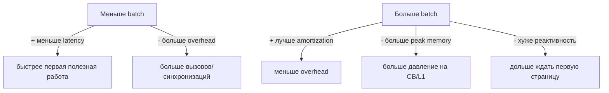

# Reader/Compute/Writer pipeline в tt-lang: “протаскивание данных” через параллельные устройства

## О чём идея (в двух словах)

Разделение kernel на **reader (NOC)** → **compute (Tensix compute)** → **writer (NOC)** — это не просто “архитектурный стиль”, а конкретная оптимизация: попытка **подтянуть данные как можно ближе к вычислениям заранее**, чтобы compute не простаивал на ожиданиях памяти.

На микро‑уровне это похоже на ping‑pong в регистрах (двойная буферизация слотов).
На макро‑уровне в tt-lang/tt-metal это то же самое, только “слоты” — это **страницы CB/участки L1**, а параллелизм идёт через разные “устройства”/ресурсы:

- NOC/DMA (перемещение данных),
- Tensix compute (FPU/SFPU/DST),
- CB/L1 как буфер между ними.

## Почему это “стандартная” оптимизация и почему она работает

### 1) Два разных “мира” по скорости

- Compute на тайлах обычно быстрый (особенно если данные уже в L1/CB/DST).
- Подвоз данных (DRAM → NOC → L1/CB) медленнее и имеет собственные очереди/контеншн.

Если выполнять всё последовательно в одном потоке, получаются “пилы”:

1) начать DMA
2) ждать DMA
3) compute
4) начать следующий DMA
5) ждать…

Compute простаивает, хотя потенциально мог работать параллельно с DMA.

### 2) Конвейер “заполняем — считаем — сливаем”

Когда reader, compute и writer отделены:

- reader **заранее** заполняет входные CB (prefetch),
- compute забирает готовое из CB и производит output,
- writer сливает output из CB в DRAM.

Если CB имеет хотя бы 2 страницы (buffer_factor ≥ 2), можно организовать ping‑pong страниц:

- на странице \(k\) compute считает,
- страницу \(k+1\) reader заполняет,
- страницу \(k-1\) writer сливает.

Mermaid: макро‑конвейер по страницам CB

## Как TRID-барьеры связаны с конвейером

Конвейер “любит” асинхронные операции (DMA) и точечные ожидания:

- reader запускает несколько DMA,
- compute не должен “глобально” ждать все DMA — он хочет ждать только те страницы, которые ему нужны сейчас,
- writer аналогично.

Если `wait` реализован глобальным барьером (“подожди всё”), то:

- один `wait` может остановить весь pipeline,
- перекрытие DMA/compute ухудшается,
- глубина in-flight транзакций практически не помогает.

TRID‑специфические барьеры позволяют:

- ждать конкретный перенос данных (страницу/слот),
- держать несколько независимых DMA одновременно,
- не ломать конвейер из‑за “лишних” outstanding транзакций.

То есть TRID — это механика, которая делает pipeline более управляемым и предсказуемым.

## Где именно “протаскивание данных” проявляется в реализации

### 1) CB как буфер между потоками (межпоточная синхронизация)

CB выполняет роль:

- очереди данных (FIFO/порядок),
- ограничителя памяти (сколько страниц можно держать),
- точки синхронизации (`wait_front`, `reserve_back`, `push`, `pop`).

Ключ: CB позволяет reader и compute жить на разных скоростях, а writer ещё на третьей, при этом “склеивая” их.

### 2) Batch size и гранулярность

Конвейер требует выбрать гранулярность:

- “по 1 тайлу” (минимальная задержка, но больше overhead),
- “по блоку тайлов” (лучше amortization, но больше latency и peak memory),
- “по строке/плитке” (часто компромисс).

Mermaid: компромисс гранулярности

### 3) Placement: параллелизм “реальный”, а не логический

Чтобы pipeline действительно давал выигрыш:

- reader и writer должны реально выполняться параллельно с compute (разные thread types/ядра/ресурсы),
- NOC операции должны иметь возможность идти асинхронно без блокировки compute.

Если по факту всё выполняется в одном ресурсе, pipeline превращается в “красивую иллюзию”.

## Что именно можно оптимизировать (рычаги)

Ниже список “кнопок”, которые обычно дают наибольший эффект.

### 1) Глубина конвейера (сколько страниц in-flight)

Параметры:

- `buffer_factor` CB (2, 3, 4…),
- сколько outstanding DMA разрешаем одновременно,
- стратегия распределения TRID (чтобы не упираться в wraparound).

Типичная картина:

- слишком маленькая глубина → compute ждёт (underrun),
- слишком большая → NOC/DRAM контеншн, рост latency, рост peak memory.

### 2) Приоритезация “заполнить следующую страницу до того, как compute её попросит”

Планировщик/эвристика должны стараться:

- запускать reader DMA “чуть заранее”,
- не запускать их слишком рано (чтобы не занять ресурсы зря).

Это ровно тот же принцип “prefetch → wait → compute”, только на уровне страниц CB.

### 3) Учет NOC contention и каналов

Даже при хорошем CB-пайплайне NOC может стать бутылочным горлышком:

- read и write могут конкурировать,
- разные потоки могут конфликтовать по каналам/очередям,
- burst‑паттерны могут создавать “пульсации” latency.

Если железо/модель позволяет, полезно:

- разделять read/write по каналам,
- управлять количеством in-flight транзакций,
- избегать “толпы” DMA, которая создаёт хвосты ожидания.

### 4) Выбор места для промежуточных данных (CB/L1/DRAM)

Если peak memory слишком большой, можно:

- уменьшать batch,
- spill’ить промежуточные данные в DRAM (как в `output_buffer_as_scratch.md`),
- или пересчитывать (rematerialization), если это выгоднее.

Pipeline и memory management связаны напрямую: чем глубже pipeline, тем больше одновременно живых страниц/тайлов.

## Как это измерять (симуляция и железо)

Чтобы “протаскивание данных” стало инженерной оптимизацией, а не верой, нужны метрики.

### Минимальный набор метрик

- **compute idle time**: сколько времени compute ждёт входные данные (`cb_wait_front`, `barrier_with_trid`),
- **NOC utilization**: загрузка каналов/очередей, глубина очередей,
- **CB occupancy**: сколько страниц занято, сколько underrun/overrun,
- **end-to-end makespan**: время выполнения полного блока/кернела,
- **throughput**: тайлы/сек или элементы/сек.

### Почему симуляция и железо дают разную картину

- симуляция может недооценивать contention и эффекты маршрутизации,
- железо может иметь “шум” из-за частоты/соседней нагрузки/параметров,
- поэтому лучше использовать оба источника: симуляция для быстрого перебора, железо для калибровки.

## Как это увязать с “умным” планированием (beam/time-aware/RL)

### 1) Coarse time-aware модель

Даже грубая модель может оценивать:

- когда следующая страница CB станет готова,
- сколько compute будет ждать, если выбрать текущий порядок,
- где выгоднее запустить prefetch.

### 2) Guidance: направлять поиск в сторону хорошего перекрытия

Если используем beam search:

- кандидаты, которые уменьшают будущие wait’ы, получают бонус,
- кандидаты, которые увеличивают peak memory без выигрыша по времени, получают штраф.

### 3) RL/обучение как “надстройка”

Если строить Gymnasium‑среду, то поведение reader/compute/writer pipeline — это естественная RL‑задача:

- state: CB levels, NOC queues, ready pages,
- action: “что prefetch’ить/что считать/что писать”,
- reward: -time, -stall, -peak memory.

Однако в прод компилятор чаще хочется вернуть детерминизм, поэтому RL удобнее как:

- источник policy/value для guidance,
- или как способ “открыть” новые эвристики, которые потом фиксируются.

## Практический вывод

Reader/Compute/Writer разбиение — это “макро‑ping‑pong”:

- вместо слотов регистров — страницы CB,
- вместо одного compute и одного DMA — три независимых участника (reader/compute/writer),
- цель та же: максимально перекрывать “подвоз данных” и “вычисление”.

TRID‑специфические ожидания и корректная работа с CB страницами — фундамент для того, чтобы этот pipeline был не “красивым”, а реально быстрым.
