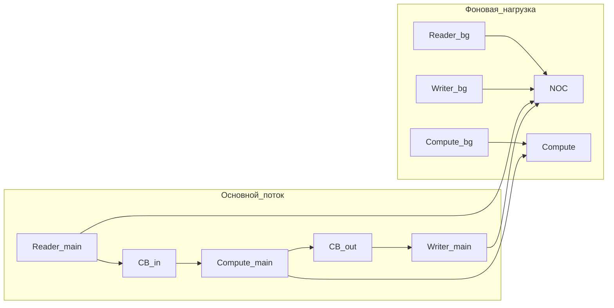
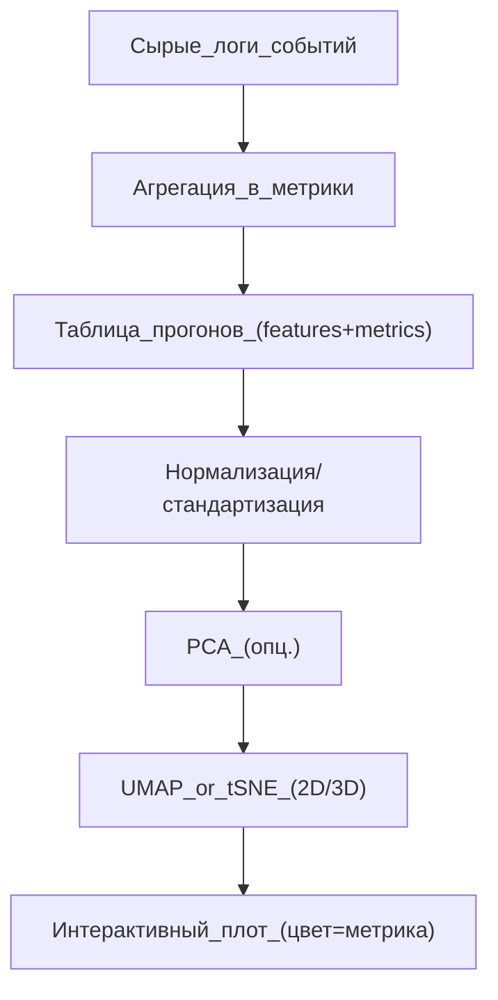

# Полевые замеры задержек на железе и 3D‑ландшафт производительности (UMAP/t‑SNE)

## Зачем это нужно

Конвейеризация (ping‑pong, Reader/Compute/Writer) и “маршрутизация данных” по ресурсам (NOC/CB/L1/compute) опираются на два вида “правды”:

1) **модель** (симулятор/эвристики),
2) **реальные задержки и контеншн** на железе (пробки на “дорогах” и загрузка “районов”).

Без измерений легко оптимизировать “не то”:

- модель может недооценить контеншн NOC,
- реальные хвосты (tail latency) могут доминировать,
- разные режимы нагрузки дают разные “правила игры”.

Цель этого документа — описать методику:

- как **снимать** задержки/пропускные способности при разной нагрузке,
- как **организовать** набор микробенчмарков,
- как **превратить** результаты в “ландшафт” и визуализировать его в 2D/3D через UMAP/t‑SNE.

## Что именно измерять

### События (event-level)

Хотим “метки времени” вокруг ключевых переходов (минимальный набор):

- `dma_read_start`, `dma_read_done`
- `cb_in_push`, `cb_in_wait_front_start`, `cb_in_wait_front_done`
- `compute_start`, `compute_done`
- `cb_out_push`, `cb_out_wait_front_start`, `cb_out_wait_front_done`
- `dma_write_start`, `dma_write_done`

Из этого напрямую считаются:

- latency “read->ready”, “ready->compute_done”, “compute_done->write_done”
- доли idle/stall (например, compute ждёт вход, writer ждёт выход)
- распределения задержек (p50/p90/p99), а не только среднее.

### Агрегаты (time-averaged)

- **makespan** блока/кернела (`t_end`)
- **compute_idle_frac** (сколько времени compute не занят полезной работой)
- **noc_read_busy / noc_write_busy** (загрузка направлений)
- **CB occupancy**: максимум уровня страниц, underrun/overrun
- **in-flight**: сколько outstanding переносов одновременно

### Почему важны хвосты (tail latency)

Если есть контеншн, то среднее может выглядеть “нормально”, но p99 будет огромным. А pipeline чаще ломается именно на хвостах, когда одна страница “застряла” и остановила весь поток.

## Набор микробенчмарков: минимальная матрица экспериментов

Идея: сначала измерить “физику” ресурсов отдельно, потом — их совместную работу.

### 1) Чистый NOC (дороги без районов)

Цель: получить зависимость latency/throughput от нагрузки.

- read-only (DRAM->L1/CB)
- write-only (L1/CB->DRAM)
- read+write одновременно (двустороннее движение)
- варьировать:
  - размер передачи (тайл/страница/пачка)
  - stride/шаблон адресации
  - число in-flight транзакций
  - количество потоков, создающих нагрузку

### 2) Чистый compute (районы без дорог)

Цель: отделить вычислительную “стоимость” и её вариативность.

- FPU-heavy vs SFPU-heavy
- фиксированная длительность (в идеале — параметризуемая)
- несколько параллельных compute потоков (чтобы увидеть contention по вычислителю/ресурсам)

### 3) RCW pipeline (дороги + районы + парковки)

Цель: увидеть режимы, когда pipeline помогает/не помогает.

Варьировать:

- `cb_pages_in`, `cb_pages_out`
- batch size / page size (гранулярность)
- глубину prefetch (сколько страниц пытаемся держать in-flight)
- read/write ratio
- фоновые “шумовые” потоки (нагрузка дорог/районов)

## Как создавать “контролируемую нагрузку”

Нагрузка должна быть:

- воспроизводимой,
- параметризуемой,
- отделимой от “основного” потока измерений.

Пример структуры: основной RCW + фоновые генераторы нагрузки NOC/compute.

Важно: даже если реальная архитектура сложнее, такая схема помогает системно “крутить пробки”.

## Дизайн эксперимента (чтобы цифрам можно было верить)

- **Warm-up**: прогреть кэши/инициализацию, не записывать в статистику.
- **Повторы**: собирать распределения, а не одно значение.
- **Стабильность**: фиксировать seed, размеры, порядок запуска.
- **Контроль условий**: частота/температура/соседняя нагрузка.
- **Разделение измерений**: отдельно baseline, отдельно pipeline, отдельно смешанные режимы.

## Формат данных (что сохранять)

Практичный формат: таблица “одна строка = один прогон”.

### Параметры прогона (inputs)

- `tiles`, `page_size`, `batch`
- `cb_pages_in`, `cb_pages_out`
- `in_flight`, `prefetch_depth`
- `read_write_ratio`
- `bg_noc_load`, `bg_compute_load` (интенсивности фона)
- `device_id`, `arch`, `clock_mode` (если применимо)

### Метрики (outputs)

- `t_end`
- `compute_idle_frac`
- `noc_read_busy`, `noc_write_busy`
- `p50_read_lat`, `p99_read_lat`
- `p50_write_lat`, `p99_write_lat`
- `cb_in_max`, `cb_out_max`
- `underrun_count`, `overrun_count` (если доступны)

## Визуализация “ландшафта”

### Что именно визуализировать

Есть два удобных слоя:

1) **Embedding “режимов”**: точки, где рядом находятся прогоны с похожим профилем поведения.
2) **Поверхность метрики**: например, цвет/высота = `t_end` или `compute_idle_frac`.

### Почему часто лучше UMAP, чем t‑SNE

- **UMAP** обычно лучше сохраняет “глобальную структуру” и стабильнее на больших наборах.
- **t‑SNE** часто хорошо показывает кластеры, но расстояния между кластерами могут быть “нефизичными”, и результаты чувствительны к параметрам.

Практичный инженерный рецепт:

1) нормализация признаков,
2) (опционально) PCA до 20–50 измерений,
3) UMAP в 2D/3D,
4) окраска точек по целевой метрике.

### Пайплайн обработки данных

### Как сделать 3D “ландшафт”

Вариант A (простой): координаты (UMAP1, UMAP2, UMAP3), цвет = `t_end`.
Вариант B (высота): (UMAP1, UMAP2) и по оси Z — `t_end`.
Вариант C (поверхность): интерполировать по соседям и строить “псевдо‑поверхность” (полезно для визуализации, но не как физическая модель).

## Как использовать это дальше (практическая цель)

Из “ландшафта” можно получить два продукта:

1) **калиброванная микро‑модель**: параметры NOC/compute/CB под реальные измерения,
2) **правила/подсказки для планировщика**:
   - “в этой зоне параметров увеличивать `cb_pages` бессмысленно — упираемся в NOC”,
   - “в этой зоне prefetch_depth=2 даёт максимум, дальше только ухудшение tail”.

В прод‑компиляторе чаще хочется детерминизм:

- UMAP/t‑SNE используются как аналитика/инструмент инженера,
- итогом становятся небольшие таблицы/эвристики, закреплённые в коде,
- или параметры, выбираемые по профилю операции/архитектуре.

## Что делать, если нет железа под рукой

Если железа нет, можно:

- начать с `tools/scheduling_sim` как “песочницы” и убедиться, что измеряемые метрики и их связи адекватны;
- заранее спроектировать формат данных и матрицу экспериментов;
- затем перенести ту же структуру на реальные микробенчмарки и сравнить распределения.
