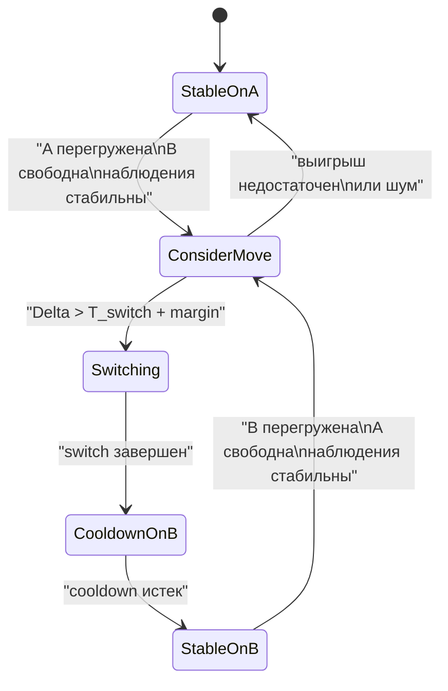
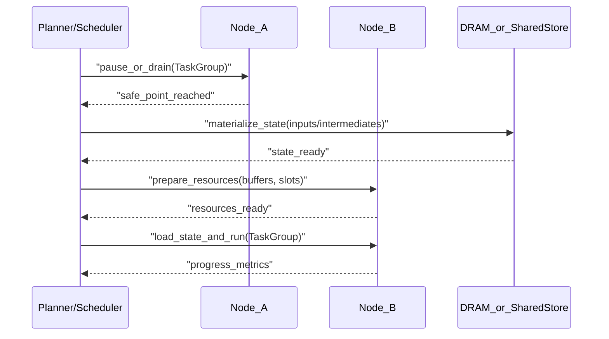
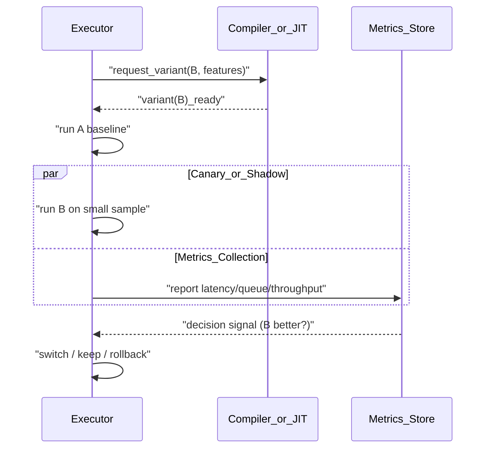
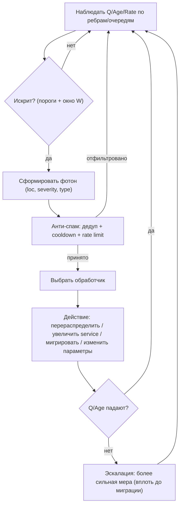

# Миграция compute между нодами с “энергетическим барьером” (перестройка, перекомпиляция, адаптация)

## Идея в одном абзаце

Иногда вычисление (compute) может быть выгодно **“перепрыгнуть” на другую ноду/ядро/исполнитель**, если там есть свободные ресурсы (compute блоки, SFPU, DST, пропускная способность локальных буферов), а текущая нода стала узким местом. Но такой “прыжок” не бесплатен: существует **энергетический барьер** (стоимость переключения), который включает перенос состояния/данных, возможную перестройку расписания и иногда **перекомпиляцию** или выбор другой версии kernel’а под новое размещение. Идея: аккуратно собирать статистику, оценивать выгоду/стоимость, и принимать решение о миграции только тогда, когда ожидаемый выигрыш устойчиво превышает барьер.

## Термины (абстрактно)

- **Нода**: любая единица исполнения, куда можно “назначить” compute (ядро/группа ядер/устройство).
- **Задача (Task)**: фрагмент вычисления, который можно запустить на ноде (тайл/блок/крупнее).
- **Состояние (State)**: данные и контекст, без которого продолжить на другой ноде нельзя (входы/промежуточные буферы/параметры/“привязки” ресурсов).
- **Энергетический барьер (Switch cost)**: время/стоимость, чтобы реально выполнить миграцию.

## Почему это похоже на “энергетический барьер”

В терминах физической аналогии:

- система может находиться в локально “хорошем” состоянии (compute закреплен на ноде A),
- есть альтернативное состояние (compute на ноде B) потенциально с меньшим makespan,
- но между ними “перевал” (барьер): нужно сделать действия, которые временно ухудшают ситуацию (копирование данных, прогрев, перекомпиляция), и только потом появляется выигрыш.

Ключ: без барьера и hysteresis система легко впадает в **flapping/thrashing** (туда-сюда).

## Что входит в стоимость “прыжка” (барьер)

Барьер удобно разложить на компоненты (не все всегда присутствуют):

- **Data movement cost**:
  - перенос входов/промежуточных данных (NOC/DRAM),
  - возможные преобразования формата/раскладки.
- **Resource re-binding cost**:
  - переназначение буферов, слотов CB, “виртуальных регистров”,
  - восстановление инвариантов синхронизации (barriers/waits).
- **Recompile / retune cost**:
  - выбор другого kernel’а/варианта (tile shape, pipeline depth),
  - JIT/перекомпиляция, линковка, прогрев кэшей/памяти.
- **Warm-up / cache cost**:
  - холодные кеши/страницы/таблицы, прогрев data path.
- **Coordination cost**:
  - согласование с остальными задачами (чтобы миграция не ломала общий граф зависимостей).

В простейшей модели всё это можно свернуть в одну величину:

\[
T_{switch} \approx T_{move} + T_{rebind} + T_{recompile} + T_{warmup}.
\]

## Что является “выгодой” миграции

Выгода — это не “быстрее на новой ноде” в вакууме, а **сколько ожиданий/простоя удается избежать**:

- уменьшение очереди на узком compute ресурсе,
- уменьшение contention (например, более свободный SFPU),
- выравнивание pipeline (reader/compute/writer),
- снижение tail latency (p95/p99), если это критично.

В простейшем виде:

\[
\Delta = \mathbb{E}[T_{stay}] - \mathbb{E}[T_{migrate}],
\]

и миграция допустима, если:

\[
\Delta > T_{switch} + \text{margin}.
\]

## Сбор статистики: что нужно измерять

Чтобы решение не было “на глаз”, система должна собирать телеметрию с аккуратными фильтрами:

- **Per-node загрузка**:
  - время занятости compute/SFPU,
  - количество задач в очереди,
  - “idle gaps” downstream (writer/consumer простаивает).
- **Per-task время**:
  - фактическая длительность выполнения (p50/p90/p99),
  - ожидания входов (сколько времени задача “готова кроме одного ресурса”).
- **Data movement метрики**:
  - время переноса нужных данных,
  - доля времени в NOC/DRAM.
- **Switch outcomes**:
  - сколько раз миграция помогла/не помогла,
  - сколько стоил switch по факту,
  - сколько раз случился thrash (обратный switch слишком быстро).

Практично хранить и использовать не “сырые значения”, а сглаженные:

- экспоненциальное сглаживание (EMA),
- окна времени,
- отдельные модели для разных размеров задач.

## Устойчивость: hysteresis, rate limiting, “барьер” как стабилизатор

Чтобы избежать flapping:

- **Hysteresis**:
  - решение “мигрировать” требует большего порога, чем решение “не мигрировать”.
- **Cool-down**:
  - после миграции нельзя мигрировать обратно/в другое место раньше, чем через \(T_{cool}\).
- **Rate limiting**:
  - ограничить количество миграций в единицу времени/на граф задач.
- **Sticky assignment**:
  - “привязка” к ноде сохраняется, пока есть стабильный прогресс.

## Когда миграция вообще легальна (ограничения корректности)

Не каждую compute задачу можно переносить “как есть”. Требуются ограничения:

- состояние переносимо (или реконструируемо),
- синхронизация не нарушается (никаких “зависших” ожиданий на старой ноде),
- данные доступны в нужном формате/раскладке,
- не нарушается детерминизм, если это требование (для компилятора/отладки).

Удобно вводить понятие **“мигрируемости”** (migratable / non-migratable) на уровне задачи/подграфа.

## Протокол миграции (высокоуровнево)

Ниже схема, которая подчёркивает, что миграция — это последовательность действий с явной стоимостью.

## Политика принятия решения: от эвристик к обучаемым моделям

Практичный путь обычно выглядит так:

### Шаг 1: простая детерминированная эвристика

- если очередь на ноде A превышает порог,
- и нода B простаивает,
- и наблюдаемая деградация стабильна \(W\) времени,
- и оценка выигрыша превышает барьер + запас,
- тогда мигрировать.

### Шаг 2: уточнение модели стоимости

Барьер и ожидаемый выигрыш можно оценивать моделью \(f(\text{features})\), где features включают:

- размер данных, формат, ожидаемый объем переносов,
- текущую нагрузку NOC/DRAM,
- тип kernel’а/операции, наличие альтернативных вариантов,
- текущий режим (например, “контеншн на NOC” vs “контеншн на compute”).

### Шаг 3: аккуратное обучение на данных

Можно собирать “опыты” миграций:

- (контекст, решение, результат),
- и обучать интерпретируемую модель (деревья/GBDT), которая:
  - подсказывает пороги,
  - повышает качество оценки \(T_{switch}\) и \(\Delta\),
  - но остаётся стабильной и отлаживаемой.

Важно: в компиляторном режиме часто требуется детерминизм, поэтому модель лучше использовать как **guidance** (подбор порогов/параметров), а не как источник недетерминированных решений.

## Снижение “барьера” через параллельную компиляцию и A/B (canary) эксперименты

### Идея

Часть “энергетического барьера” — это не физический перенос данных, а **подготовка альтернативы** (другой kernel, другой вариант раскладки/параметров, другой mapping на ноды). Эту подготовку можно (в ряде случаев) делать **параллельно и независимо** от текущего исполнения:

- “основной план” продолжает выполняться как обычно,
- параллельно компилируется/готовится “альтернативный план”,
- затем система выбирает момент переключения (или отбрасывает альтернативу), опираясь на измеренную пользу.

Так барьер \(T_{recompile}\) частично превращается из “блокирующего” в “фоновый”.

### A/B схема (высокоуровнево)

Вместо единичного решения “перейти/не перейти” можно запускать ограниченные эксперименты:

- **A**: текущая стратегия (baseline).
- **B**: альтернативная стратегия (другой kernel/параметры/размещение/гранулярность).

Эксперимент может быть:

- **теневым (shadow)**: B исполняется частично или “вхолостую” ради метрик, но не влияет на конечный результат;
- **канареечным (canary)**: B получает небольшой процент задач/тайлов/микробатчей и влияет на результат, но в контролируемом объеме.

### Что именно можно “параллелить”

Типовые варианты, которые имеют смысл готовить заранее:

- разные параметры kernel’а (tile shape, pipeline depth, unroll),
- разные размещения (какой compute ресурс исполняет что),
- разные политики prefetch/backpressure,
- разные “режимы” для разных уровней загрузки (mode switching).

### Ограничения корректности и безопасности

A/B подход полезен, но требует явных ограничений:

- **эквивалентность результата**: A и B должны вычислять один и тот же смысл (или B должен быть “теневым” и не менять результат);
- **изоляция ресурсов**: эксперименты не должны “съедать” весь NOC/DRAM и ухудшать baseline;
- **детерминизация**: если нужен детерминизм, нужно фиксировать seed/выборку и логировать решения;
- **rollback**: при ухудшении метрик B быстро отключается, и система возвращается к A.

Практично вводить бюджет:

- максимум \(K\) параллельных вариантов,
- максимум \(p\%\) трафика на canary,
- cooldown на переключения и на повторные эксперименты.

### Как это связано с “энергетическим барьером”

С точки зрения модели:

- \(T_{move}\) и часть \(T_{rebind}\) часто неизбежны,
- но \(T_{recompile}\) и часть \(T_{warmup}\) можно частично “спрятать” в фоне,
- а decision‑policy получает реальные данные (не только прогноз) о \(\Delta\).

## Как эта идея сочетается с пайплайнами (RCW, prefetch, pull-based)

Миграция compute — “крупная” мера. Часто прежде, чем прыгать между нодами, полезно:

- поправить глубину prefetch/ping-pong,
- изменить гранулярность задач (тайл vs блок тайлов),
- ввести backpressure для выравнивания writer/compute,
- применить pull-based перераспределение внутри ноды.

Миграция становится полезной, когда:

- локальными тюнингами уже нельзя снять узкое место,
- либо узкое место носит “режимный” характер (длительная деградация ресурса).

## Событийная рекофигурация через “фотон‑сообщения” (ping только когда “искрит”)

### Наблюдение: постоянные “пинги” часто бесполезны

Если система дискретна по тикам (например, “раз в 137 тиков” появляется событие “данные пришли”), естественный соблазн — дополнительно “пинговать” планировщик/исполнителей с той же периодичностью.

Проблема: при нормальной работе такие пинги почти всегда подтверждают очевидное (“все идет”), но при этом:

- тратят полосу/циклы на передачу метаданных,
- создают шум (сложно отличить нормальные колебания от проблемы),
- провоцируют преждевременные решения (flapping).

Идея: вместо “пинга по расписанию” использовать **редкие событийные сигналы**: “фотон‑сообщение” посылается не всегда, а только когда возникла аномалия (искрит): данные “столпились”, не пробивается, случился затор/bottleneck.

### Что такое “фотон‑сообщение”

“Фотон” можно рассматривать как минимальный control‑event (почти как прерывание):

- **где**: идентификатор ребра/очереди/буфера, где накапливаются данные,
- **что**: тип проблемы (рост очереди, рост возраста данных, отсутствие прогресса),
- **насколько**: severity (глубина очереди, возраст, скорость роста),
- **что требуется**: подсказка обработчика (нужен compute, нужен writer, нужен перенос/миграция, нужен retune).

Ключ: фотон не переносит “всю телеметрию” — он инициирует локальный разбор и выбор действия.

### Триггеры: когда именно “искрит”

Удобно определять “искрение” через пороги по трем осям:

- **порог по уровню**: \(Q(t) > Q_{high}\),
- **порог по возрасту**: \(Age(t) > Age_{high}\),
- **порог по росту**: \(\frac{dQ}{dt} > R_{high}\).

Чтобы отфильтровать шум, “искрение” подтверждается только если условие держится \(W\) тиков подряд (или превышение по EMA).

### Алгоритм обработки фотона (высокоуровнево)

### Какие “обработчики” уместны

Фотон не обязан сразу означать миграцию. Это механизм “поднять флаг”, а дальше обработчик выбирается по типу bottleneck:

- **writer отстает**:
  - включить backpressure upstream (compute),
  - ограничить prefetch depth (reader),
  - отдать writer больше “полезного времени”/слотов (если политика это допускает).
- **compute отстает**:
  - уменьшить гранулярность (разбить монолитные задачи),
  - включить альтернативный compute ресурс локально,
  - рассмотреть миграцию на другую ноду, если \(\Delta > T_{switch}\).
- **read/NOC contention**:
  - снизить число in-flight переносов,
  - изменить порядок на более “пакетный” (где возможно),
  - временно снизить агрессивность prefetch.

Это хорошо сочетается с “энергетическим барьером”: **фотон** является триггером на оценку, а **миграция** — крайняя мера после проверки, что локальные действия не помогают.

### Анти-спам и устойчивость (обязательно)

Поскольку настоящий затор может породить лавину фотонов, нужны стабилизаторы:

- **дедупликация**: один активный фотон на `(location, type)` в интервале времени,
- **cooldown**: после принятого фотона по location нельзя принимать новый \(T_{cool}\) тиков,
- **rate limit**: ограничить общий бюджет фотонов на окно времени,
- **агрегация**: слить близкие фотон‑события в “затор района”,
- **ступенчатая эскалация**: сначала мягкие меры, затем сильные (включая миграцию).

### Связь с периодическим “данные пришли”

Периодическое событие “данные пришли” — workflow‑event: оно двигает pipeline вперед в штатном режиме.
“Фотон” — control‑event: он появляется редко и включает “планировщик‑реаниматор” (локальный анализ узкого места + выбор действия).

## Риски (нужно явно)

- **Thrashing**: слишком частые прыжки, ухудшение makespan.
- **Скрытые стоимости**: перекомпиляция/прогрев могут доминировать.
- **Сложность корректности**: миграция пересекается с синхронизацией и зависимостями.
- **Сложность отладки**: если решения недетерминированы, воспроизводимость падает.

## Короткий вывод

Миграция compute между нодами может дать выигрыш, если рассматривать её как переход через “энергетический барьер”: перенос состояния и адаптация требуют времени, поэтому решение должно опираться на статистику, иметь hysteresis и rate limiting. В хорошем дизайне миграция — редкий, но мощный инструмент, включающийся только при устойчивой деградации и гарантированной выгоде.
