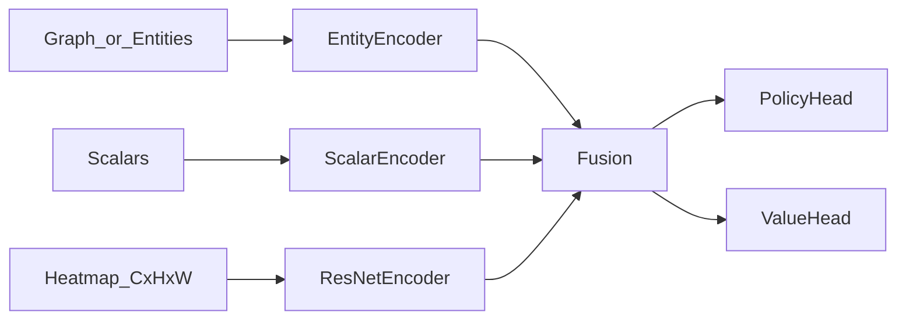
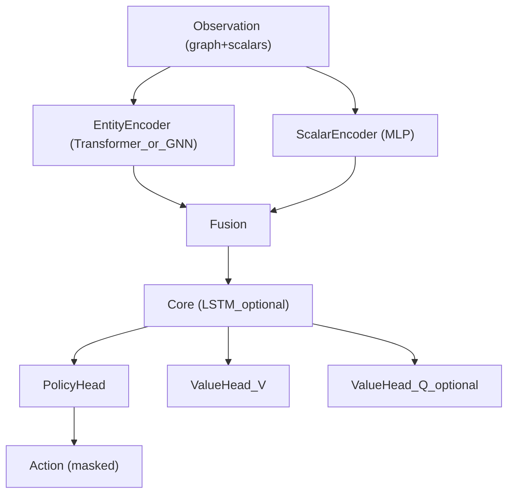
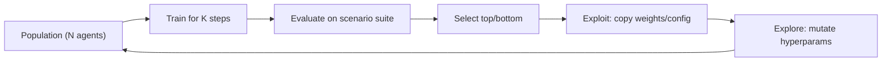
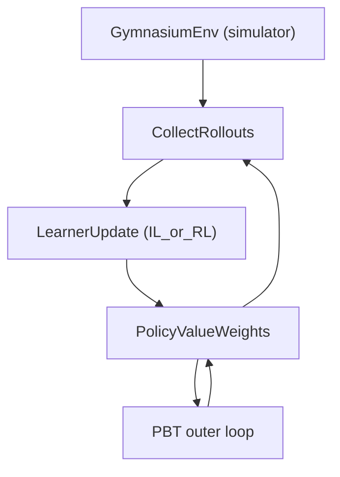

# AlphaStar-идеи для планирования: PBT + Transformer-эмбеддинги + Policy/Value (V и Q)

## Идея в одном абзаце

AlphaStar интересен не только “само-игрой”, а тем, что это практичная система для обучения сложной политики в среде с огромным пространством действий: **богатое представление состояния (entity embeddings через self-attention/Transformer)**, **разделение на policy и value**, и **Population-Based Training (PBT)** для автоматического тюнинга гиперпараметров и “режимов” обучения. В контексте tt-lang/tt-metal это можно перенести на задачу планирования/маршрутизации по графу ресурсов (NOC/CB/DST/SFPU/DRAM/L1): держать популяцию планировщиков, оценивать их по наборам режимов (arch, нагрузка, размеры графов), копировать веса лучших и мутировать параметры (reward weights, budgets, throttling/backpressure), а value-сеть использовать для оценки “выигрыша” состояния и/или действий (V(s) и Q(s,a)).

## 1. Что именно из AlphaStar мы переносим (и что не переносим)

### 1.1 Переносим

- **Entity/unit embeddings через self-attention**: в StarCraft наблюдение включает список сущностей (юниты/здания) с атрибутами; AlphaStar пропускает это через Transformer (self-attention), чтобы получить устойчивые эмбеддинги множества сущностей.
- **Policy network + Value network**: отдельные “головы” (или отдельные сети) для выбора действия и для оценки.
- **PBT**: внешний цикл, который автоматически подбирает гиперпараметры обучения и поведения, сохраняя разнообразие и устойчивость.

### 1.2 Не переносим (на первом шаге)

- Полную league/self-play систему (оппоненты/эксплойтеры). Для планирования можно начать с “режимов среды” вместо оппонентов.
- Сверхсложное разложение действий “как в RTS” (auto-regressive action arguments + pointer network). В нашем случае это возможно, но можно начать с более простого action space.

## 2. Аналогия “юниты/здания” -> “ресурсы/таски” (entity embeddings)

В StarCraft сущности:

- имеют тип (юнит/здание),
- имеют состояние (HP, position, cooldowns, queue),
- взаимодействуют через пространство/ограничения.

В задаче планирования/маршрутизации для tt-lang можно определить сущности (entities) так:

- **Resource entities**: `NocReadChan[i]`, `NocWriteChan[j]`, `Cb[k]`, `Dst[m]`, `Sfpu`, `Fpu`, `Dram`, `L1`.
- **Task entities**: `DmaRead(tile_p)`, `Compute(tile_k)`, `DmaWrite(tile_q)`, `CbReserve/Push/Pop/Wait`.

И построить два семейства представления (оба полезны):

- **resource-graph**: узлы = ресурсы; ребра = возможные потоки данных/контеншн.
- **bipartite task-resource**: узлы двух типов; ребра = “task может исполняться на resource”.

В обоих случаях Transformer/self-attention по множеству entity embeddings дает:

- контекстную “карту” текущего режима пробок/простоя,
- компактный вектор состояния для policy/value голов.

Примечание: вместо Transformer можно использовать GNN (см. `docs/ideas/solutions/13_gnn_routing_from_simulator.md`).
Transformer удобно использовать, если хочется работать именно с множеством сущностей (set encoder) и/или иметь pointer-подобные выборы “какой entity выбрать”.

## 3. Policy и Value: зачем две сети (и почему обе нужны)

### 3.1 Policy network

Policy отвечает за “что делать дальше”:

- выбрать следующий task из `ready_set`,
- выбрать ресурс/канал/маршрут для transfer,
- выбрать шаг ожидания (advance-to-next-event), если ничего нельзя стартовать.

### 3.2 Value network как оценка выигрыша/перспективности

В AlphaStar value используется как baseline для policy-gradient и как стабилизатор обучения.
В планировании value можно использовать тремя способами:

#### Вариант A: state value \(V(s)\)

\(V(s)\) оценивает “насколько хорошее состояние”:

- \(V(s) \approx -E[\text{remaining\_makespan}]\) или
- \(V(s) \approx -E[\text{remaining\_cost}]\),

где cost может включать overflow/contension/idle.

Использования:

- actor-critic (advantage \(A(s,a) = r + \gamma V(s') - V(s)\)),
- guidance для beam/A*: ранжирование состояний beam по \(V(s)\) или по \(g(s)+h(s)\), где \(h(s)\approx -V(s)\).

#### Вариант B: action value \(Q(s,a)\)

\(Q(s,a)\) оценивает качество конкретного действия:

- \(Q(s,a) \approx -E[\text{remaining\_makespan} \mid \text{take } a]\).

Использования:

- как scorer действий (выбор top-k действий для развилки поиска),
- как “critic” в actor-critic (особенно если action space небольшой/сильно маскируемый).

#### Вариант C: оба варианта вместе

Практично держать:

- \(V(s)\) как дешевую оценку состояния (стабильная, хорошо работает с beam),
- \(Q(s,a)\) как более точный ранжировщик кандидатов, когда нужно выбрать из небольшого набора допустимых действий.

## 4. Архитектура “как в AlphaStar” (адаптация)

Оригинальная архитектура AlphaStar (высокоуровнево) сочетает:

- entity encoder: Transformer (self-attention),
- scalar encoder: MLP,
- spatial encoder: ResNet (для карты),
- core: deep LSTM,
- action heads: авто-регрессивная генерация аргументов, pointer network для выбора сущностей,
- value head: отдельная голова/сеть.

Для нашей задачи можно оставить тот же “скелет”, но заменить детали:

- entity encoder: Transformer или GNN над entity/task/resource,
- spatial encoder: можно добавить как “карту огоньков” (heatmap) по сетке core/mesh, если хочется наглядного и локально-коррелированного сигнала,
- core memory: LSTM (если частичная наблюдаемость/задержки/скрытое состояние) или без памяти, если симулятор дает полное состояние,
- action heads: выбор task/resource; для выбора “какой CB/какой DST” можно использовать pointer head по entity embeddings,
- value head: \(V(s)\) и/или \(Q(s,a)\).

### 4.1 Spatial encoder как “карта огоньков” producers/consumers (2D/3D -> 2D ResNet)

Идея: помимо графа/скаляров подать в модель **пространственную “карту” нагрузки**, чтобы ResNet ловил локальные паттерны пробок
и “горячие зоны” (как в AlphaStar для карты StarCraft).

#### 2D представление

Пусть есть решетка вычислителей (например cores \(H\times W\)). Тогда строится тензор:

\[
X \in \mathbb{R}^{C \times H \times W},
\]

который можно трактовать как “нарисованную карту”:

- **каналы producers/consumers**:
  - `ProducerHeat`: где “производится” много данных,
  - `ConsumerHeat`: где данные “упираются” в обработку;
- **каналы пробок**:
  - `QueueDepthHeat` (очереди/входные буферы),
  - `InFlightHeat` (сколько in-flight transfers),
  - `ContentionHeat` (оценка арбитража/конфликтов);
- **каналы ресурсов**:
  - `CbFillHeat` (уровень заполнения CB),
  - `DstOccHeat` (занятость DST),
  - `NocUtilHeatRead`, `NocUtilHeatWrite` (read/write отдельно).

Интенсивность (“толщина/яркость огоньков”) задается, например:

- \(\text{heat} = \log(1 + \text{bytes\_per\_tick})\) для потоков,
- \(\text{heat} = \text{EMA}(\text{queue\_depth})\) для очередей,
- клиппинг по percentiles, чтобы не доминировали выбросы.

#### 3D -> 2D (многослойная реальность)

Если исходное состояние “3D” по смыслу (например, уровни памяти/каналы/направления), то практично
оставить это как многоканальный 2D input: “3D” превращается в \(C\) каналов.

Например, “read vs write”, “L1 vs DRAM”, “несколько NOC каналов” можно разнести по каналам.

#### Что именно дает ResNet

- ResNet хорошо учится распознавать **локальные конфигурации**: “горячее ядро + перегруженный соседний канал”, “полоса пробки по краю”, “кластер переполненных CB”.
- Это дополняет Transformer/GNN (которые сильнее в глобальном контексте), давая модельный “зрительный” сигнал.

#### Fusion (как склеить с entity encoder)

Простейший вариант:

- heatmap -> ResNet -> вектор `spatial_emb`,
- entity/scalars -> encoder -> `state_emb`,
- `concat(state_emb, spatial_emb)` -> policy/value головы.





## 5. PBT: что это и почему это “альфастарная” часть

### 5.1 Коротко: exploit/explore для популяции

PBT поддерживает популяцию “тренирующихся” агентов. Периодически:

- **evaluate**: измерить fitness каждого агента на фиксированном наборе сценариев;
- **exploit**: слабые агенты копируют веса и/или конфигурации сильных;
- **explore**: к скопированным конфигурациям применяются мутации гиперпараметров.

Главная польза: гиперпараметры и “режимы” не подбираются руками; система сама ищет устойчивые настройки.



### 5.2 Где PBT сидит в нашем пайплайне

PBT — внешний цикл поверх любого learner’а:

- imitation learning (по “учителю”),
- RL (actor-critic),
- hybrid (imitation pretrain -> RL finetune).



## 6. Что именно тюнит PBT в задаче планирования (примеры)

### 6.1 Параметры обучения (RL/IL)

- `learning_rate`, `entropy_coef`, `gamma`, `gae_lambda`;
- веса reward shaping \(\lambda_i\) (overflow, contention, idle, invalid);
- коэффициенты auxiliary losses (predict_delay, predict_queue_growth).

### 6.2 Параметры поиска/гарантий (если policy = guidance)

- `beam_width`, `rollout_budget`, `max_expansions`;
- правило tie-break (фиксированное для детерминизма);
- пороги “эскалации” (когда переходить к более дорогой проверке/поиску).

### 6.3 Параметры поведения и стабилизации

- `action_budget` на окно времени;
- `cooldown` для дорогих действий (переназначение, миграция, переключение режимов);
- `backpressure_thresholds` для CB fill/drain;
- `in_flight_limits` для NOC read/write.

Важно: многие из этих “параметров поведения” можно реализовать как hard constraints и тюнить их значения через PBT.

## 7. Fitness: как сравнивать агентов честно

Обычно fitness должен быть:

- **multi-objective** (несколько метрик),
- **robust** (по набору режимов/архов),
- **устойчив к “читерству”** (reward hacking).

Пример fitness:

\[
F = -w_1\cdot \text{makespan} - w_2\cdot \text{p95\_latency} - w_3\cdot \text{overflow\_count} - w_4\cdot \text{compute\_idle}.
\]

Оценка должна делаться на “suite” сценариев:

- разные `arch` (например `blackhole`, `wormhole_b0`),
- разные режимы нагрузки (low/high contention),
- разные размеры графа/батча.

## 8. Протокол exploit/explore (конкретика)

### 8.1 Когда делать exploit

Типовая схема:

- каждые `T_eval` шагов обучаем агента,
- считаем fitness на фиксированном наборе seeds,
- bottom `p%` заменяем на копию top `q%`.

### 8.2 Как делать explore (мутации)

Нужны разные мутации для разных типов параметров:

- непрерывные (LR, entropy): log-normal noise (умножение на \(e^{\epsilon}\)),
- дискретные (beam width): swap из набора допустимых значений,
- пороги (backpressure): additive noise + clip.

Псевдокод:

```text
if agent in bottom:
  agent.weights = sample(top).weights
  agent.hparams = mutate(sample(top).hparams)
```

### 8.3 Diversity и предотвращение collapse

Чтобы популяция не схлопнулась в один режим:

- элитизм: сохранять несколько “чемпионов” без мутаций;
- diversity penalty: штраф за слишком похожие hparams/поведение;
- стратифицированный отбор: лучший на каждом “режиме” (арх/нагрузка) сохраняется.

## 9. Риски и как их контролировать

- **Overfitting на сценарий suite**: расширять suite, использовать held-out режимы.
- **Reward hacking**: валидировать hard constraints отдельно (например overflow=0 как обязательное).
- **Нестабильность из-за non-stationarity**: фиксировать окна оценки, логировать артефакты и делать rollback.
- **Недетерминизм**: фиксировать seeds, tie-break, записывать “run manifest” (hparams + версии).

## 10. Минимальный план внедрения (без кода)

1) Зафиксировать Gymnasium env (наблюдение как graph+scalars, action mask).
2) Сделать baseline policy (heuristics) и baseline value (простая регрессия на remaining time).
3) Добавить training loop (imitation или actor-critic).
4) Обернуть сверху PBT: population + eval suite + exploit/explore.
5) Артефакты: таблицы fitness, best configs, репродуцируемые “снапшоты”.

## Перекрестные ссылки в репозитории

- `docs/ideas/solutions/13_gnn_routing_from_simulator.md`
  - “Куда это прикручивается”: формализация симулятора как Gymnasium env и графовое представление + обучение policy/value.
  - Этот документ добавляет внешний слой оптимизации: PBT как способ автоматически тюнить гиперпараметры и стабилизаторы.
- `docs/ideas/solutions/04_full_fidelity_sim_rl_env.md`
  - “Насколько детально симулировать”: какие ресурсы и задержки стоит моделировать, чтобы reward был осмысленным.
  - PBT особенно полезен на высокой fidelity, потому что ручной тюнинг reward weights и budgets обычно становится неустойчивым.
- `docs/ideas/solutions/02_adaptive_online_scheduling.md`
  - “Как внедрять без магии”: value/policy как guidance для детерминированного поиска и как встроить PGO/FDO цикл.
  - PBT можно рассматривать как более мощный autotuning слой поверх того же цикла (с контролем репродуцируемости).

## Источники по AlphaStar (архитектура и training setup)

- AlphaStar paper (PDF): `https://storage.googleapis.com/deepmind-media/research/alphastar/AlphaStar_unformatted.pdf`
- DeepMind blog: `https://www.deepmind.com/blog/alphastar-grandmaster-level-in-starcraft-ii-using-multi-agent-reinforcement-learning`

