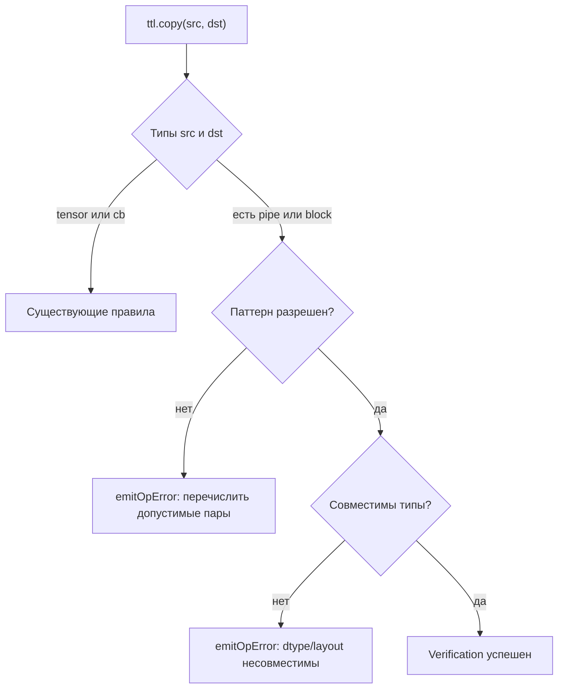
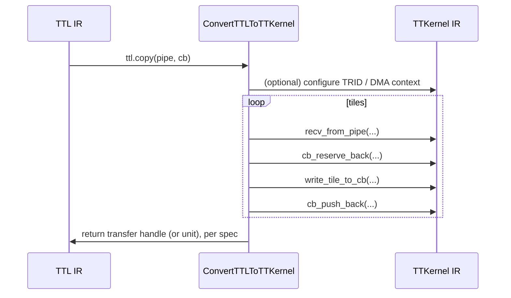
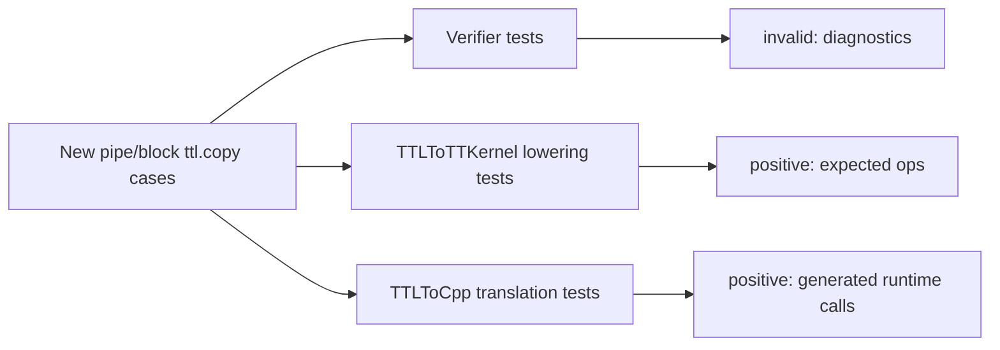

# Анализ Issue #88: поддержка `ttl.copy` для операндов pipe/block

Источник: `https://github.com/tenstorrent/tt-lang/issues/88`

## Кратко (что сейчас “не умеем”)

На текущий момент в TTL проверка (verification) и lowering операции `ttl.copy` поддерживают ограниченный набор типов операндов (в первую очередь тензоры и circular buffer). В Issue #88 требуется расширить:

- **Verification** (`lib/Dialect/TTL/IR/TTLOps.cpp:64`): разрешить и корректно валидировать варианты копирования, где один или оба операнда — **pipe** и/или **block**.
- **Lowering** (`lib/Dialect/TTL/Transforms/ConvertTTLToTTKernel.cpp`): генерировать корректный TTKernel (и дальнейший downstream) IR для новых комбинаций.

Желаемое состояние: copy с pipe/block становится “первоклассным” — легален в IR, типобезопасен и понижается без костылей.

## Термины (минимально)

- **Pipe**: типизированный канал коммуникации между producer/consumer (часто между ядрами/потоками).
- **Block**: структурная абстракция “блока”/буфера/области (точная семантика зависит от текущего дизайна TTL).
- **CB (circular buffer)**: hardware-visible circular buffer для тайлизованного data movement.

## Что должно получиться (deliverables)

- **Расширенная валидация IR**:
  - `ttl.copy` принимает pipe/block операнды (в разрешенных комбинациях).
  - Неразрешенные комбинации дают понятные diagnostics.
- **Расширенный lowering**:
  - Каждая новая легальная комбинация понижается в четко определенную последовательность TTKernel-операций.
- **Тесты**:
  - Позитивные тесты на каждую поддерживаемую комбинацию.
  - Негативные тесты `*_invalid.mlir` с `--verify-diagnostics`.

## Карта решений: что нужно определить перед реализацией

До того как писать код, нужно зафиксировать (в коде или в правилах verifier-а):

- **Направление (directionality)**: pipe/block может быть только источником, только назначением, или и тем и другим?
- **Тип/лейаут элемента**: как pipe/block несет layout-информацию (tile shape, dtype, memory space)?
- **Семантика синхронизации**: copy с pipe/block возвращает transfer handle (как tensor/CB) или является синхронным (без handle)?
- **Цель lowering-а**: pipe/block копирования понижаются в:
  - NOC async read/write напрямую?
  - последовательность CB ops (reserve/push/wait/pop)?
  - новый набор TTKernel ops?
  - runtime вызовы, которые видны уже на уровне EmitC/C++?

## Предлагаемая структура реализации

### 1) Verification: сделать легальность явной

Идея: иметь единое место, которое решает, легальна ли пара `(src_type, dst_type)`, и если нет — почему.

Mermaid: решение на верхнем уровне



Verification как минимум должен проверять:

- Совместимость dtype (например, `f16` -> `f16`, а `f16` -> `f32` только если явно разрешено).
- Совместимость tile/layout (если тип это кодирует).
- Ожидания по shape/tiling (single-tile vs multi-tile, и известна ли форма).
- Разрешенные роли pipe/block как src/dst.

### 2) Lowering: по одному “каноническому” lowering-у на каждый паттерн

Lowering удобнее организовать как таблицу паттернов (по одному на комбинацию), а не как большой вложенный `if`.

Черновая таблица (нужно финализировать после уточнения семантики pipe/block):

```text
tensor -> pipe    : pack tiles from tensor and send on pipe
pipe   -> tensor  : recv tiles from pipe and write into tensor
cb     -> pipe    : pop from CB and send on pipe
pipe   -> cb      : recv from pipe and push into CB
block  -> cb/tensor/pipe : depends on block meaning (needs explicit rule)
```

Mermaid: эскиз последовательности (пример: pipe -> CB)



### 3) План тестирования

Добавить новые conversion-тесты в:

- `test/ttlang/Conversion/TTLToTTKernel/` for TTKernel IR expectations.

Если пользовательская “видимая” форма результата для этих паттернов — это TTLToCpp translation, добавить покрытие в:

- `test/ttlang/Translate/TTLToCpp/`

Негативные тесты:

- Name files `*_invalid.mlir`.
- Use `--verify-diagnostics` and `expected-error` annotations.

Mermaid: как покрывать тестами



## Риски и типовые проблемы

- **Неясная семантика**: если смысл pipe/block не отражен в типах/attrs, verifier не сможет корректно проверять.
- **Частичный lowering**: если разрешить IR, но не уметь полностью понижать, ошибки “вылезут” в более поздних passes.
- **Потеря shape/layout**: если pipe/block не несет layout, lowering должен либо добавить явную метаинформацию, либо такие случаи запрещать.

## Предлагаемая разбивка на инкременты

- **Milestone A**: только verification (четко reject-ить и документировать разрешенные пары).
- **Milestone B**: один “тонкий вертикальный срез” end-to-end (например, `pipe -> cb`) + тесты.
- **Milestone C**: расширить таблицу на остальные пары + тесты на каждую.

