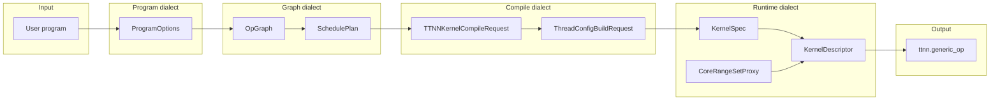

# Python dialect layers and data flow (LLD)

- **Статус**: актуально (LLD).
- **Аудитория**: разработчики Python API, планировщика, тестов.
- **Связанные документы**: [02_LLD_CompilerPipeline.md](02_LLD_CompilerPipeline.md) (MLIR TTL→TTKernel), [03_LLD_RuntimeAndPythonAPI.md](03_LLD_RuntimeAndPythonAPI.md).

## 1. Назначение

Документ фиксирует слои представления данных в Python-фреймворке tt-lang («диалекты») и трансформации между ними. Цель — явная граница между вводом пользователя, графом операций, компиляцией и рантаймом; все интерфейсы выражаются Pydantic-моделями (или прокси из ttnn_proxy) для однозначности и тестируемости.

Нижний компиляционный пайплайн (Python DSL → TTL IR → passes → TTKernel → EmitC → C++) описан в [02_LLD_CompilerPipeline.md](02_LLD_CompilerPipeline.md). Здесь — уровень Python-объектов до и после вызова этого пайплайна.

## 2. Слои (диалекты)

| Слой | Содержимое | Модули / типы |
|------|------------|----------------|
| **Program** | Что задаёт пользователь: grid, block_factors, objective, placement. | `ProgramOptions`, `ProgramConfig`; декоратор `@ttl.program`. |
| **Graph** | Внутреннее представление программы как граф операций и план размещения. | `OpGraph`, `OpNode`, `Topology`, `SchedulePlan` (scheduler); док 12, фазы 3–4 roadmap. |
| **Compile** | Всё для одной компиляции: module, args, grid, thread_tensor_indices, опции. | `TTNNKernelCompileRequest`, `ThreadConfigBuildRequest`, `KernelWriteRequest`, `ComputeDescriptorBuildContext`; результат — MLIR module, kernel paths, `CompiledTTNNKernel`. |
| **Runtime** | Что уходит в ttnn: дескрипторы ядер, CB, CoreRangeSet, запуск. | `KernelSpec`, ttnn_proxy (ComputeConfigDescriptor, Reader/Writer, CoreRangeSet); `build_kernel_descriptors`, `build_cb_descriptors`, `run_kernel_on_device`. |

## 3. Data flow (диаграмма)

## 4. Реестр трансформаций

| From | To | Реализация (код) |
|------|----|-------------------|
| User program | ProgramOptions | Декоратор `@ttl.program`, валидация ProgramOptions. |
| ProgramOptions | TTNNKernelCompileRequest | pykernel_gen → module, затем сборка compile_req в ttl_api. |
| (OpGraph) SchedulePlan | grid / program_config | Планировщик (заглушка) → grid, placement. |
| TTNNKernelCompileRequest | CompiledTTNNKernel | `_compile_ttnn_kernel(req)`. |
| ThreadConfigBuildRequest | (config, entries) | `_build_config_for_thread(request)` → descriptor_options + ttnn_proxy. |
| CompiledTTNNKernel + tensors | run | `kernel_runner.build_*_descriptors`, `run_kernel_on_device`. |

Входы и выходы трансформаций — только Pydantic-типы или типы из ttnn_proxy.

## 5. Реестр Python-диалектов

- **Program**: ProgramOptions, ProgramConfig.
- **Graph**: OpGraph, OpNode, Topology, SchedulePlan.
- **Compile**: TTNNKernelCompileRequest, ThreadConfigBuildRequest, KernelWriteRequest, ComputeDescriptorBuildContext, TTNNKernelCompileOptions.
- **Runtime**: KernelSpec, дескрипторы через ttnn_proxy (ComputeConfigProxy/Resolved, ReaderConfigProxy, WriterConfigProxy, CoreCoordProxy, CoreRangeProxy, CoreRangeSetProxy).

Реестр исполнительных Python-диалектов ведётся отдельно от документационного пайплайна (Doc–MLIR–GraphDB, диалект ttm.sdlc_doc). Регистрация: в этом документе и при необходимости в `.cursor/artifacts_mlir_graphdb` или `docs/sdlc/_KG_MLIR` для прослеживаемости.
