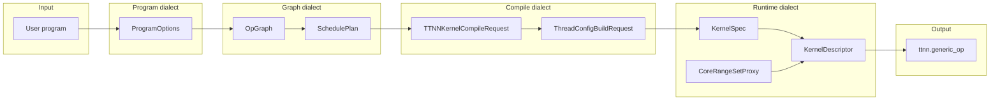

# Python dialect layers and data flow (LLD)

- **Статус**: актуально (LLD).
- **Аудитория**: разработчики Python API, планировщика, тестов.
- **Связанные документы**: [02_LLD_CompilerPipeline.md](02_LLD_CompilerPipeline.md) (MLIR TTL→TTKernel), [03_LLD_RuntimeAndPythonAPI.md](03_LLD_RuntimeAndPythonAPI.md), [18_ideal_ux_and_layer_responsibilities.md](../00_Ideas/18_ideal_ux_and_layer_responsibilities.md) (идеальный UX, user/framework/engine). Идеальный data flow и целевая модульная структура: [20_IdealDataFlowAndModuleStructure.md](20_IdealDataFlowAndModuleStructure.md).

## 1. Назначение

Документ фиксирует слои представления данных в Python-фреймворке tt-lang («диалекты») и трансформации между ними. Цель — явная граница между вводом пользователя, графом операций, компиляцией и рантаймом; все интерфейсы выражаются Pydantic-моделями (или прокси из ttnn_proxy) для однозначности и тестируемости.

**Целевой UX (идеальный код первым):** пользователь думает только «что считать» и «с какими параметрами запустить»; фасад `ttl.run(spec, *args)` или `ttl.run(program, *args, grid=...)` скрывает сборку request'ов, компиляцию и запуск. См. [18_ideal_ux_and_layer_responsibilities.md](../00_Ideas/18_ideal_ux_and_layer_responsibilities.md).

**Опциональный конфиг планировщика:** при включённом `use_scheduler` вызов `run(..., engine_config_path=...)` или `run(..., engine_config=AbstractEngineConfig)` задаёт бэкенд и топологию: для бэкенда tenstorrent используется `topology_grid` из конфига (если задан), иначе grid из программы; для бэкенда toy_shops/toy_bakeries выполняется `schedule_toy_stub` по графу и топологии из конфига. См. [20_nickel_mlir_config_abstract_engine.md](../00_Ideas/20_nickel_mlir_config_abstract_engine.md).

**Один фокус при чтении:** в пользовательском коде — только kernel и run; в слое Program — только grid и опции; в Compile — только spec → артефакты; в Runtime — только артефакты → запуск. Границы между слоями — только Pydantic-типы (request/response).

**Валидация только в Pydantic:** проверки входов/выходов слоёв выполняются **только в Pydantic-моделях** (field_validator, model_validator). В бизнес-логике (ttl_api, kernel_runner, _compile_ttnn_kernel и т.п.) не вызывают отдельные функции validate_*; контракты обеспечиваются при построении/валидации request/response моделей.

**Reader/Compute/Writer** — один из паттернов размещения внутри движка (Compile/Runtime), а не ось слоёв API; пользователь не обязан знать типы тредов. Лучшие раскладки вычислений могут быть другими.

Нижний компиляционный пайплайн (Python DSL → TTL IR → passes → TTKernel → EmitC → C++) описан в [02_LLD_CompilerPipeline.md](02_LLD_CompilerPipeline.md). Здесь — уровень Python-объектов до и после вызова этого пайплайна.

## 2. Слои (диалекты)

| Слой | Содержимое | Модули / типы |
|------|------------|----------------|
| **Program** | Что задаёт пользователь: grid, block_factors, objective, placement. Иерархия запроса компиляции: per-invocation + опции декоратора. | `ProgramOptions`, `ProgramConfig`, `KernelCompileRequest` (root: grid, program_hash, indexing_maps, iterator_types; nested: `options: ProgramOptions`); декоратор `@ttl.program`. |
| **Graph** | Внутреннее представление программы как граф операций и план размещения. | `OpGraph`, `OpNode`, `Topology`, `SchedulePlan` (scheduler); док 12, фазы 3–4 roadmap. |
| **Compile** | Всё для одной компиляции: request в _compile_kernel, module, args, grid, thread_tensor_indices, опции; source info по тредам. | `KernelCompileRequest`, `TTNNKernelCompileRequest`, `ThreadConfigBuildRequest`, `KernelWriteRequest`, `ComputeDescriptorBuildContext`, `TTNNKernelCompileOptions`, `ThreadSourceInfo`; `_compile_kernel(f, args, kwargs, request)`, `_collect_source_info_from_threads(threads)`; результат — MLIR module, kernel paths, `CompiledTTNNKernel`. |
| **Runtime** | Что уходит в ttnn: дескрипторы ядер, CB, CoreRangeSet, запуск. | `KernelSpec`, ttnn_proxy (ComputeConfigDescriptor, Reader/Writer, CoreRangeSet); `build_kernel_descriptors`, `build_cb_descriptors`, `run_kernel_on_device`. |

## 3. Data flow (диаграмма)

## 4. Реестр трансформаций

| From | To | Реализация (код) |
|------|----|-------------------|
| User program | ProgramOptions | Декоратор `@ttl.program`, валидация ProgramOptions. |
| ProgramOptions + per-invocation | KernelCompileRequest | pykernel_gen строит `KernelCompileRequest(grid, program_hash, indexing_maps, iterator_types, options)` и вызывает `_compile_kernel(f, args, kwargs, request)`. |
| KernelCompileRequest | (threads, module, …) | `_compile_kernel(request)` → компиляция тредов; source info через `_collect_source_info_from_threads(compiled_threads)` по `ct.source_info` (ThreadSourceInfo). |
| (internal) compiled_threads | all_source_files / all_source_lines / kernel_line_offsets | `_collect_source_info_from_threads(threads)` — по `ct.name` и `ct.source_info` (ThreadSourceInfo). |
| ProgramOptions / module path | TTNNKernelCompileRequest | pykernel_gen → module, затем сборка compile_req в ttl_api. |
| (OpGraph) SchedulePlan | grid / program_config | Планировщик (заглушка) → grid, placement. |
| TTNNKernelCompileRequest | CompiledTTNNKernel | Валидация request (тензоры TTNN, число ядер) — в TTNNKernelCompileRequest (model_validator). `_compile_ttnn_kernel(req)`. |
| ThreadConfigBuildRequest | (config, entries) | `_build_config_for_thread(request)` → descriptor_options + ttnn_proxy. |
| CompiledTTNNKernel + tensors | run | `kernel_runner.build_*_descriptors`, `run_kernel_on_device`. |

Входы и выходы трансформаций — только Pydantic-типы или типы из ttnn_proxy.

## 5. Реестр Python-диалектов

- **Program**: ProgramOptions, ProgramConfig, KernelCompileRequest (иерархия: root + options: ProgramOptions).
- **Graph**: OpGraph, OpNode, Topology, SchedulePlan.
- **Compile**: KernelCompileRequest, TTNNKernelCompileRequest, ThreadConfigBuildRequest, KernelWriteRequest, ComputeDescriptorBuildContext, TTNNKernelCompileOptions, ThreadSourceInfo; хелперы `_compile_kernel(f, args, kwargs, request)`, `_collect_source_info_from_threads(threads)`; TTLGenericCompiler.source_info → ThreadSourceInfo.
- **Runtime**: KernelSpec (Pydantic), дескрипторы через ttnn_proxy (ComputeConfigProxy/Resolved, ReaderConfigProxy, WriterConfigProxy, CoreCoordProxy, CoreRangeProxy, CoreRangeSetProxy).

Внутренние типы на границах слоёв приведены к Pydantic: ThreadWrapperView, CompilerContext (ttl_ast), KernelSpec (kernel_runner), TTNNLayoutConfig (layouts) — все BaseModel; ProgramSpec и run(spec, *args) — фасад идеального UX (см. 18_ideal_ux_and_layer_responsibilities.md). Модуль ttl.layers реэкспортирует типы по слоям для одного фокуса при чтении.

Реестр исполнительных Python-диалектов ведётся отдельно от документационного пайплайна (Doc–MLIR–GraphDB, диалект ttm.sdlc_doc). Регистрация: в этом документе и при необходимости в `.cursor/artifacts_mlir_graphdb` или `docs/sdlc/_KG_MLIR` для прослеживаемости.

## 6. Целевое направление (proxy / ttnn boundary)

Для каждой примитивной сущности, которую tt-lang передаёт в ttnn (DataType, дескрипторы, CoreRange и т.д.), целевая модель: **Pydantic-прокси или обёртка с методом `.to_ttnn()`**, разрешающая тип на границе вызова. Валидация и сериализация — в Pydantic; флаги дескрипторов (например `fp32_dest_acc_en`) задаются через post-validation или фабричные методы, без ручного перечисления в вызывающем коде.
