# Идеальный data flow и модульная структура (видение без ограничений)

- **Статус**: актуально (видение + целевая структура).
- **Аудитория**: разработчики Python API, планировщика, тестов.
- **Связанные документы**: [08_PythonDialectLayersAndDataFlow.md](08_PythonDialectLayersAndDataFlow.md) (реестры слоёв и трансформаций), [18_ideal_ux_and_layer_responsibilities.md](../00_Ideas/18_ideal_ux_and_layer_responsibilities.md), [11_future_framework_vision.md](../00_Ideas/11_future_framework_vision.md), [13_architecture_impact_and_refactor_vision.md](../00_Ideas/13_architecture_impact_and_refactor_vision.md).

## 1. Назначение

Документ фиксирует **идеальное** выражение потока данных в tt-lang без ограничений: от пользовательского вызова до выполнения на устройстве. Цель — единая точка входа, явные слои с Pydantic-контрактами и модульная структура кода по образцу PyTorch. Сначала документация и примеры; рефакторинг кода выполняется после согласования.

## 2. Сравнение с PyTorch

| Аспект | PyTorch | tt-lang (целевой идеал) |
|--------|---------|--------------------------|
| Пользовательский ввод | Тензоры + операции (`y = x + z`) или модель (`model(x)`). | «Что считать» (kernel/program) + «с какими параметрами» (grid, memory, objective). |
| Единая точка входа | `tensor.backward()`, `model(x)`, `optimizer.step()`. | `ttl.run(program, *args, grid=...)` или `ttl.run(spec, *args)`. |
| Слои | Frontend (Python) → Dispatcher → Backend kernels; nn.Module / autograd / execution изолированы. | Program (intent) → Graph (op graph, schedule) → Compile (request → MLIR → artifacts) → Runtime (descriptors → device). |
| Модульность | `torch`, `torch.nn`, `torch.autograd`; чёткое разбиение по пакетам. | Один фокус на слой; только Pydantic-типы на границах; переиспользуемые примитивы (DM, compute, sync). |
| Структура кода | Понятное дерево: `torch/`, `nn/`, `csrc/`. | Целевое дерево: фасад + подмодули по слоям (program / graph / compile / runtime). |

Итог: минимум точек входа, максимум декларативности, слои с явными контрактами (request/response).

## 3. Идеальный data flow (без ограничений)

Поток данных от пользователя до `ttnn.generic_op`:

1. **User** вызывает `ttl.run(program, *args, grid=...)` или `ttl.run(spec, *args)`.
2. **Program** — намерение пользователя превращается в `ProgramSpec` и далее в `KernelCompileRequest` (grid, program_hash, indexing_maps, iterator_types, options).
3. **Graph** (опционально) — программа как граф операций и план размещения (`OpGraph`, `SchedulePlan`); пока планировщик — заглушка, слой тонкий.
4. **Compile** — `KernelCompileRequest` → компиляция тредов → `TTNNKernelCompileRequest` → `CompiledTTNNKernel` (MLIR, kernel paths, дескрипторы).
5. **Runtime** — артефакты компиляции → `KernelSpec`, CB-дескрипторы, `CoreRangeSet` → `build_kernel_descriptors` / `build_cb_descriptors` → `run_kernel_on_device` → `ttnn.generic_op`.

Границы между слоями — только Pydantic-модели (или прокси с `.to_ttnn()`). Reader/Compute/Writer — внутренний паттерн движка (Compile/Runtime), а не ось API; пользователь не обязан знать типы тредов.

```mermaid
flowchart LR
  subgraph User ["User"]
    Run["ttl.run(program, *args, grid=...)"]
  end
  subgraph Program ["Program layer"]
    Spec["ProgramSpec"]
    Req["KernelCompileRequest"]
  end
  subgraph Graph ["Graph layer"]
    OpGraph["OpGraph"]
    SchedPlan["SchedulePlan"]
  end
  subgraph Compile ["Compile layer"]
    TTNNReq["TTNNKernelCompileRequest"]
    Compiled["CompiledTTNNKernel"]
  end
  subgraph Runtime ["Runtime layer"]
    KernelSpec["KernelSpec"]
    Desc["KernelDescriptor"]
    Exec["run_kernel_on_device"]
  end
  subgraph Output ["Output"]
    GenericOp["ttnn.generic_op"]
  end
  Run --> Spec
  Spec --> Req
  Req --> OpGraph
  OpGraph --> SchedPlan
  SchedPlan --> TTNNReq
  TTNNReq --> Compiled
  Compiled --> KernelSpec
  KernelSpec --> Desc
  Desc --> Exec
  Exec --> GenericOp
```



## 4. Примеры идеального использования

### 4.1 Elementwise add: одна строка запуска

Пользователь думает только «что считать» и «с какими параметрами». Вариант с явным grid:

```python
@ttl.program(grid=(2, 2))
def add_kernel(lhs, rhs, out):
    # ... CB, @ttl.compute(), @ttl.datamovement() ...
    pass

# Идеал: один вызов (program + args + grid)
ttl.run(add_kernel, lhs, rhs, out, grid=(2, 2))
```

### 4.1.1 Lambda и вывод (целевой UX, в видении)

Желательно принимать в `run()` не только программу (декорированную `@ttl.program`), но и **лямбду**, и выводить всё по её параметрам и возвращаемому значению:

```python
# Целевой вариант: lambda + полный вывод
ttl.run(lambda lhs, rhs: lhs + rhs, lhs, rhs)
# Фреймворк выводит: операция = elementwise add, формы из lhs/rhs, grid из форм/топологии,
# выход (out) из возвращаемого типа или аллокации по контракту.
```

Вывод по лямбде предполагает:

- **Параметры**: типы и формы аргументов (тензоры) задают число входов, dtype, shape; по ним можно вывести tiling и grid (например, из tile layout и размера сетки).
- **Возвращаемое значение**: тип/форма результата задаёт выходной буфер; при необходимости фреймворк сам выделяет out и подставляет его в программу (или трактует лямбду как спецификацию операции и строит программу с одним выходом).

Реализация потребует: диспетчеризацию по типу операции (elementwise, matmul, reduction, …), построение программы (DM + compute) из высокоуровневой спецификации, вывод grid/options из тензоров и политик. Пока поддерживается только вызов `run(program, *args, grid=...)` для программы, задекорированной `@ttl.program`; передача «сырой» лямбды приводит к понятной ошибке с отсылкой к этому разделу.

Вариант через Spec (явные данные для компиляции и запуска):

```python
spec = ttl.ProgramSpec(
    program=add_kernel,
    grid=(2, 2),
    options=ttl.ProgramOptions(memory_space="L1", tiled=True),
)
ttl.run(spec, lhs, rhs, out)
```

Внутри `run`: spec → KernelCompileRequest → compile → run_kernel_on_device. Никакой ручной сборки request'ов в пользовательском коде.

### 4.2 Elementwise add: декларативный целевой вариант (направление)

Долгосрочное направление — пользователь задаёт только семантику и формы; grid/CB/число потоков выводит фреймворк:

```python
@ttl.program(placement="auto", objective="latency")
def add(lhs: ttnn.Tensor, rhs: ttnn.Tensor) -> ttnn.Tensor:
    return lhs + rhs  # фреймворк строит граф, размещает
```

Такой API требует вывода grid и материализации графа операций; пока в видении, не в текущем API.

### 4.3 Tiled matmul: декларативное описание

Текущий стиль: явные grid, циклы по k/m/n, семафоры, два DM-ядра и один compute. Целевой вариант (иллюстрация):

```python
@ttl.program(tile=(32, 32), placement="auto", objective="throughput")
def matmul(lhs, rhs):
    return ttl.matmul(lhs, rhs, tile=(32, 32))
```

Запуск — один вызов `ttl.run(matmul, lhs, rhs, out)` с тензорами. Tiling и grid выводятся или задаются опциями.

### 4.4 Multicore: один program, grid из опций

```python
@ttl.program(grid=(4, 4), memory_space="L1")
def multicore_add(lhs, rhs, out):
    # ... описание через CB и треды ...
    pass

ttl.run(multicore_add, lhs, rhs, out)
```

Grid и память заданы в декораторе; фреймворк строит KernelCompileRequest и прогоняет Compile → Runtime.

### 4.5 Композиция из маленьких модулей (направление)

По аналогии с PyTorch `nn.Sequential`: элементарные DM-шаги, compute-шаги и синхронизация определяются отдельно и собираются в программу. Фреймворк обеспечивает согласованные сигнатуры и подстановку в общую программу. Конкретный API композиции — в видении (док. 11, 13); текущий API — один program с несколькими `@ttl.compute()` / `@ttl.datamovement()`.

## 5. Устройство внутри фреймворка

### 5.1 Слой → типы (Pydantic) → ключевые функции/модули

| Слой | Типы (Pydantic) | Ключевые функции / модули |
|------|-----------------|---------------------------|
| Program | ProgramOptions, ProgramSpec, KernelCompileRequest | Декоратор `@ttl.program`, `run(spec, *args)`, построение KernelCompileRequest из spec и args. |
| Graph | OpGraph, OpNode, Topology, SchedulePlan | scheduler/ (op_graph, topology, scheduler_stub); планировщик пока заглушка. |
| Compile | KernelCompileRequest, TTNNKernelCompileRequest, ThreadConfigBuildRequest, TTNNKernelCompileOptions, ThreadSourceInfo | ttl.compile.pipeline: _compile_kernel(f, args, kwargs, request), _compile_ttnn_kernel(req); ttl.compile.validation; descriptor_options; ttl_ast (TTLGenericCompiler). |
| Runtime | KernelSpec, KernelDescriptorBuildRequest, CBDescriptorBuildRequest, RunKernelRequest | ttl.runtime.runner: build_kernel_descriptors, build_cb_descriptors, run_kernel_on_device; ttl.kernel_runner — тонкий реэкспорт. |

Реестр трансформаций «From → To → Реализация» приведён в [08_PythonDialectLayersAndDataFlow.md](08_PythonDialectLayersAndDataFlow.md) (§4); здесь не дублируется.

### 5.2 Reader/Compute/Writer

Reader/Compute/Writer — один из паттернов размещения внутри движка (Compile/Runtime), а не ось слоёв API. Пользователь описывает программу; фреймворк при необходимости раскладывает её на треды и дескрипторы по этому паттерну.

## 6. Целевая структура по папкам и файлам

Рекомендуется **вариант B** (минимальный сдвиг, пошаговый рефакторинг): фасад остаётся в `ttl_api.py`, логика выносится в подмодули по слоям с чётким разграничением и реэкспортом в `ttl/__init__.py` и `ttl/layers.py`.

Целевая схема:

| Путь | Слой | Содержимое |
|------|------|------------|
| `python/ttl/ttl_api.py` | Фасад | `run`, `pykernel_gen` (kernel/program), `ProgramSpec`, `KernelCompileRequest`, декораторы compute/datamovement; импорт из program/, compile/, runtime/, graph/. |
| `python/ttl/program/` | Program | ProgramOptions, ProgramSpec, KernelCompileRequest, построение request из spec и args. |
| `python/ttl/graph/` | Graph | Реэкспорт OpGraph, SchedulePlan, Topology из scheduler/; при необходимости алиас scheduler → graph. |
| `python/ttl/compile/` | Compile | pipeline.py: _compile_kernel, _compile_ttnn_kernel; validation.py: валидация TTNN/модуля; TTNNKernelCompileRequest, ThreadConfigBuildRequest; импорт descriptor_options, ttl_ast. |
| `python/ttl/runtime/` | Runtime | runner.py: KernelSpec, build_kernel_descriptors, build_cb_descriptors, run_kernel_on_device; kernel_runner.py — тонкий реэкспорт из ttl.runtime для совместимости. |
| `python/ttl/boundary/` | Boundary | ttnn_types.py (Protocols), mlir_types.py (MlirModuleLike); типы на границе с ttnn/MLIR; Any только в ttnn_proxy. |
| `python/ttl/layers.py` | Реэкспорт | Типы по слоям для одного фокуса при чтении (как сейчас). |

Общая структура каталогов (после рефакторинга):

```
python/ttl/
  __init__.py       # публичный API пакета
  ttl_api.py        # фасад (run, pykernel_gen, декораторы)
  layers.py         # реэкспорт типов по слоям
  program/          # ProgramOptions, ProgramSpec, RunRequest, ProgramDecoratorParams, KernelCompileRequest
  graph/            # OpGraph, SchedulePlan, Topology (реэкспорт scheduler)
  compile/          # pipeline (_compile_kernel, _compile_ttnn_kernel), validation
  runtime/          # runner (KernelSpec, build_*_descriptors, run_kernel_on_device); kernel_runner — реэкспорт
  boundary/         # ttnn_types, mlir_types (типы на границе с ttnn/MLIR)
  scheduler/        # текущая реализация графа (op_graph, topology, ...)
  _src/             # ttl_ast, tensor_registry, auto_profile
  ...
```

Вариант A (полное разбиение: отдельный `api/` с run и Spec) возможен на следующем шаге; для первого рефакторинга достаточно варианта B.

## 7. Гибкая модульная система

- **Примитивы**: элементарные DM-, compute- и sync-модули, собираемые в программу. Библиотека переиспользуемых примитивов и реестр/фабрики (по аналогии с док. 17 для планировщика) — по мере появления требований (док. 11, 13).
- **Расширяемость**: добавление нового типа thread или дескриптора без правки ядра фасада — через опции и прокси с `.to_ttnn()` на границе с ttnn.
- **Модульность в духе PyTorch**: сборка из маленьких блоков, понятный код пользователя и фреймворка, тестируемость изолированных единиц. См. [11_future_framework_vision.md](../00_Ideas/11_future_framework_vision.md) (§5).

## 8. Дальнейшие шаги

1. Согласовать документ и целевую структуру папок.
2. Обновить [08_PythonDialectLayersAndDataFlow.md](08_PythonDialectLayersAndDataFlow.md), [Direction.md](../00_Status/Direction.md), [00_projects_graph.md](../../01_tt_metal/00_Status/00_projects_graph.md) ссылками на этот документ.
3. Рефакторинг: Фаза 1 — вынос program/, compile/, runtime/, graph/ с сохранением фасада в ttl_api.py и зелёных тестов.
4. Фаза 2 — проверка контрактов между слоями (только Pydantic на границах) и тесты по слоям.
5. Фаза 3 (опционально) — примитивы и композиция по мере требований.
