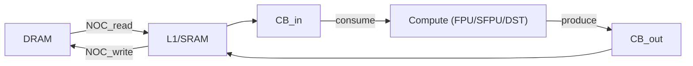
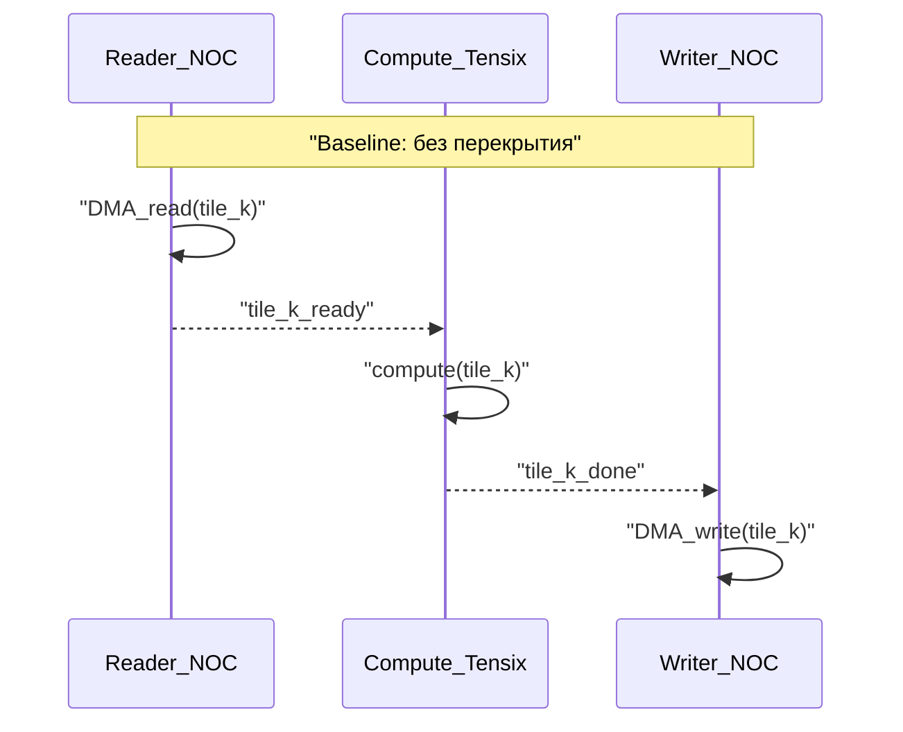
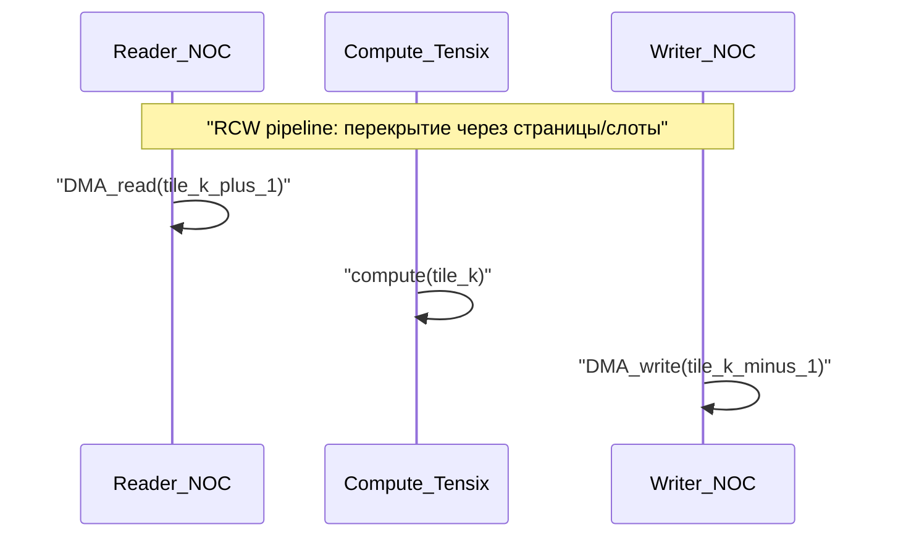
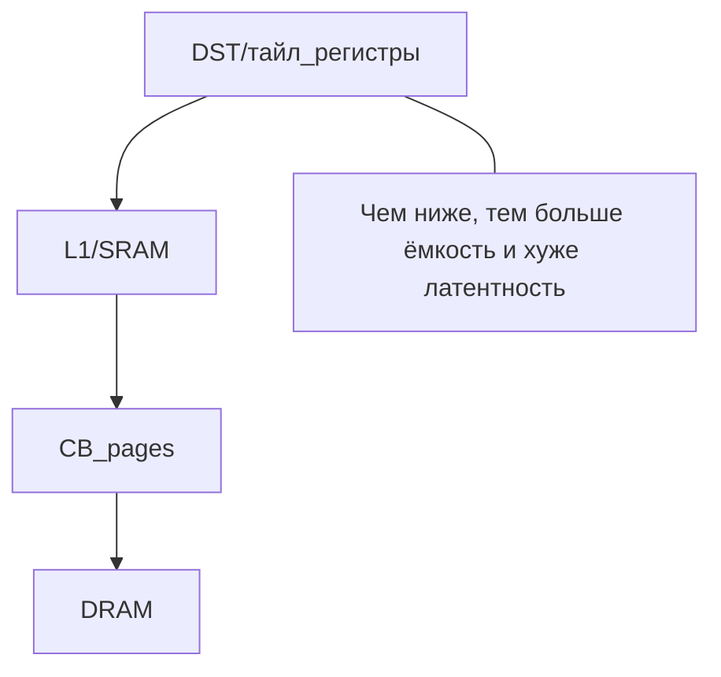

# Протаскивание данных через пайплайн как задача маршрутизации по графу ресурсов

## Зачем этот документ (и чем он отличается от `08_reader_compute_writer_pipeline.md`)

В `docs/solutions/08_reader_compute_writer_pipeline.md` уже описана “классика” **Reader/Compute/Writer** и почему конвейеризация через страницы **CB** помогает перекрывать **NOC/DMA** и compute.

Этот документ дополняет тему другой полезной “оптикой”:

- есть **граф вычислений/данных** (что нужно сделать),
- есть **граф ресурсов/интерконнекта** (где это можно сделать и как возить данные),
- а оптимизация превращается в задачу “логистики”: как **маршрутизировать** поток тайлов/страниц по ресурсам так, чтобы:
  - уменьшить простой compute,
  - не упереться в NOC contention,
  - не взорвать peak memory (DST/L1/CB),
  - и при этом сохранить корректность зависимостей.

Это же удобно объяснять “аналогией города”: **данные = машинки**, **NOC = дороги**, **очереди/каналы = полосы**, **CB/L1 = парковки/перевалочные пункты**, **compute = районы, где производится работа**.

## Две карты: DAG и граф ресурсов

### Карта 1: DAG вычислений/данных (что нужно посчитать)

На верхнем уровне компилятор/пайплайн выбирает необходимые “узлы” (операции/примитивы), чтобы получить требуемый результат. Это удобно думать как **DAG**, где ребра — зависимости по данным.

Пример (упрощенно): “протащить вход через вычислительный примитив и получить выход”.


### Карта 2: Граф ресурсов и интерконнекта (где это исполняется)

Даже если DAG фиксирован, остаётся вопрос: **где живут данные** и **как они перемещаются** между уровнями памяти и вычислителями.

Минимальная “карта ресурсов” для рассуждений о конвейеризации:



Важно: на реальном железе это не одна “дорога” и не один “канал”. Даже если не моделировать всё детально, полезно помнить про:

- отдельные направления read/write,
- ограниченную capacity (DST регистры, L1, CB pages),
- очереди и contention (несколько потоков конкурируют за NOC).

## “Города и трафик”: почему проблема сложнее, чем “выбрать порядок”

Представим, что **каждый тайл** (или “страница”) должен пройти путь:

1) быть прочитанным (DRAM -> NOC -> L1/CB),
2) быть обработанным compute,
3) быть записанным (CB/L1 -> NOC -> DRAM).

Если делать всё строго последовательно, получается “однополосная улица”, где машинки едут по очереди.



Конвейеризация — это попытка сделать так, чтобы:

- пока compute обрабатывает `tile_k`, reader уже подвозил `tile_k+1`,
- а writer уже сливал `tile_k-1`.



Но это перекрытие не “магия”: оно начинает работать только если:

- есть **буферизация** (хотя бы 2 слота/страницы),
- синхронизация **точечная** (ждём то, что нужно сейчас, а не “всё сразу”),
- ресурсы реально могут выполняться параллельно (или хотя бы эффективно чередоваться).

## Пайплайнинг как частный случай маршрутизации

Можно представить общий шаблон: “маршрутизировать поток тайлов через ресурсы так, чтобы они не стояли в пробках”.

Сценарии, которые уже удобно обсуждать (и которые есть как микро‑симуляция в `tools/scheduling_sim`):

- **baseline**: нет перекрытия (DMA -> wait -> compute),
- **ping-pong**: два слота (prefetch следующего слота параллельно compute),
- **RCW baseline**: reader/compute/writer фазами (слабое перекрытие),
- **RCW pipeline**: reader/compute/writer параллельно через страницы CB.

Связка с репозиторием:

- описание и запуск: `tools/scheduling_sim/README.md`
- логика сценариев: `tools/scheduling_sim/scenarios.py` (там есть и ping-pong, и RCW baseline/pipeline).

## Примеры мотивации (на уровне “что происходит”)

Здесь важно: ниже не про конкретные реализации, а про типовую структуру движения данных.

### Пример 1: unsqueeze как “переразметка” потока данных

В терминах “протаскивания” unsqueeze часто ближе к “перевезти/переупаковать/переинтерпретировать”, чем к тяжёлому compute.

Типовая картина:

- входные тайлы читаются пачками,
- происходят недорогие преобразования адресации/страйдов/укладки,
- выходные тайлы записываются.

Если compute дешёвый, выигрывает стратегия:

- держать NOC загруженным,
- не провоцировать лишние барьеры,
- выбирать batch/страницы так, чтобы amortize overhead, но не раздувать peak memory.

### Пример 2: dropout как “compute‑узел в середине потока”

Dropout удобно мыслить как “есть поток тайлов, к каждому надо применить примитив (например, LLK‑уровня), и получить выход”.

С точки зрения маршрутизации:

- reader старается держать input готовым заранее,
- compute не должен простаивать,
- writer не должен отставать так, чтобы заполнить `CB_out`.


## Что именно является “стоимостью” (и где появляются пробки)

Набор типичных ограничений/стоимостей, которые полезно держать в голове:

- **Емкости**:
  - DST/тайл‑регистры: очень мало, очень быстро.
  - L1/SRAM: мало, быстро.
  - CB: быстро, ограничено страницами и правилами reserve/push/pop.
  - DRAM: много, медленно.
- **Пропускная способность**:
  - NOC read/write ограничены; часто конкурируют несколько потоков.
- **Зависимости**:
  - compute может стартовать, только когда нужная страница CB готова.
- **Синхронизация**:
  - ожидания “на всё” убивают конвейер; ожидания “на конкретный кусок” поддерживают перекрытие.

Схема “куда можно выталкивать/перекладывать данные”, если не хватает быстрых уровней:



## Как связать это с измерениями и симуляцией

Поскольку “пробки” и contention сложно оценить на глаз, удобный инженерный подход:

1) начать с простой микро‑модели (дискретно‑событийной),
2) калибровать параметры по измерениям,
3) итеративно менять глубину пайплайна, batch и политику prefetch/flush.

В репозитории есть небольшой симулятор:

```bash
cd /home/kilka/Projects/ML/TT-NN/tt-lang
source build/env/activate

# В README описано, как поставить dev-зависимости (salabim)
# и как запускать сценарии:
python -m tools.scheduling_sim.run --scenario all
```

Что полезно смотреть (даже в микро‑модели):

- `t_end` (makespan),
- `compute_idle` (сколько простаивает compute),
- `nocR_busy` / `nocW_busy`,
- максимальные уровни CB (`cb_in_max_level`, `cb_out_max_level`).

## Как “улучшать карту”: что тюнится на практике

Типовые “ручки”, которые часто дают эффект:

- глубина конвейера: `buffer_factor` / число страниц CB,
- гранулярность: “по тайлу” vs “по блоку тайлов”,
- политика prefetch: насколько заранее заполнять следующий слот,
- ограничения на in-flight перемещения (чтобы не вызвать лавину contention),
- выбор где держать intermediate (L1/CB vs spill в DRAM).

## Следующий шаг (как идея, без реализации): поиск и обучение

Если смотреть на это как на “маршрутизацию по графу”, естественно появляются варианты:

- поиск по состояниям (beam/time-aware) с оценкой:
  - peak memory,
  - predicted makespan,
  - штрафы за ожидания/пробки,
- обучаемые подсказки (policy/value), где модель направляет поиск к хорошим стратегиям.

Но важно: в компиляторе часто хочется сохранять детерминизм. Поэтому практичная схема обычно такая:

- симуляция и/или RL помогают **найти** хорошую эвристику/политику,
- а в production фиксируется компактная детерминированная логика и набор калиброванных параметров.

## Короткий вывод

Reader/Compute/Writer pipeline — это полезная “форма” реализации.
А “протаскивание данных” шире: это задача **маршрутизации** потока тайлов по графу ресурсов с учетом емкостей, зависимостей и contention.

Когда мыслить так, становится проще:

- объяснять, почему конвейер иногда “не взлетает” (пробки/переполнения/неправильная гранулярность),
- формулировать, что именно нужно измерять,
- и понимать, какие параметры действительно стоит тюнить.
