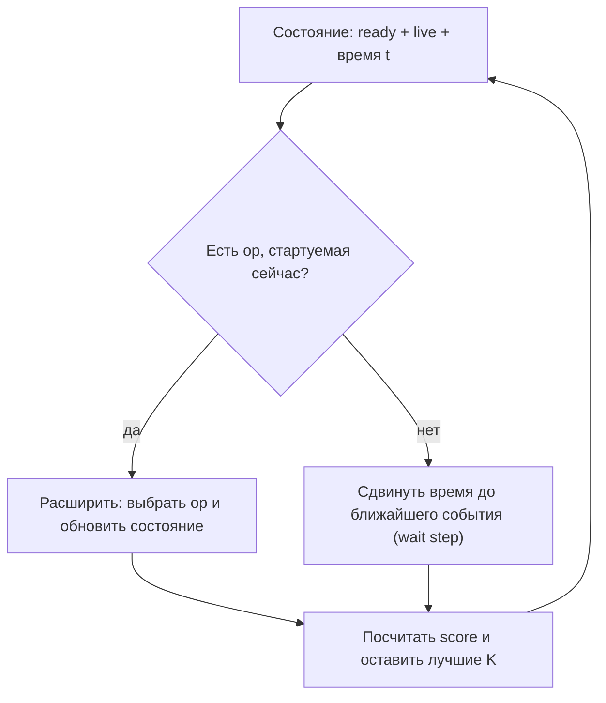
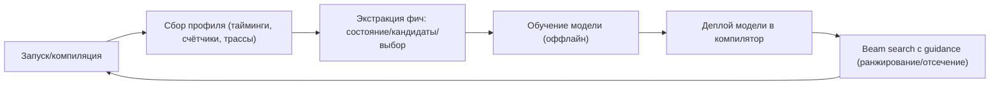

# Адаптивное планирование по runtime-данным (beam search + модель задержек + онлайн-обучение)

## Идея

Если задача Phase 0 (перестановка независимых операций для снижения DST pressure и количества копий) решается через beam search, то beam можно усиливать **моделью времени** и **моделью выбора**:

- **Модель времени (latency / timing model)**: приближённо симулирует, когда операции реально “готовы” по времени (NOC, CB, DST регистры, Tensix pipeline).
- **Модель выбора (policy / cost model)**: подсказывает beam search, какие ветки расширять и какие операции выбирать в `ready`.

Ключевой мотив: для Tensix/NOC многие задержки достаточно предсказуемы (или стабильно измеряемы), поэтому можно вести “фронт времени” и оценивать не только “pressure”, но и **ожидаемую готовность данных** и **простаивания**.

## Термин (как это обычно называется)

То, что описано как “улучшать алгоритм по данным, собранным при реальном запуске”, обычно относят к:

- **Profile-Guided Optimization (PGO)** / **Feedback-Directed Optimization (FDO)**: оптимизация на основе профиля.
- **Autotuning**: автоподбор параметров/стратегий по измерениям.
- **Online learning / contextual bandits / RL**: если модель обновляется во время эксплуатации.

Здесь можно начать с “простого” PGO/FDO и только потом двигаться к online learning.

## Что именно можно моделировать

### 1) “Фронт времени”

Для каждого ресурса/события поддерживать “когда он станет доступен”:

- **CB**: когда можно `cb_reserve_back`, когда данные появятся на чтение (`cb_wait_front` удовлетворится).
- **NOC DMA**: время старта/завершения асинхронного read/write (по TRID или по каналу).
- **DST**: когда регистры освобождаются (после последнего использования и после `tile_regs_release` / синхронизаций).
- **Compute pipeline**: базовые константные задержки на tile-op (или табличные).

Минимальная модель: “операция занимает фиксированное время + блокируется, пока готовы входы/ресурсы”.

### 2) Ограничения ресурсов (resource constraints)

Даже если SSA-зависимости разрешают выполнить op, она может быть “не готова” по ресурсам:

- заняты CB slots,
- DMA канал/очередь перегружены,
- DST capacity/временная занятость регистров.

Beam search можно расширить так, чтобы “готовность” означала готовность и по SSA, и по ресурсам.

## Как интегрировать это с beam search

### Базовый вариант (двухуровневый скоринг)

В каждом состоянии beam:

- хранить `peak_live` (как раньше),
- хранить `t` (текущее модельное время),
- хранить `ready_ssa` и (опционально) `ready_time`, где `ready_time` — те ops, которые можно стартовать без ожидания.

Score состояния можно сделать, например:

- основной критерий: минимизировать `peak_live`,
- затем минимизировать `t_end` (модельное время выполнения всего блока),
- затем максимизировать эвристики “release/fire/affinity”.

### Вариант “с ожиданием” (если ничего не готово)

Если `ready_ssa` не пусто, но по времени/ресурсам ни одна op не может стартовать, можно:

- либо разрешить “шаг ожидания” (advance time до ближайшего события),
- либо штрафовать такие состояния и отдавать приоритет веткам, где есть стартуемые ops.

Mermaid: общая схема beam + timing

## Где взять тайминги (данные)

Есть 3 уровня “качества”:

1) **Табличные/константные задержки** (нулевая стоимость внедрения):
   - “NOC read tile ~ X циклов”, “tile-op ~ Y циклов”, “cb_push/pop ~ Z”.
   - точность средняя, но уже помогает избегать очевидных простоев.

2) **Профилирование на симуляции**:
   - если есть sim-слой (без железа), можно получать задержки из симулятора.
   - точность зависит от fidelity симулятора.

3) **Профилирование на реальном железе**:
   - собрать трассы/счётчики (таймстемпы начала/конца DMA, CB fill/drain, stalls).
   - это даёт лучшую калибровку модели и выявляет эффекты контеншна.

## “Онлайн тренировать деревья” (как именно)

Идея: обучать модель, которая для каждого состояния планировщика выдаёт:

- оценку “насколько перспективно расширять эту ветку” (value function),
- или вероятность/ранжирование выбора следующей операции (policy),
- или предсказание прироста метрики (delta peak_live, delta time).

Для “деревьев” практичнее всего:

- **градиентный бустинг (GBDT)** (LightGBM/XGBoost) — обычно оффлайн,
- **простые decision trees / random forest** — тоже оффлайн,
- **онлайн-апдейты** возможны, но сложнее и не всегда стабильно.

Поэтому реалистичный путь:

1) Собирать датасет “состояние -> действие -> результат” (по профилю).
2) Учить модель оффлайн.
3) В проде использовать модель для ранжирования кандидатов (beam guidance).
4) Периодически переобучать (FDO/PGO цикл).

Если “онлайн” критично (адаптация на месте), то чаще применяют:

- **contextual bandits** (например, epsilon-greedy/Thompson) над небольшим набором стратегий,
- либо **маленькую линейную модель**, которую можно обновлять стабильно.

## Что можно взять как признаки (features)

### Признаки состояния

- `ready_size`, `live_size`, `peak_live_so_far`
- “сколько значений имеют remaining_uses==1” (потенциал release)
- “сколько unary ops в ready, которые являются consumer multi-consumer value”
- оценка критического пути для кандидата
- модельные “ресурсные времена”: `t_cb_available[cb]`, `t_noc_channel_free`, `t_dst_free_slots`

### Признаки кандидата `op`

- тип операции (unary/binary/особый tile-op)
- число operands и их `remaining_uses`
- ожидаемая длительность (из latency model)
- ожидаемые ресурсы (CB read/write, NOC read/write)
- “сколько зависимых ops станет ready” (fire potential)

### Целевая метрика (label)

Варианты:

- `peak_live_final` (минимизировать),
- `time_end` (минимизировать),
- `copies_inserted` после Phase 1 (минимизировать),
- смешанная метрика: \(w_1 \cdot peak\_live + w_2 \cdot time\_end + w_3 \cdot copies\).

## Контур данных (collect -> train -> deploy)

## Как это может выглядеть в реализации (уровень архитектуры)

Минимальный “инженерный” дизайн:

- `LatencyModel`: интерфейс, который выдаёт “сколько времени занимает op” и “какие ресурсы блокирует”.
- `SchedulingState`: хранит `remaining_uses`, `live`, `t` и ресурсные “availability times”.
- `GuidanceModel`: интерфейс `score_candidate(state, op)` или `rank_candidates(state, ready_ops)`.
- Флаг конфигурации:
  - включить/выключить Phase 0,
  - beam width,
  - включить timing model,
  - включить guidance model,
  - “строгий детерминизм” (фиксированные tie-break, отключить stochastic exploration).

## Риски и ограничения

- **Детерминизм**: online learning и стохастика усложняют воспроизводимость. Для компилятора часто нужно “один вход -> один выход”.
- **Сложность внедрения**: сбор профиля на железе может требовать отдельного инструментария и соглашения о форматах данных.
- **Переносимость**: тайминги зависят от поколения устройства, частоты, загрузки NOC, размера сетки, и т.д.
- **Переобучение/нестабильность**: если модель обновлять на лету, она может деградировать на других workload’ах.

## Практичный план внедрения (по шагам)

1) Ввести Phase 0 beam search без timing (как описано в `beam_search.md`).
2) Добавить примитивный latency model (табличные задержки) + учёт “wait step”.
3) Добавить сбор профиля (даже простой: суммарные stall counters/тайминги DMA).
4) Перейти к FDO: оффлайн обучение модели ранжирования кандидатов.
5) Только если нужно — аккуратно добавить online-адаптацию (bandit над стратегиями), сохраняя детерминизм опциональным флагом.

