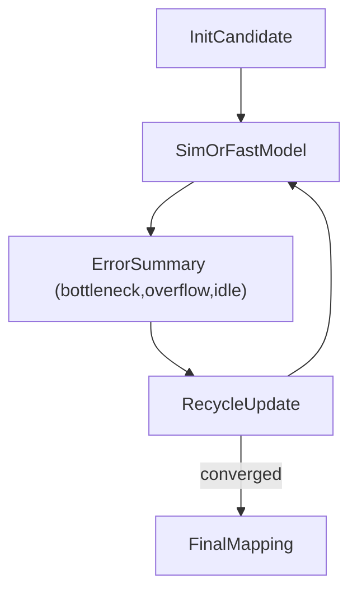

# AlphaFold-стиль distance maps для “маппинга алгоритма на hardware”

## Идея в одном абзаце

AlphaFold решает задачу “свертки” как поиск согласованной 3D-конфигурации, опираясь на **pairwise представление** и предсказания “карт расстояний” (distogram / distance map), которые затем итеративно уточняются (recycling). Аналогия для tt-lang/tt-metal: хочется найти “согласованную конфигурацию” выполнения алгоритма на железе — placement, routing, scheduling — так, чтобы минимизировать лишние движения данных, пробки и простаивания. Для этого можно учить модель, которая предсказывает **latency/communication maps** между парами сущностей (таски, буферы, ресурсы) и затем итеративно улучшает кандидат-раскладку и расписание, пока не достигнет стабильного “компактного” решения.

Документ описывает: что именно такое distogram/pair representation в AlphaFold (корректно), как перенести эти идеи на hardware mapping, какие карты предсказывать, какие “треугольные” обновления полезны, и как организовать обучение и использование в проде (модель как guidance для детерминированного поиска + строгий verifier).

## 1. Аналогия: protein folding -> hardware mapping

### Protein folding (интуиция)

- есть цепочка (последовательность residues),
- есть взаимодействия между парами residues,
- требуется найти согласованную геометрию, где локальные и глобальные ограничения не конфликтуют.

### Hardware mapping (интуиция)

- есть граф задач/данных (таски/тайлы/страницы),
- есть граф ресурсов (cores/mesh, NOC read/write, CB, DST, L1/DRAM, SFPU/FPU),
- требуется найти согласованную конфигурацию:
  - **placement**: где выполняется compute и где “живут” буферы,
  - **routing**: как и по каким каналам идут передачи,
  - **scheduling**: когда что стартует/ждет, чтобы перекрывать и избегать overflow.

В обоих случаях проблема не сводится к независимым локальным решениям: выбор для пары влияет на третьих (контеншн/конфликты), поэтому нужны механизмы “глобальной согласованности”.

## 2. Что такое distogram/distance map в AlphaFold (корректно, без лишней мистики)

### 2.1 Distogram (в общих чертах)

Distogram — это не одно число расстояния, а **распределение по бинам** для пары (i, j): “какова вероятность, что расстояние попадает в этот интервал”.

Эта идея удобна тем, что:

- дает неопределенность (модель может быть “не уверена”),
- легко учится как классификация (softmax по бинам),
- потом может использоваться как “мягкое” ограничение.

### 2.2 Pair representation (понятие)

Pair representation — это внутреннее представление для **каждой пары** (i, j), в котором накапливаются сигналы о взаимодействии/ограничениях.

См. определение термина “pair representation” в глоссарии EMBL-EBI:

- `https://www.ebi.ac.uk/training/online/courses/alphafold/glossary-of-terms/`

### 2.3 Triangle updates (почему “треугольные” операции)

AlphaFold обновляет pair representation через “треугольные” операции, которые проталкивают согласованность между тройками (i, k, j): информация по (i,k) и (k,j) должна согласовываться с (i,j).

Высокоуровневое описание Evoformer и triangle updates:

- `https://www.uvio.bio/alphafold-architecture/`

### 2.4 Recycling (итеративное уточнение)

AlphaFold прогоняет сеть несколько раз, подавая часть выходов обратно как входы (“recycling”), чтобы уточнять структуру итеративно.

Интуитивно это похоже на “приближения” в поиске: на первом проходе — грубый набросок, потом — уточнение деталей, когда контекст стал яснее.

## 3. Что будет “distance map” в задаче маппинга на железо

### 3.1 Latency-distogram (задержки как распределение)

Вместо расстояния между residues можно предсказывать распределение по бинам задержки/стоимости для пары сущностей:

- `Task_i -> Task_j` (если есть зависимость по данным),
- `Producer -> Consumer` (по каналу),
- `Resource_u <-> Resource_v` (если оцениваем пропускную способность/конфликты).

Пример “бинов”:

- 0–10 ticks, 10–20 ticks, ..., “>K ticks”.

### 3.2 Communication map (интенсивности потоков)

Можно предсказывать матрицу:

- \(F_{uv}\) = ожидаемый поток (bytes/tick) по ребру (u,v),
- либо \(P_{uv}\) = вероятность, что (u,v) станет bottleneck.

### 3.3 Confidence maps (аналог pLDDT/PAE)

В AlphaFold есть меры уверенности (локальная и парная). Для hardware mapping полезно иметь:

- уверенность в latency-distogram по паре (i,j),
- уверенность в “корректности” текущего candidate schedule (где модель сомневается).

Это напрямую помогает: “где применять дорогую проверку/поиск/симуляцию, а где можно доверять эвристике”.

## 4. Pair representation для hardware mapping (что туда складывать)

Пусть есть множество сущностей \(E\) (tasks + resources). Тогда:

- есть **node embeddings** \(h_i\) для каждой сущности i,
- есть **pair embeddings** \(z_{ij}\) для каждой пары (i,j).

Смысл \(z_{ij}\) в нашем домене:

- ожидаемая коммуникационная стоимость между i и j,
- вероятность конфликтов по общим ресурсам (арбитраж, shared NOC),
- потенциальное переполнение буферов из-за пары,
- “структурные” ограничения: например, “эти два этапа должны перекрываться” или “эти два этапа нельзя выполнять одновременно”.

## 5. Triangle-like обновления как индуктивный bias

Triangle идеи полезны, потому что hardware mapping тоже имеет “треугольные” согласованности:

- **Routing**: если i->k быстро, и k->j быстро, то путь i->j через k должен быть конкурентоспособным (с учетом контеншна).
- **Scheduling**: если i блокирует k, а k блокирует j, то согласованность очередей/стартов должна проявляться и в i<->j.
- **Contention**: общий “узкий мост” k должен отражаться во многих парах.

Псевдо-правило (идея, не доказательство):

```text
z_ij := z_ij + f(z_ik, z_kj, h_k)
```

где f “склеивает” информацию по двум ребрам через посредника k.

## 6. “Structure module” аналог: как из карт получить конкретный mapping

В AlphaFold структура = координаты атомов. У нас структура = дискретное решение:

- `placement`: `core_id(task)` или `core_range(task_group)`,
- `routing`: `path_id(transfer)` / `channel_id(transfer)`,
- `schedule`: `start_time(task)` или приоритет/порядок для детерминированного планировщика.

Два практичных пути:

### 6.1 Сразу дискретные решения

Модель выдает logits по дискретным вариантам (core/channel/next-task), дальше включается маскирование легальности.

### 6.2 “Continuous latent -> discretize”

Модель выдает “координаты”/векторы, а затем:

- assignment / matching переводит их в дискретные core_id,
- маршруты выбираются коротким детерминированным поиском, guided эмбеддингами.

## 7. Как обучать (loss + ограничения)

### 7.1 Supervised по симулятору/трассам

Если симулятор дает ground truth:

- целевые latency maps,
- целевой makespan,
- целевые bottleneck edges,

то можно обучать distogram/карты как supervised/auxiliary задачи.

### 7.2 RL/IL: “награда” за итоговую эффективность

Reward может учитывать:

- makespan/throughput,
- overflow events (CB/DST),
- contention penalty,
- compute idle.

Важно: illegal actions лучше не допускать через mask, а не “наказывать постфактум”.

### 7.3 Violation loss (аналог физики)

В AlphaFold есть штрафы за физические нарушения. Для hardware mapping аналог:

- штраф за overflow буферов,
- штраф за deadlocks,
- штраф за превышение лимитов in-flight,
- штраф за нарушение протоколов (reserve/push/pop, acquire/commit/wait/release).

## 8. Recycling как алгоритм уточнения кандидата

Можно реализовать “recycling” как итеративное улучшение:

1) построить initial candidate mapping/schedule,
2) прогнать симулятор/быструю модель и получить ошибки (где bottleneck/overflow/idle),
3) подать summary обратно в модель,
4) уточнить карту и перепредложить изменения.



## 9. Как использовать в production (без недетерминизма)

Чтобы не “впустить магию” в компилятор/пайплайн:

- модель генерирует кандидатов и/или heuristic scores,
- дальше работает детерминированный search/verifier:
  - beam/A* с фиксированными tie-break,
  - строгая проверка легальности и контрактов,
  - ограниченный бюджет.

То есть модель — “подсказчик”, а не источник истины.

## 10. Связь с документами в этом репозитории

- `tt-lang/docs/solutions/gnn_routing_from_simulator.md` — базовый рецепт “симулятор -> Gymnasium -> GNN policy/value”.
- `tt-lang/docs/solutions/full_fidelity_sim_rl_env.md` — что значит “полная симуляция” и какие состояния/ресурсы включать.
- `tt-lang/docs/solutions/dataflow_routing_pipeline.md` — взгляд на проблему как на маршрутизацию по графу ресурсов.

## Источники (в тексте)

- AlphaFold glossary (термин pair representation): `https://www.ebi.ac.uk/training/online/courses/alphafold/glossary-of-terms/`
- AlphaFold architecture overview (Evoformer, triangle updates, distogram loss, recycling): `https://www.uvio.bio/alphafold-architecture/`

