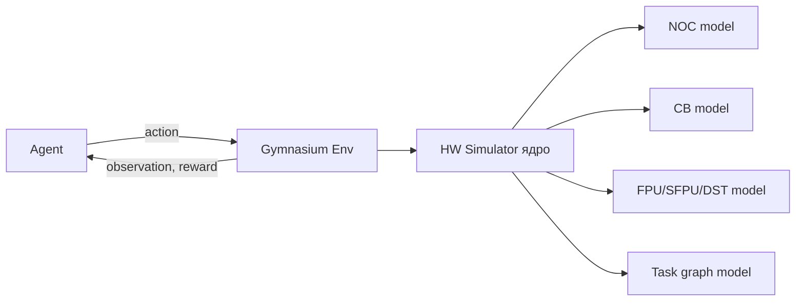
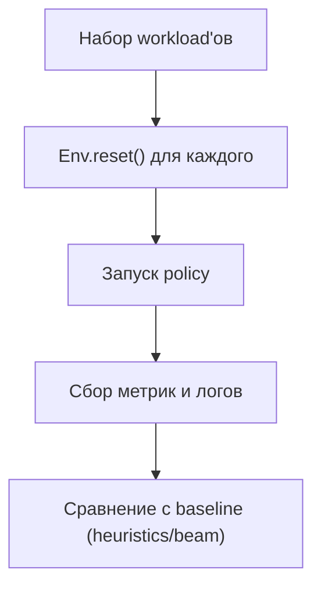

# Полная симуляция железа как RL-задача (Gymnasium-среда для планирования)

## Зачем это нужно

Если хочется “самый сильный” планировщик, то можно пойти дальше coarse/discrete-event моделей и построить **максимально детальную симуляцию**:

- NOC с несколькими каналами/очередями и правилами арбитража,
- CB как реальные кольцевые буферы со своими read/write указателями и ограничениями,
- FPU/SFPU как отдельные исполнительные устройства с pipeline/stall,
- DST и другие регистры как ресурсы с явным временем занятости и конфликтами.

Такую симуляцию можно переформулировать как **reinforcement learning** задачу и оформить в виде стандартной среды **Gymnasium**, чтобы:

- экспериментировать с разными RL/поисковыми методами,
- измерять качество в едином формате,
- строить воспроизводимые бенчмарки и сравнения.

## Важное уточнение про цель

RL здесь не “магия”, а инструмент исследования. Целью обычно является не заменить компилятор стохастической политикой, а:

- получить **сильную политику/оценочную функцию**,
- потом “сжать” её в детерминированное правило (policy distillation / imitation / табличные эвристики),
- или использовать как guidance для beam search (как описано в других документах).

## Формулировка RL-задачи

### 1) Эпизод

Один эпизод = планирование и “исполнение в симуляции” для одного workload:

- один `ttl.compute` блок, или
- связка reader/compute/writer (полный микрокернел),
- или целый kernel graph (если нужно).

Эпизод заканчивается, когда:

- все операции выполнены и данные дошли до выходов (done),
- или превышен лимит шагов/времени (truncated).

### 2) Состояние (observation)

Observation должен отражать “полное состояние мира”, но при этом быть удобным для ML:

- **SSA/граф задач**
  - какие ops выполнены,
  - какие ops готовы по зависимостям,
  - сколько осталось uses и какие values live.
- **NOC**
  - состояние каналов (занятость, очередь запросов),
  - оценка backlog по направлениям,
  - конфликты/арбитраж.
- **CB**
  - read/write pointers,
  - fill level,
  - блокировки по reserve/push/pop.
- **Compute ресурсы**
  - состояние FPU/SFPU (занятость, pipeline stage),
  - состояние DST/регистров (занятость по индексам),
  - ожидания (stall reasons).
- **Время**
  - текущее `t` в циклах (или тиках),
  - ближайшие события.

Observation можно отдавать:

- как вектор фиксированного размера (под небольшой N),
- или как “граф” (GNN-подход), если N большое и структура важна.

### 3) Действия (action)

Основные варианты:

1) **Выбор следующей операции** из множества допустимых (ready по SSA и по ресурсам).
2) **Выбор ресурса/канала** (например, какой NOC канал использовать).
3) **Шаг времени** (если ничего не стартуемо): “advance to next event”.

На практике лучше держать action space минимальным:

- action = индекс операции из `ready_time`,
- плюс специальное действие `WAIT` (если `ready_time` пусто).

Если нужно управлять маршрутизацией/каналами NOC, это можно добавить как:

- параметр действия (op, channel),
- или как внутреннюю политику симулятора (фиксированная стратегия арбитража).

### 4) Награда (reward)

Награда должна поощрять:

- меньшее общее время исполнения (makespan),
- меньшее `peak_live` / меньше конфликтов DST,
- меньше stalls и “пузырей” pipeline,
- меньше вставленных копий (если моделируется вставка).

Варианты reward:

- “на конце эпизода”: `reward = -t_end` (простая, но sparse),
- “пошаговая”: отрицательная стоимость шага/простоя, например:
  - `-Δt` за продвижение времени,
  - штраф за увеличение `peak_live`,
  - штраф за `WAIT`, если он случился из-за плохого выбора, а не из-за неизбежности.

Хороший практический компромисс:

- каждый шаг: `reward += -Δt` (минимизация времени),
- плюс небольшой штраф за рост `peak_live`,
- на конце: бонус/штраф для нормировки.

## Архитектура Gymnasium-среды

### Интерфейс

- `reset(seed) -> obs, info`
- `step(action) -> obs, reward, terminated, truncated, info`

`info` должен содержать метрики для анализа:

- `t`, `t_end_estimate`,
- `peak_live`,
- `stall_breakdown`,
- `noc_queue_depths`,
- `cb_levels`,
- `schedule` (список выбранных ops).

### Что симулирует “ядро среды”

Симуляция должна быть дискретно-событийной или тиковой:

- **tick-based**: каждое `step()` двигает модель на 1 тик или на `k` тиков,
- **event-based**: каждое `step()` стартует op, затем симулятор двигает время до следующего “наблюдаемого” состояния.

Если цель “полная симуляция”, tick-based логичнее, но дороже.
Для RL обычно лучше event-based (быстрее), а внутри события можно детально обновлять ресурсы.

Mermaid: компоненты среды

## Как “встроить” граф задач в среду

Нужно формализовать, что именно является “операциями”:

- ops внутри `ttl.compute`,
- или компоновка из нескольких потоков (reader/compute/writer),
- или уже после lowering (TTKernel ops).

Для максимальной точности лучше симулировать ближе к TTKernel/микрокоду, но тогда:

- state/action сложнее,
- датасеты тяжелее,
- медленнее обучение.

Практичная стратегия:

- начать с task graph на уровне TTL/TTKernel “крупными блоками”,
- постепенно уточнять модель ресурсов.

## Метрики и стандартизованная оценка

Чтобы “оценивать стандартно”, нужно зафиксировать:

- набор workload’ов (dataset),
- seed/детерминизм симулятора,
- метрики:
  - makespan (`t_end`),
  - `peak_live`,
  - число stalls,
  - число insert-copies (если есть),
  - throughput/latency per tile.

Mermaid: контур эксперимента

## План реализации (по шагам)

### Шаг 1: Минимальная среда (MVP)

- только выбор следующей op из `ready` + `WAIT`,
- простая модель времени и ресурсов (без полной детализации),
- reward = `-Δt` и штраф за `peak_live`.

### Шаг 2: Добавить CB как настоящий кольцевой буфер

- pointers, capacity, блокировки,
- корректная модель `cb_wait_front`, `cb_reserve_back`, `cb_push_back`, `cb_pop_front`.

### Шаг 3: Добавить NOC каналы/очереди

- несколько каналов,
- фиксированные правила arbitration,
- latency модели по размеру/маршруту (или таблично).

### Шаг 4: Добавить FPU/SFPU pipeline и DST модель

- занятость устройств,
- конфликты по ресурсам,
- модель освобождения DST по использованию/операциям синхронизации.

### Шаг 5: Бенчмарки и baseline

- базовая эвристика (например, из `DST_Allocation.md`),
- beam search baseline,
- сравнение RL-policy и baseline по метрикам.

### Шаг 6: “Сжать” результат в компилятор

Варианты:

- imitation: обучить простую модель ранжирования кандидатов и использовать как guidance,
- distillation: получить детерминированную эвристику (таблица/правила),
- использовать RL-policy только в режиме исследования/автотюнинга.

## Риски

- **Стоимость симуляции**: полный fidelity может быть слишком медленным для RL.
- **Детерминизм**: симулятор должен быть воспроизводимым, иначе сравнение политик ломается.
- **Сложность action space**: чем больше управляешь (каналы, ресурсы), тем сложнее обучение.
- **Gap между симуляцией и железом**: нужна калибровка по профилям (FDO).

## Итог

Формулировка “полная симуляция как Gymnasium среда” — это хороший исследовательский путь:

- он даёт стандартный интерфейс для экспериментов,
- позволяет сравнивать подходы на одних и тех же workload'ах,
- и может привести к практичному guidance-модулю для beam search в компиляторе.

