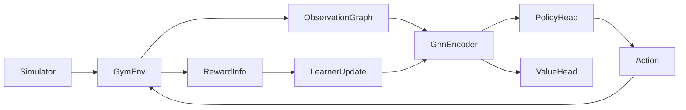
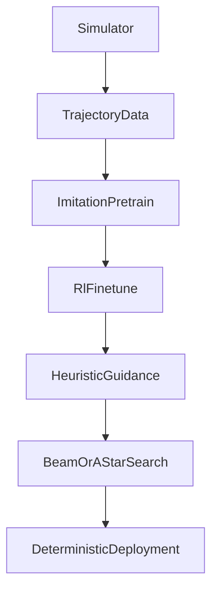

# GNN + Gymnasium для поиска оптимальных маршрутов и расписаний по графу ресурсов

## Идея в одном абзаце

Если есть симулятор, который моделирует задержки и contention (NOC, CB, DST, SFPU/FPU, DRAM/L1), то можно завернуть его в стандартную **Gymnasium**-среду и обучить модель с **GNN**-энкодером графа. Модель получает наблюдение в виде графа (узлы/ребра + фичи состояния), и возвращает решения по маршрутизации/планированию (какую передачу/таск запускать, по какому ресурсу/каналу, когда ставить backpressure). Цель — научиться приближать “оптимальные” маршруты и расписания при динамических задержках, где классические Dijkstra/A* в чистом виде плохо применимы из-за зависимости стоимости ребер от состояния и от конкуренции потоков.

Документ описывает алгоритмический рецепт: как определить состояние/действия/награду, как устроить графовое представление, какую архитектуру GNN выбрать, как обучать (imitation -> RL), и как использовать эмбеддинги как эвристику для поисковых алгоритмов с гарантиями.

## 1. Постановка задачи (что является “маршрутом”)

В контексте tt-lang/tt-metal “маршрут” редко означает только кратчайший путь по статическому графу. На практике маршрут/план включает:

- **маршрутизацию данных**: откуда и куда тащить тайлы/страницы (DRAM -> NOC -> L1 -> CB -> DST -> CB -> NOC -> DRAM);
- **назначение ресурсов**: какой канал/порт/исполнитель (read/write NOC, compute, writer) обслуживает работу;
- **планирование во времени**: когда стартовать операции, чтобы перекрывать transfers и compute и не переполнять буферы;
- **backpressure/prefetch**: как управлять глубиной in-flight, чтобы не создать пробку.

Почему “просто Dijkstra” не хватает:

- вес ребра не фиксирован: \(latency = f(\text{in_flight}, \text{queue_depth}, \text{arbitration}, \text{arch})\);
- появляются жесткие ограничения по емкостям (CB/DST), из-за которых путь может стать невалидным;
- оптимальность зависит от целевой метрики (makespan, p95 latency, throughput, overflow-free) и от стратегии перекрытия;
- действие “выбрать следующий шаг” меняет будущие стоимости (non-stationary / feedback).

## 2. Симулятор как датасет и как Gymnasium среда

### 2.1 Что должен уметь симулятор (минимум)

Симулятор должен быть способен по шагам времени обновлять состояние ресурсов и задач:

- очереди NOC, in-flight transfers, арбитраж;
- CB fill level и указатели reserve/push/pop;
- DST занятость/локи;
- compute устройства (занятость, stall reasons);
- время (ticks/cycles) и события.

Это совпадает по духу с документом:

- `tt-lang/docs/solutions/full_fidelity_sim_rl_env.md`

### 2.2 Gymnasium API (контракт)

Псевдокод интерфейса среды:

```python
class RoutingEnv(gym.Env):
    def reset(self, *, seed: int | None = None, options: dict | None = None):
        obs = build_graph_observation()
        info = {"episode_id": "...", "arch": "blackhole"}
        return obs, info

    def step(self, action):
        apply_action(action)
        advance_simulation()
        obs = build_graph_observation()
        reward = compute_reward()
        terminated = is_done()
        truncated = is_timeout()
        info = build_info()
        return obs, reward, terminated, truncated, info
```

Режимы:

- **deterministic**: фиксированные параметры задержек и арбитража (нужно для воспроизводимости и оценки);
- **stochastic**: шум/случайные флуктуации, чтобы модель не переобучалась на один “режим”.

## 3. Графовое представление (что подается в GNN)

Нужно решить, что является узлами и ребрами.

### 3.1 Вариант A: resource-graph (ресурсы как узлы)

Узлы — ресурсы (или их агрегаты):

- `NocRead`, `NocWrite` (или несколько каналов),
- `CbIn[i]`, `CbOut[j]` (или группы),
- `Dst[k]` (или агрегированный DST pool),
- `Sfpu`, `Fpu`, `Dram`, `L1`.

Ребра — допустимые направления перемещения/обслуживания:

- `Dram -> NocRead -> L1 -> CbIn -> Dst -> CbOut -> L1 -> NocWrite -> Dram`.

Плюс ребра “конфликт/контеншн” (опционально) между ресурсами, которые делят арбитраж.

### 3.2 Вариант B: bipartite graph (task-resource)

Двудольный граф:

- узлы `Task` (DMA_read, compute_tile, DMA_write, cb_ops),
- узлы `Resource` (NOC/CB/DST/SFPU/...),
- ребро `Task -> Resource` означает: task может выполняться на ресурсе.

Этот вариант удобен для policy “выбрать следующий task” и маскировать недопустимые task по ресурсам.

### 3.3 Фичи узлов/ребер (пример)

Node features (resource):

- `queue_depth`, `in_flight`, `utilization_ema`;
- `capacity_total`, `capacity_free` (для CB/DST);
- `last_service_time`, `stall_reason_id` (если есть);
- `type_id`, `arch_id`.

Edge features:

- `base_latency`, `bandwidth`;
- `contention_level`, `in_flight_on_edge`;
- `is_bidirectional` / `direction_id`.

Global features:

- `tick` (или normalized time);
- `arch_id`;
- `workload_id` / “режим нагрузки”.

Нормализация:

- `clip(x, -k, k)` для экстремумов;
- `log1p(queue_depth)` для тяжелых хвостов;
- EMA для сглаживания шума.

## 4. Архитектура модели (GNN encoder + головы)

### 4.1 GNN encoder

Базовый message passing:

```text
for l in 1..L:
  m_u = sum_{(v->u) in E} phi_m(h_v, h_u, e_vu, g)
  h_u = phi_u(h_u, m_u, g)
```

Практичные варианты:

- GraphSAGE: устойчивый baseline;
- GAT: если важны “веса” соседей и разные типы ребер;
- MPNN с edge features: если задержка сильно зависит от ребра.

### 4.2 Policy/value головы

Пусть модель возвращает:

- **policy logits** над допустимыми действиями;
- **value** — оценку остаточной стоимости (например makespan remaining).

Возможные action spaces:

- выбрать `next_task_id` из `ready_set`;
- выбрать `route_choice` (например канал или следующий ресурс для transfer);
- выбрать “advance_time_to_next_event”, если ничего нельзя запускать.

### 4.3 Маскирование недопустимых действий (легальность)

Критично: action space должен быть “safety-first”.

Псевдокод:

```python
logits = policy_head(emb)
logits[action_mask == 0] = -inf
action = sample_or_argmax(logits)
```

`action_mask` строится детерминированно из симулятора: что ready по данным, что готово по ресурсам, что не нарушает емкости.

### 4.4 Auxiliary heads (опционально, для стабильности)

Чтобы ускорить обучение и сделать эмбеддинги “семантичными”, можно добавить вспомогательные цели:

- `predict_edge_delay` (регрессия задержки на ребрах);
- `predict_queue_growth` (классификация: очередь растет/падает);
- `predict_bottleneck_node` (multi-label).

## 5. Обучение: от imitation к RL

### 5.1 A. Supervised / imitation learning (учитель)

Идея: сначала научить policy имитировать хороший планировщик на малых графах.

Учитель можно получить так:

- exact/near-exact solver на малых задачах (ILP/MILP, полный поиск);
- beam/rollout по симулятору;
- hand-crafted heuristics как baseline.

Данные:

- `obs_graph_t`, `action_teacher_t`, `valid_mask_t`, `reward_t` (опционально).

Loss:

```text
L = CrossEntropy(policy_logits_masked, action_teacher)
```

Плюсы: быстрый старт, стабильность.
Минусы: учитель может быть дорогим и не идеально масштабируется.

### 5.2 B. RL (actor-critic)

RL нужен, когда:

- учитель слишком дорог;
- цель — оптимизировать метрику, которую сложно задать правилами.

Reward shaping (пример):

\[
r_t = -\Delta makespan_t - \lambda_1 \cdot overflow_t - \lambda_2 \cdot contention_t - \lambda_3 \cdot invalid_t.
\]

Практика:

- actor-critic (PPO/A2C-стиль);
- entropy bonus для исследования;
- curriculum: сначала маленькие графы/легкие режимы, потом сложнее;
- строгий `invalid_t` = большой штраф (но лучше вообще не допускать invalid через mask).

### 5.3 C. Hybrid: imitation pretrain -> RL finetune

Рекомендуемый путь:

1) imitation pretrain, чтобы policy не была случайной;
2) RL finetune для “дожима” метрик на распределении workload’ов.

## 6. Как из эмбеддингов получить “маршруты” (и сохранить гарантии)

Есть два режима использования модели.

### 6.1 Online policy (шаг за шагом)

Policy напрямую выбирает действия и ведет симуляцию/исполнение.
Плюс: максимальная гибкость.
Минус: сложнее гарантировать свойства без дополнительных проверок.

### 6.2 Эвристика для поиска (A*/beam) с проверяющим алгоритмом

Более “инженерный” путь:

- модель выдает heuristic/score для кандидатов (например estimate remaining time);
- дальше используется детерминированный поиск (beam/A*), который:
  - проверяет легальность,
  - имеет фиксированный tie-break,
  - может быть ограничен по бюджету.

Так модель становится “компасом”, а не источником истинности.

Связанные идеи:

- `tt-lang/docs/solutions/beam_search.md`
- `tt-lang/docs/solutions/pull_based_adaptive_scheduling.md`

## 7. Метрики качества и эксперименты

Core метрики:

- makespan / total_time;
- throughput (tiles per tick);
- p50/p95/p99 latency на “доставку” тайлов;
- overflow events (CB/DST);
- utilization: NOC read/write, compute idle.

Ablations (обязательные):

- без GNN (MLP на агрегированных фичах);
- без auxiliary losses;
- без mask (для демонстрации, почему это плохо);
- без curriculum;
- different GNN types (SAGE vs GAT vs MPNN).

Generalization:

- размеры графов больше, чем в обучении;
- другой arch (`blackhole` vs `wormhole_b0`);
- другие режимы нагрузки/контеншна.

## 8. Риски и стабилизация

Типовые проблемы:

- non-stationarity (модель “ломается”, если режимы нагрузки меняются);
- reward hacking (политика находит странные циклы);
- action spam (слишком много микро-действий без прогресса).

Стабилизаторы:

- action budget на эпизод;
- cooldown для “дорогих” переключений;
- backpressure правила как hard constraints;
- safe fallback policy (детерминированная эвристика), если модель деградирует.

## 9. Минимальный план внедрения (без кода)

1) Определить формат логов симулятора: граф, фичи, mask, action, reward, метрики.
2) Сделать Gymnasium wrapper + baseline policies (heuristics).
3) Сгенерировать датасет учителя на малых графах (rollout/beam/ILP).
4) Pretrain imitation.
5) Finetune RL + оценка на удержанном наборе режимов/архитектур.

## Диаграммы

### A. Контур обучения/исполнения



### B. Поэтапное обучение: imitation -> RL -> эвристика для поиска



## Ссылки на существующие документы в репозитории

- `tt-lang/docs/solutions/dataflow_routing_pipeline.md`
  - Дает базовую “оптику” задачи: есть DAG вычислений/данных и есть граф ресурсов, а оптимизация похожа на логистику/маршрутизацию.
  - Этот документ добавляет к этой оптике конкретный ML-рецепт: как получить policy/heuristic из симулятора.
- `tt-lang/docs/solutions/pull_based_adaptive_scheduling.md`
  - Описывает распределенный “pull” протокол (“свободная касса”) и стабилизаторы (дедуп, TTL, hysteresis).
  - В терминах этого документа GNN+RL может выступать как “локальный мозг” выбора задач/маршрутов, при этом анти-спам правила остаются hard constraints.
- `tt-lang/docs/solutions/full_fidelity_sim_rl_env.md`
  - Описывает максимальную детализацию симуляции и формализацию как RL-задачи (state/action/reward).
  - Этот документ специализирует эту идею на графовом представлении (GNN) и на варианте “модель как эвристика” для детерминированного поиска.
- `prompts-search/docs/ttmetal_dropout_llk_trace.md`
  - Пример “oracle trace” по dropout, полезный как мотивация: что именно означает корректный протокол CB/DST/NOC/SFPU в реальном коде.
  - Такой trace можно использовать как источник сценариев для симулятора и как набор проверочных метрик/инвариантов.

## Внешние ориентиры (для поиска литературы)

Подходы, которые близки по идее (GNN как эвристика/политика для графового поиска и маршрутизации):

- Imitation learning для эвристик поиска на графах: [Learning Graph Search Heuristics](https://arxiv.org/abs/2212.03978)
- “Скелетные”/иерархические GNN для shortest path: [Skeleton-Guided Learning for Shortest Path Search](https://arxiv.org/abs/2508.02270)
- Benchmarks/среды в стиле Gym для сетевых задач: [NetworkGym](https://arxiv.org/abs/2411.04138)

