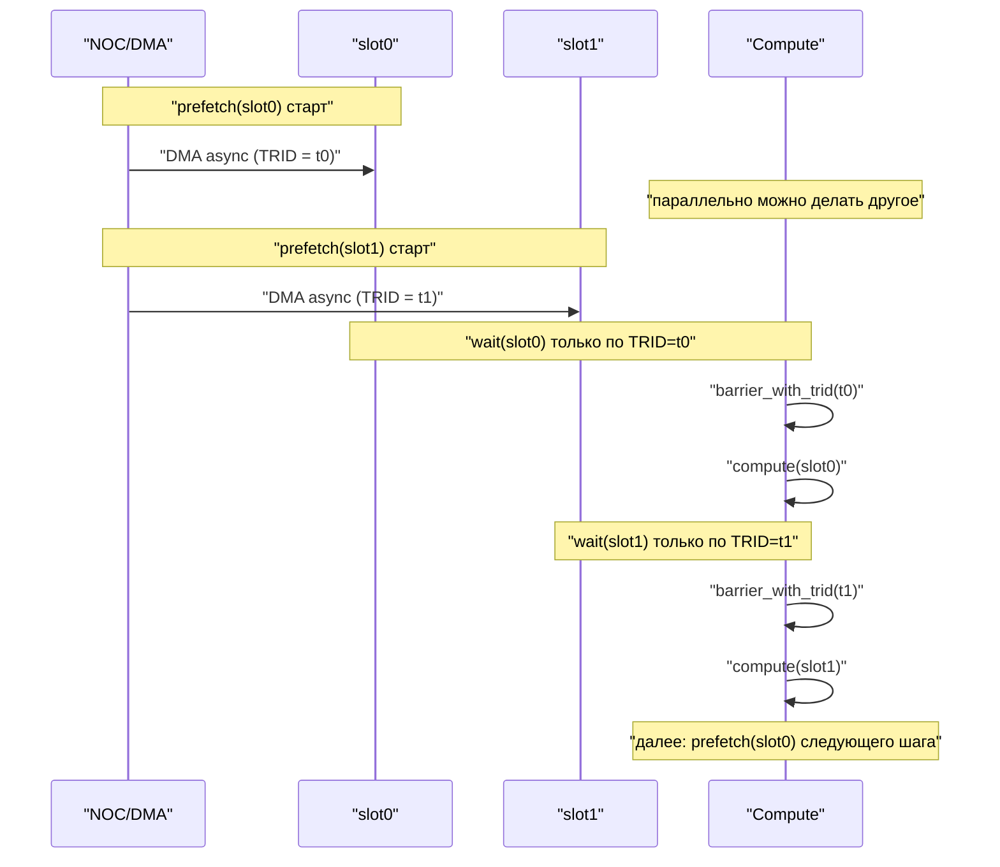
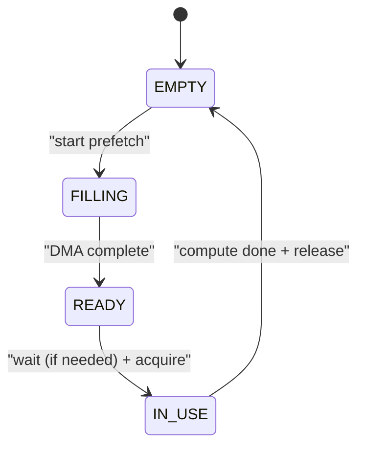
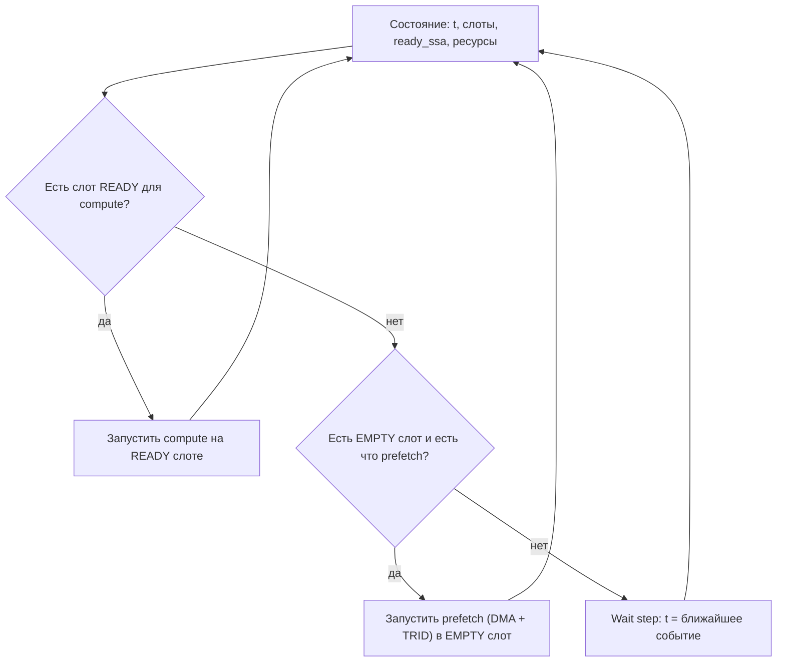

# Ping-pong prefetch pipeline: prefetch → wait → compute → send next (по замерам симуляции и железа)

## Идея

Если данные для следующей операции можно доставлять асинхронно (через NOC/DMA) и при этом вычислительный блок (FPU/SFPU) работает значительно быстрее, чем “подвоз данных”, то выгодно организовать выполнение как **конвейер**:

- заранее начать асинхронный подвоз данных (prefetch),
- дождаться ровно того, что нужно (точечный wait),
- быстро выполнить операцию,
- параллельно запустить подвоз следующего набора данных.

Ключевая техника — **двойная буферизация** (“ping-pong”) на самом быстром уровне хранения:

- два “слота” для входных данных: `slot0` и `slot1`,
- пока compute использует один слот, второй слот наполняется асинхронно,
- затем роли слотов меняются (логический swap).

Под “слотом” можно понимать:

- DST/тайл-регистр (наиболее быстрый вариант),
- CB-страницу/участок L1,
- другой локальный scratch-буфер.

## Почему это может дать выигрыш

### Интуиция

Без конвейера выполнение часто выглядит так:

1) начать DMA,  
2) ждать DMA,  
3) вычислить,  
4) снова начать DMA,  
5) снова ждать…

В результате compute простаивает.

С конвейером:

- compute почти всегда занят,
- wait’ы становятся короткими и редкими,
- DMA перекрывается с вычислением.

### Почему важны TRID-барьеры

Если wait “глобальный” (ждёт все outstanding DMA), то он ломает конвейер: один `wait` может остановить всё, даже если нужные данные уже готовы.

TRID-специфические барьеры позволяют:

- ждать **строго один конкретный перенос** (prefetch для конкретного слота),
- не блокировать независимые DMA,
- строить правильный ping-pong без лишних stall.

## Абстракция: таймлайны доступности и события

Вместо симуляции “по тикам” удобно использовать дискретно-событийную модель:

- `t` — текущее модельное время,
- `t_ready[slot]` — когда данные в слоте готовы,
- `t_free[resource]` — когда ресурс (NOC канал, FPU/SFPU, и т.п.) снова свободен.

Время старта compute на слоте:

\[
t_{start} = \max(t,\ t_{ready}[slot],\ t_{free}[compute])
\]

и завершение:

\[
t_{end} = t_{start} + latency(op)
\]

## Схема ping-pong на двух слотах

### Последовательность (событийная)

### Машина состояний для одного слота

Идея: каждый слот проходит цикл `EMPTY -> FILLING -> READY -> IN_USE -> EMPTY`.

## “Быстрый swap” слотов

Важный момент: ping-pong не требует физического копирования данных “между слотами”.

Чаще всего swap — это:

- смена “какой индекс DST сейчас активный”,
- смена “какая CB-страница считается current”,
- смена ссылок на буферы в модели.

То есть swap — логическая операция планировщика/аллокатора, почти бесплатная.

## Как использовать замеры (симуляция vs железо)

### Что измерять

Чтобы конвейер можно было “подогнать”, нужны параметры:

- `latency_dma_read_tile`, `latency_dma_write_tile`,
- стоимость `wait` (зависит от того, насколько рано запустили prefetch),
- `latency_compute_op` (по типам ops: unary/binary/sfpu),
- contention NOC: как меняется latency при нескольких outstanding DMA/каналах,
- стоимость CB операций (reserve/push/pop/wait).

Источники:

- симуляция (если есть ttsim/сходная инфраструктура),
- реальные замеры на железе (трассы/счётчики/stall breakdown).

### Как использовать

1) **Калибровать таблицы задержек** (coarse model).
2) **Калибровать модель contention**:
   - например “на каждом канале одновременно можно держать X outstanding”,
   - или “latency растёт с глубиной очереди”.
3) **Сравнивать стратегии**:
   - “prefetch как можно раньше” vs “prefetch ближе к использованию”,
   - beam guidance по ожидаемому `t_end`.

## Интеграция с планировщиком (beam/time-aware)

### Минимальный набор решений, которые должен принимать планировщик

В каждый момент (состояние):

- какие DMA запускать сейчас (prefetch для какого слота),
- на каком слоте запускать compute (если готово),
- делать ли “wait step” (если ничего не стартуемо сейчас).

### Упрощённая схема выбора

### Почему без TRID это ломается

Если “wait” глобальный, то в схеме выше:

- compute на READY слоте может случайно ждать другой DMA,
- параллельные prefetch начинают мешать друг другу,
- конвейер деградирует к “start DMA → wait all → compute”.

TRID-барьеры позволяют держать wait точечным: `wait(slotX)` = `barrier_with_trid(trid(slotX))`.

## Расширение: многопоточность (reader/compute/writer)

Ping-pong можно делать не только в compute-потоке, но и на границах потоков:

- reader заранее заполняет CB страницами,
- compute “потребляет” CB с ping-pong страницами,
- writer заранее освобождает/дренирует CB.

Тогда слоты — это уже **страницы CB**, а не только регистры.

В этой модели полезно хранить:

- `cb_level` и “какие страницы готовы”,
- времена готовности страниц,
- ограничения “не перезаписать страницу до чтения”.

## Практический план внедрения (пошагово)

1) **Coarse модель**:
   - два слота (DST или CB page),
   - таблица latency для DMA и compute,
   - TRID-поинтовые wait’ы.
2) **Автоматический выбор prefetch времени**:
   - метрика: минимизировать `t_end` при фиксированном `peak_live`.
3) **Contestion модель**:
   - учёт NOC каналов/очередей,
   - штрафы при переполнении outstanding DMA.
4) **Многопоточность**:
   - добавить lane для reader/compute/writer,
   - общие CB и NOC как глобальные ресурсы.
5) **Подгонка по профилю**:
   - обновление latency таблиц по симуляции/железу,
   - сравнение стратегий на фиксированных workload’ах.

## Итог

Ping-pong prefetch pipeline — это “локальная” форма time-aware планирования:

- вместо попытки симулировать весь мир, мы фокусируемся на ключевом паттерне перекрытия DMA и compute,
- TRID-специфические барьеры являются фундаментом для точечных wait’ов,
- замеры из симуляции и железа дают параметры модели и позволяют автоматизировать выбор “когда prefetch’ить”.

