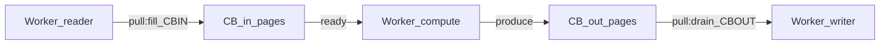
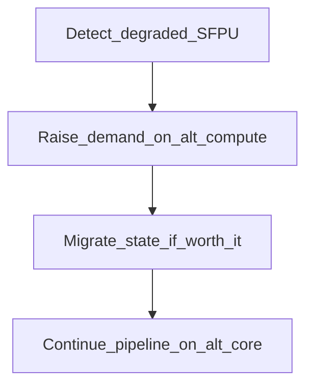

# Pull-based адаптивное планирование (“Свободная касса”) для конвейера данных

## Идея в одном абзаце

Вместо “push‑планировщика” (который сверху выбирает, что запускать), можно построить **pull‑based** систему: каждый ресурс (NOC read/write, compute блоки, CB‑операции, “виртуальные регистры”) ведёт себя как касса в супермаркете:

- “**я простаиваю** → я хочу работу”
- выбираю ближайшую подходящую работу из очереди (или из графа),
- и если для этой работы не готовы входы, я рекурсивно “протягиваю” запрос по зависимостям назад: “**мне нужен input**”,
- таким образом, “очереди разбредаются” к свободным ресурсам, а пробки постепенно рассасываются.

Эту идею удобно рассматривать как **асинхронный рынок**: ресурсы делают ставки на работу, работа “притягивается” туда, где есть свободная мощность, а система стабилизируется через простые правила анти‑спама (как “не бегать кассирам по магазину каждые 10 мс”).

## Почему это похоже на умный prefetch

Prefetch — это частный случай: “свободен NOC read → подтяни следующую страницу/тайл в свободный буфер”.

Pull‑планирование — обобщение:

- свободен compute → подтяни данные под compute (через NOC/CB) и подготовь следующий шаг,
- свободен writer → “вытолкни” готовые страницы из `CB_out`,
- свободен reader → наполни `CB_in`,
- свободен любой ресурс → попытайся “снять” напряжение в узком месте рядом по графу.

## Две сущности: работа и ресурс

### Работа (Task)

Работа — минимальная единица, которую можно “взять в обработку”:

- DMA read для страницы `p`
- compute для тайла `k`
- DMA write для страницы `p`
- CB push/pop/wait (логические операции синхронизации)

У каждой работы есть:

- `deps` (что должно быть готово)
- `produces` (какое состояние/данные появляются)
- `required_resource` (кто должен её исполнять)
- `cost_hint` (оценка длительности/важности)

### Ресурс (Worker/Resource)

Ресурс — активная сущность, которая:

- публикует состояние `idle/busy/degraded`
- имеет очередь заявок или подписку на “рынок задач”
- умеет “выбирать” работу локально (из ближайших/подходящих)

## Модель “свободная касса”: протокол заявок

Суть: когда ресурс простаивает, он создаёт **заявку** на работу.

```mermaid
flowchart TD
  WorkerIdle["Worker_idle"] --> CreateRequest["Create_request"]
  CreateRequest --> SelectTask["Select_task_or_dependency"]
  SelectTask -->| "task_ready" | ClaimTask["Claim_task"]
  SelectTask -->| "needs_input" | DemandDeps["Demand_dependencies"]
  DemandDeps --> SelectTask
  ClaimTask --> Execute["Execute_on_resource"]
  Execute --> UpdateState["Publish_outputs"]
  UpdateState --> WorkerIdle
```

### Рекурсивный “pull по графу”

Если выбранная работа не готова из‑за отсутствия входов:

- ресурс формирует **demand** на недостающие зависимости,
- эти demand’ы кладутся в систему так, чтобы их могли подобрать другие ресурсы.

Это похоже на BFS/поиск по графу зависимостей, только распределённый: “простаивающие кассы” помогают вытянуть цепочку назад до источников данных.

## Что значит “виртуально бесконечные ресурсы” и зачем это полезно

Мысленный эксперимент:

1) представим, что ресурсов бесконечно много и они мгновенные,
2) тогда оптимальное расписание — это “все узлы стартуют сразу при готовности входов”,
3) реальная система — это проекция этого идеала на конечные ресурсы и задержки.

Pull‑подход делает проекцию “естественной”:

- если ресурсов мало — они всё равно будут подтягивать работу из очереди,
- если какой‑то блок деградировал/занят — спрос переключится на другие цепочки,
- локальные пробки не останавливают глобально всю систему: спрос перераспределяется.

## Анти‑спам и устойчивость (чтобы система не “флаппила”)

Ключевой риск: если статус ресурсов/готовности шуми́т, можно получить:

- лавину demand’ов,
- бессмысленное “перетягивание” одной и той же работы,
- thrashing (все бегают, никто не делает полезное).

Нужны стабилизаторы, аналогичные “очередям у кассы”:

### 1) Дедупликация demand’ов

Для пары `(task_id, missing_dep)` должна существовать максимум одна активная заявка demand в интервале времени.

### 2) Lease/TTL на заявки и на “занятость” задач

- заявка живёт \(T\) времени, потом истекает,
- “claim” задачи выдаётся как lease: если исполнитель умер/переехал, задача возвращается на рынок.

### 3) Rate limiting + hysteresis для статуса ресурса

- ресурс не должен менять `idle->busy->idle` слишком часто без реального прогресса,
- `idle` подтверждается только после стабильного окна времени,
- деградация/занятость имеет “липкость” (hysteresis), чтобы не дергаться.

### 4) Backpressure (ограничить глубину спроса)

Чтобы не вытягивать “слишком далеко” по графу:

- ограничить рекурсивную глубину pull,
- или ограничить число активных demand на ресурс/на этап.

## Связь с NOC/CB/Compute pipeline (RCW)

В RCW‑терминах “кассы” выглядят так:

- `Reader` касса: когда свободна, тянет “DMA_read следующей страницы” в свободный `CB_in` слот.
- `Compute` касса: когда свободна, тянет “compute следующего тайла”, но если вход не готов — инициирует demand на `cb_wait_front`/prefetch.
- `Writer` касса: когда свободна, тянет “DMA_write следующей готовой страницы” из `CB_out`.



## Пример: редкая недоступность SFPU и перераспределение

Сценарий: SFPU‑блок периодически занят (или конфликтует с соседними операциями), из‑за чего compute начинает “проседать” и стопорить pipeline.

Pull‑идея для реакции:

- compute_worker замечает деградацию (рост времени выполнения / рост idle downstream),
- повышает спрос на альтернативный compute ресурс (другое Tensix‑ядро),
- инициирует перенос промежуточного состояния (например, “виртуальный регистр”/страница) туда, где есть свободная “касса”.

Важно: это не “магия миграции”; это политика, которая должна уважать цену переноса (NOC/DRAM) и ограничения формата данных.



## Где это живёт в терминах алгоритма (уровни реализации)

### Уровень A: “концепт/симуляция”

Самый безопасный первый шаг — реализовать это как:

- дискретно‑событийную симуляцию,
- либо как планировщик в `tools/` (оффлайн),
- чтобы проверить: стабилизаторы действительно гасят спам, а throughput растёт.

### Уровень B: “компиляторный планировщик”

В компиляторе можно использовать pull‑идею как **эвристику**:

- “если ресурс свободен → выбирай работу, которая уменьшает будущие ожидания”
- demand’ы превращаются в приоритеты/весовые коэффициенты

### Уровень C: “runtime‑адаптация”

Самый амбициозный вариант: runtime собирает телеметрию и адаптивно перестраивает политику pull (или параметры rate limiting/hysteresis) на лету.

## Риски и ограничения (важно явно)

- Перераспределение работы между ядрами требует переносов данных: это может быть дороже, чем ждать.
- Нужно строго определять, что именно можно “мигрировать” (и в каком формате).
- Нужны гарантии отсутствия дедлоков при backpressure.
- Нужна детерминизация, если политика используется в компиляторе (иначе трудно отлаживать).

## Короткий вывод

Pull‑based “свободная касса” — это способ думать о конвейере как о системе, которая:

- сама стремится загрузить простаивающие ресурсы,
- рекурсивно вытягивает зависимости,
- естественно перераспределяет очереди и снижает локальные пробки,
- но требует обязательных стабилизаторов (дедуп, lease/TTL, rate limit, hysteresis, backpressure).

Такая модель хорошо сочетается с идеей умного prefetch и с “ландшафтом задержек”: ресурсы могут принимать решения на основе измеренной/смоделированной стоимости пробок.

