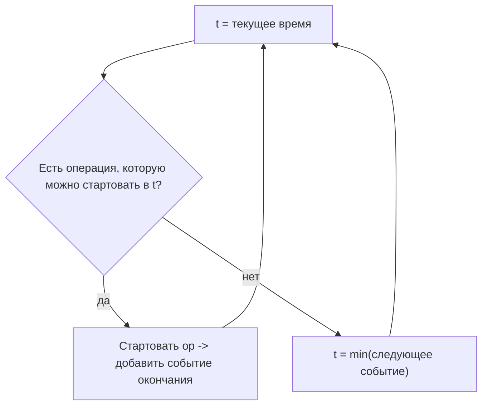
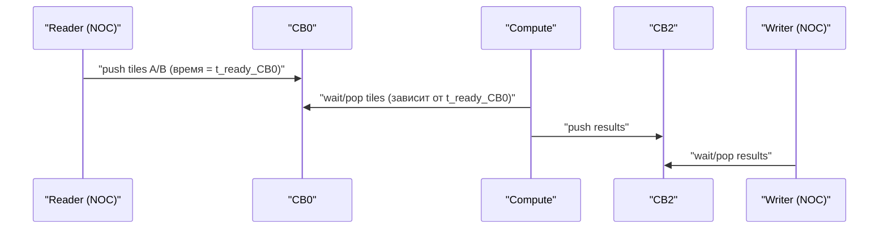
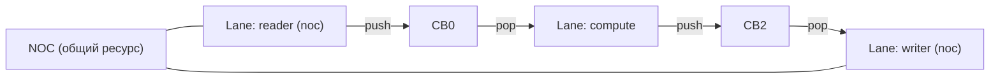
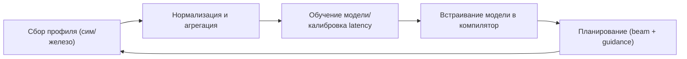

# Полное time-aware планирование для TTL (beam search + дискретно-событийная модель + межпоточное взаимодействие)

## Цель

Сделать планировщик (Phase 0 перед `TTLAssignDST`) “сильным” не только по регистровому давлению (DST pressure), но и по времени исполнения:

- минимизировать `peak_live` (давление на DST / риск вставки копий),
- минимизировать модельное время завершения `t_end` (простои из-за ожиданий NOC/CB/ресурсов),
- учитывать межпоточное взаимодействие (reader/compute/writer, общие CB и NOC),
- сохранять детерминизм по умолчанию (один вход -> один выход), а стохастику/адаптацию включать флагами.

Документ описывает архитектуру и пошаговый план корректной имплементации.

## Контекст: что есть сейчас

Pass `TTLAssignDST` сегодня (см. `lib/Dialect/TTL/Transforms/TTLAssignDST.cpp`) не реализует “Phase 0 scheduling” в коде: он делает copy insertion + интервалы + linear scan allocation.

В `docs/development/DST_Allocation.md` описана опциональная Phase 0 (перестановка независимых ops), но это пока концепция.

## Почему нельзя симулировать “полное состояние мира на каждый тик”

Если моделировать:

- каждое Tensix ядро,
- состояния FPU/SFPU,
- pipeline stages,
- contention NOC по всем маршрутам,
- CB occupancy по каждому буферу,
- и всё это в дискретных тиках,

то пространство состояния будет слишком большим для beam search (и вообще для большинства методов поиска).

Практичный компромисс: **дискретно-событийная модель ресурсов** (discrete-event), где состояние хранит не “мир на тик”, а “когда ресурс/данные станут доступны”.

## Идея: дискретно-событийная модель (discrete-event) вместо “тика”

### Ключевая компрессия состояния

Вместо хранения состояния на каждый тик, храним “таймлайны доступности”:

- `t_free[ресурс]`: когда ресурс снова свободен,
- `t_ready[данные]`: когда конкретный input/тайл/CB-slot становится доступен,
- плюс SSA-состояние: `indegree`, `remaining_uses`, `live`, `peak_live`.

Это приближает реальную динамику, но остаётся вычислимо.

### События

События — моменты, когда что-то меняет доступность:

- завершение compute op,
- завершение DMA (NOC read/write),
- появление данных в CB (push завершён),
- освобождение DST/ресурса.

Время шага `t` двигается **к ближайшему событию**, когда в текущем состоянии нет операции, которую можно запустить прямо сейчас.

Mermaid: “прыжки по событиям”

## Модель межпоточного взаимодействия (reader/compute/writer)

Для реальных TT kernels типичный паттерн:

- **reader (noc thread)**: читает из DRAM/тензора, пишет в CB,
- **compute (compute thread)**: ждёт CB, делает tile ops, пишет в CB,
- **writer (noc thread)**: читает из CB, пишет в DRAM.

При этом:

- CB — общий ресурс (межпоточная синхронизация),
- NOC — общий ресурс (contension, очереди),
- compute thread имеет FPU/SFPU/DST и свои ограничения.

Mermaid: взаимодействие потоков через CB

## Как объединить beam search и time-aware модель

### Что оптимизируем

Вместо чистого “переставить ops в одном блоке”, хотим выбирать решения, учитывая:

- когда данные реально появятся (CB/NOC),
- какие ресурсы заняты (NOC каналы, FPU/SFPU),
- и как выбор сейчас влияет на будущие простои.

### Что является “ready”

Разделяем готовность:

- `ready_ssa`: операция разрешена SSA-зависимостями (topological readiness),
- `ready_time`: операция может стартовать **сейчас** по времени/ресурсам.

Если `ready_time` пусто, добавляем “wait step” (advance time).

### Состояние beam (минимальный набор)

В каждом узле beam хранить:

- `peak_live`: максимум live values по пути,
- `t`: текущее модельное время,
- `indegree[op]`: текущие SSA зависимости,
- `remaining_uses[value]`: для `release_pot` и live,
- `t_ready[value]`: когда данные/тайл доступны (опционально, если данные приходят извне),
- `t_free[resource]`: когда ресурс свободен,
- `cb_state[cb]`: например `(level, capacity, t_can_push, t_can_pop)` или эквивалент.

### Операция как “задача” (task model)

Для каждой op определяем:

- `inputs`: какие values/CB требуются,
- `resources`: какие ресурсы занимает (пример: `NOC_READ`, `FPU`, `SFPU`, `CB_PUSH`, `CB_POP`),
- `latency(op)`: длительность (из таблицы/модели),
- `outputs`: какие values/CB становятся ready по завершению.

Тогда:

- `t_start(op) = max(t, max(t_ready[input]), max(t_free[ресурс]))`
- `t_end(op) = t_start(op) + latency(op)`
- обновляем `t_free[ресурс] = t_end(op)` для занятых ресурсов
- обновляем `t_ready[output] = t_end(op)`

### Score состояния

Рекомендуемый “двухуровневый” скоринг:

1) минимизировать `peak_live`
2) минимизировать `t_end_estimate` (например `t` в конце, или lower bound)
3) максимизировать эвристики (`release_pot`, `fire_pot`, affinity)

Практически:

- сортировать beam по ключу `(peak_live ASC, t ASC, tie_break DESC)`
- tie-break: лексикографический tuple метрик.

## “Отличный алгоритм” и реалистичный план внедрения

Сделать “идеальный планировщик” сразу сложно. Ниже — план, как прийти к максимально качественному алгоритму поэтапно.

### Этап 0: базовый beam search без времени (регистровое давление)

Сделать Phase 0 как beam search только по SSA + `peak_live`/copy-эвристикам, без timing model.

- Плюсы: минимальный риск, быстрые wins (меньше `copy_dst`).
- Минусы: не избегает простоев NOC/CB.

### Этап 1: coarse timing model (табличные задержки) + wait step

Добавить ресурсы на грубом уровне:

- `NOC_READ`, `NOC_WRITE`, `FPU`, `SFPU`, `CB_PUSH`, `CB_POP`.

Добавить:

- `t_free[ресурс]`,
- “wait step” (advance `t` до ближайшего события),
- метрику `t_end`.

Это уже позволит выбирать порядок, который уменьшает простои.

### Этап 2: межпоточное моделирование (несколько “лент времени”)

Ввести понятие “исполнителя” (executor/lane) для операций:

- lane `noc` (reader/writer),
- lane `compute` (compute thread),
- при желании: разделить `noc_read` и `noc_write` (или каналы).

Состояние расширяется:

- `t_lane[noc]`, `t_lane[compute]`,
- `t_free_lane[lane][resource]` (часть ресурсов привязана к lane),
- общие ресурсы остаются глобальными (например, NOC contention).

Beam search начинает учитывать межпоточные блокировки через CB.

Mermaid: архитектурная картинка

### Этап 3: калибровка задержек (Profile-Guided / FDO)

Собрать реальные/симулированные профили:

- длительности DMA,
- stall counters,
- времена ожиданий CB,
- распределения latency по типам ops.

И обновлять таблицы `latency(op)` и/или параметры contention модели.

### Этап 4: guidance модель (ранжирование кандидатов в beam)

Чтобы beam не “взрывался” при большом `ready`, добавляем guidance:

- модель ранжирования кандидатов `score_candidate(state, op)`,
- либо модель “value function” для состояния.

Начать с детерминированной модели (без онлайна), обученной оффлайн по профилям (FDO):

- собрать датасет `(state_features, op_features) -> outcome`,
- учить GBDT/деревья,
- применять в beam как “prior” (сортировать кандидаты, обрезать top-M).

### Этап 5: адаптация по runtime (осторожно)

Онлайн-обучение (в рантайме) в компиляторе опасно для детерминизма. Реалистичная стратегия:

- по умолчанию детерминизм и фиксированная модель,
- онлайн-адаптацию включать флагом,
- предпочесть “bandit над стратегиями” (выбор из нескольких фиксированных политик), а не непрерывно обучаемую GBDT.

## Детали корректной имплементации (что именно нужно реализовать)

### 1) Формализация “операций” для планировщика

Определить, какие ops участвуют:

- только tile compute ops в `ttl.compute`?
- включать ли CB ops (wait/reserve/push/pop) и DMA внутри того же планирования?

Варианты:

- **локально**: планировать только compute ops (Phase 0 для DST), timing учитывать грубо,
- **системно**: строить unified task graph для reader/compute/writer.

Для “полной” идеи нужен unified task graph.

### 2) Построение unified task graph

Нужно иметь граф задач, где ребра бывают двух типов:

- SSA/data dependencies,
- resource/queue dependencies (CB level, NOC channel).

### 3) Дискретно-событийная симуляция состояния

Нужны структуры:

- `EventQueue` (можно неявно через `min(next_event)` по `t_free/t_ready`),
- `ResourceTimeline` (t_free),
- `CBModel` (уровень заполнения и времена).

### 4) Механизм “wait step”

Если в состоянии нет стартуемых ops, но есть будущие события, нужно:

- `t = min(next_event_time)`,
- обновить derived readiness (например, какие ops теперь `ready_time`).

### 5) Детерминизм

Правила:

- стабильные tie-break (по `opIndex` или stable id),
- фиксированная сортировка,
- отсутствие случайных решений по умолчанию.

### 6) Тестирование

Тест-план должен покрывать:

- корректность (нет нарушения SSA зависимостей),
- воспроизводимость порядка,
- улучшение метрик на известных паттернах:
  - multi-consumer + unary (меньше копий),
  - reader/compute/writer (меньше простоев по модели),
  - edge cases (пустой ready_time -> wait step).

## Форматы данных для профиля (для FDO)

Рекомендуется определить стабильный формат:

- `kernel_id`, `op_id`, `op_type`,
- `observed_latency`, `stall_reason`,
- `cb_wait_time`, `noc_queue_depth` (если доступно),
- `device_arch` / `freq` / `config`.

Mermaid: контур FDO

## Критические компромиссы

- **Точность vs стоимость**: чем детальнее модель, тем тяжелее состояние beam.
- **Качество vs детерминизм**: стохастика и online learning могут улучшать качество, но ломают воспроизводимость.
- **Глобальный оптимум недостижим**: это задача близкая к NP-трудным, нужен приближенный поиск.

## Рекомендуемые параметры по умолчанию (для стартовой реализации)

- beam width `K = 8..16`,
- per-state candidate cap `M = 8..16` (guidance/эвристика для top-M из ready),
- coarse latency таблицы, затем FDO.

